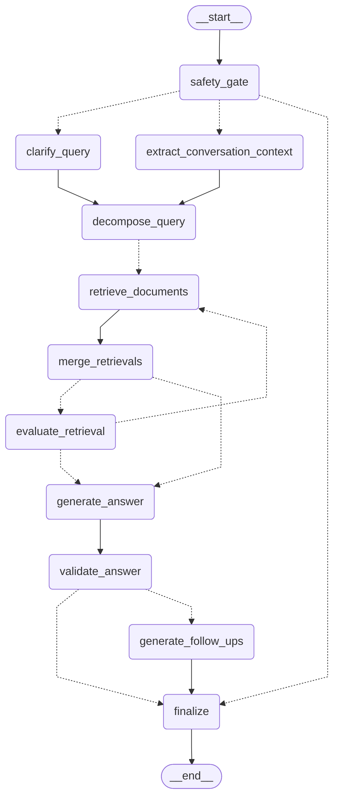

# Hybrid RAG Agent with Answer Validation
[](https://www.python.org/downloads/) [](LICENSE) [](https://github.com/timpowellgit/healthcare-rag/commits)

This project implements a sophisticated Retrieval-Augmented Generation (RAG) system designed to answer questions grounded in healthcare product monographs (e.g., Lipitor, Metformin). It tackles the challenge of providing accurate, grounded answers quickly, even for complex or ambiguous queries, by running a **conditional pipeline on a LangGraph `StateGraph`**.

Instead of a rigid sequential pipeline (or racing multiple answer paths), the graph branches at runtime: every query is first classified by a safety gate, then conditionally clarified, decomposed into parallel retrieval fan-outs, and merged into a single validated answer. Key capabilities include:

*   **Intelligent Query Handling:** Utilizes conversation history for query clarification and decomposes complex questions into simpler sub-queries.
*   **Targeted Hybrid Retrieval:** Employs OpenAI function calling to route queries to the correct Weaviate vector store (Lipitor or Metformin) and retrieves relevant document chunks using Weaviate's hybrid search (BM25 + OpenAI embeddings with `relativeScoreFusion`).
*   **Context Enhancement:** Summarizes relevant snippets from conversation history and evaluates retrieval sufficiency, performing gap-filling via additional sub-queries if necessary.
*   **Validated Answer Synthesis:** Generates a freeform answer incorporating retrieved context and history summary, followed by a rigorous multi-step validation process detailed further below. This validation ensures the final answer is factually grounded in the source documents by checking cited evidence.
*   **Dialogue Promotion:** Suggests relevant follow-up questions based on the interaction.

This orchestrated approach, powered by technologies like Weaviate, OpenAI, LangGraph and Docling (for document processing), aims to deliver fast, accurate, and context-aware responses for healthcare information retrieval, with per-thread conversation memory and controlled `GraphEngine` update streaming. LangGraph Studio and Agent Server remain development surfaces for non-sensitive synthetic input.

## Table of Contents
- [Core Pipeline Components](#core-pipeline-components)
- [Technology Stack](#technology-stack)
- [Conditional Pipeline Orchestration (LangGraph)](#conditional-pipeline-orchestration-langgraph)
- [Coach Agent Platform](#coach-agent-platform)
- [Retrieval Engine Details](#retrieval-engine-details)
- [Setup & Execution](#setup--execution)
- [Routing Experiment Status](#routing-experiment-status)
- [Example Query Flow](#example-query-flow)
- [Detailed Answer Validation and Hallucination Handling](#detailed-answer-validation-and-hallucination-handling)

---

## Core Pipeline Components

**Clarification & Decomposition:**
*   **Clarification:** Uses conversation history to interpret follow-up questions containing ambiguous references (like pronouns) that depend on previous turns in the dialogue.
*   **Decomposition:** Breaks down complex questions into multiple, focused sub-queries specifically for retrieval. This process operates independently of conversation history.
*(Query refinement logic in the `clarify_query` / `decompose_query` graph nodes, `healthcare_rag/graph/nodes/preprocess.py`)*

**Conversation Context Summarization:** Before generating an answer, this component analyzes the current user query and the preceding conversation history. It identifies and extracts key snippets from the history that are relevant for providing context or answering the current question. This summary is then passed along to the answer generation step. *(The `extract_conversation_context` node)*

**Document Retrieval (Weaviate Hybrid RAG):** An LLM function call first analyzes the user query to determine the relevant medication, routing the request to the specific Weaviate vector store for either "Lipitor" or "Metformin". The system then retrieves relevant **document chunks** using Weaviate's hybrid search capabilities. The specifics of this hybrid search (combining dense and sparse methods with Relative Score Fusion) are detailed in the "Retrieval Engine Details" section below. *(Routing and search in `healthcare_rag/processors/retrieval.py`, driven by the `retrieve_documents` node)*

**Retrieval Evaluation & Gap-Filling:** After the merged retrieval, this component assesses whether the collected document chunks contain sufficient information to answer the user's query thoroughly. If the context is deemed insufficient, the evaluator generates new, targeted sub-queries to fetch additional relevant document chunks (one gap-fill round, phase-0 only). *(The `evaluate_retrieval` node)*

**Answer Generation:** This component receives the working query and the final set of retrieved document chunks (potentially augmented by gap-filling). Using this context, an LLM generates a freeform answer, aiming to include citations pointing back to the source documents. *(The `generate_answer` node)*

**Answer Validation:** The initial freeform answer undergoes a rigorous validation process to check for factual grounding and handle potential hallucinations. See the "Detailed Answer Validation and Hallucination Handling" section below for specifics. *(The `validate_answer` node, `healthcare_rag/processors/validation.py`)*

**Follow-Up Question Generation:** Based on the final answer and conversation context, the system can also generate relevant follow-up questions to guide the user or explore related topics. *(The `generate_follow_ups` node)*

**Prompt Management (Jinja2 Templates):** LLM interactions for various tasks (clarification, decomposition, evaluation, generation, validation, follow-ups) are driven by prompts defined in Jinja2 template files located inside the package at `healthcare_rag/prompts/` (shipped in the wheel as package data), allowing for dynamic prompt construction based on runtime data. *(Rendered by `healthcare_rag/graph/prompts.py`)*

**Actual Data Flow:**

The following diagram is the real graph shape (kept in sync by a mermaid drift test; see `docs/graph.mmd`):



## Technology Stack

This project utilizes the following core technologies:

*   [](https://www.python.org/) - Core programming language.
*   [](https://weaviate.io/) - Vector database for hybrid search.
*   [](https://github.com/langchain-ai/langgraph) - Conditional-pipeline orchestration, checkpointed threads, streaming.
*   [](https://openai.com/) - Language models for generation, embeddings, and function calling.
*   [](https://www.docker.com/) - Used via Docker Compose for running Weaviate.
*   [](https://jinja.palletsprojects.com/) - For managing LLM prompts.
*   Docling - Python library for document parsing and chunking (especially PDFs).
*   [](https://docs.pydantic.dev/latest/) - For data validation, particularly in structuring LLM outputs.
*   [](https://mermaid.js.org/) - Used for rendering diagrams in this README.

---

## Conditional Pipeline Orchestration (LangGraph)

The runtime is a custom LangGraph `StateGraph` (`healthcare_rag/graph/`) whose node names are the pipeline stages and whose conditional edges are the runtime self-evaluators:

*   **`safety_gate` →** the process-owned Presidio/deterministic sanitizer scans the current query and history before safety classification. Emergency / personal-advice / out-of-scope / prompt-injection messages short-circuit straight to `finalize` with a terminal templated response (see `docs/safety.md`). Identifier sanitization remains active during safety-classification ablations.
*   **`decompose_query` →** simple queries retrieve once; complex queries fan out via LangGraph `Send` — the parent (possibly clarified) query **plus** up to `HC_RAG_MAX_SUBQUERIES` sub-queries retrieve in parallel, and `merge_retrievals` de-duplicates their documents by `doc_id` into one merged set. There is deliberately **no speculative racing**: one answer and one validation per turn, on the original query (the measured "synthesis" behaviour).
*   **`evaluate_retrieval` →** one sufficiency check on the merged documents; an insufficient round fans out ≤3 gap-fill retrievals, after which the graph routes straight to generation (no second evaluation).
*   **`validate_answer` →** citation validation (below); a structuring failure writes no answer rather than failing open.
*   **`generate_follow_ups` →** answer-neutral UX feature; `finalize` persists the (scrubbed) question and the final answer to the thread's checkpointed history.

Conversation memory lives in the graph's checkpointer keyed by an opaque `thread_id` (in-memory by default; opt into SQLite via `HC_RAG_CHECKPOINT=sqlite:<path>` for threads that survive restarts). The supported identifier-bearing surface is `GraphEngine` with `updates` streaming, `durability="exit"`, and LangSmith tracing disabled. See `docs/safety.md` for the precise boundary and limitations.

`make dev` serves the graph on the local LangGraph Agent Server (Studio-compatible) and `scripts/langgraph_smoke.py` exercises threads, two-turn history carry-over, streaming and queued-run cancellation against it.
`langgraph.json` loads the gitignored `.env` for `langgraph dev`; `langgraph deploy`
uploads those variables as deployment secrets rather than baking them into the
image. The generated deployment image installs the pinned Presidio/spaCy model
through the root package declared in `dependencies`. Both Agent Server surfaces
remain limited to synthetic, non-sensitive input as described in
`docs/safety.md`.

---

## Coach Agent Platform

The member-facing coach is a second LangGraph application under
`healthcare_rag/agent/`, with its Next.js client under `frontend/`. Its ordered
decision-list gate is the authority for every turn: D0a admits only validated,
server-originated reminder wakes; D0b admits the fixed attachment review route;
D1–D9 then select erasure, safety handling, monograph relay, or coaching tools.
The model does not choose which perimeter it runs inside.

Generative UI is data-bound rather than prose-bound. Tools emit DATA envelopes,
`compose_ui` may emit only the catalog tree, and every fact-bearing component prop
must be a `{__ref: {turn_scope_id, block_id, pointer}}` object. The frontend
hydrates those references against same-turn envelopes and rejects literal facts,
unknown components, unresolved references, and unknown dispatch actions.

Recurring reminders are owner-scoped store records paired with Agent Server cron
runs. Cron creation and reconciliation use server-held internal credentials; a
member can create, edit, or cancel reminders only through natural-language coach
turns. A valid `cron_wake` is delivered model-free after the server revalidates its
owner, thread, reminder, and rotating token.

Document upload is a two-step reservation pipeline. The server atomically reserves
the client upload id for 15 minutes, reads supported content into a request-lifetime
buffer, performs extraction, scrubs the proposal, and stores only the bounded
proposal for review. The original bytes are cleared and never written to disk.

The member perimeter authenticates Supabase bearer tokens and exposes a fixed
allow-list: own threads, constrained update streams, branch copy, uploads, feedback,
and unified interrupt resumes. Cron administration, arbitrary state mutation,
MCP, and A2A are not member surfaces. Deploy the `coach` graph and HTTP app from
`langgraph.json`, configure the deployment secrets and allowed frontend origin,
then use `make deployed-smoke LANGGRAPH_DEPLOYMENT_URL=https://…` for the live
acceptance checks.

Self-erasure follows the same path as a real chat turn. `make forget-member
LANGGRAPH_DEPLOYMENT_URL=https://…` signs in as the member, asks the graph to erase
owner-scoped records, crons, and upload reservations, waits for the durable marker,
then snapshots and deletes all owned threads with the marker thread last. Use
`FORGET_ARGS=--dry-run` to list the thread phase without mutation. The safety and
privacy boundaries, residuals, and data-handling posture are documented in the
[coach platform safety addendum](docs/safety.md#coach-agent-platform-addendum).

---

## Retrieval Engine Details

**Weaviate Hybrid Retrieval:** Document chunks are indexed in Weaviate collections (e.g., `Lipitor`, `Metformin`). Each chunk includes:
*   An OpenAI embedding vector (dense vector) used for semantic search, compared using cosine similarity.
*   Preparation for Weaviate's sparse keyword indexing via **BM25**. BM25 calculates relevance by considering both the frequency of query terms within a chunk (**Term Frequency**) and how unique those terms are across the entire dataset (**Inverse Document Frequency**). It also includes parameters to **normalize for document length**, preventing longer chunks from having an unfair advantage simply due to size. This results in higher scores for chunks where query terms appear relatively often and are distinctive across the corpus.
*   Associated metadata (source, page numbers, etc.).

Queries utilize Weaviate's `hybrid` search function, specifically configured with:
*   **Fusion Strategy:** `relativeScoreFusion`. This method prepares the scores from the vector search and keyword search for combination. It independently normalizes each set of scores using a min-max scaling approach: within each result set (vector or keyword), the highest score is mapped to 1, the lowest score is mapped to 0, and all other scores are scaled proportionally in between. These normalized scores (ranging from 0 to 1) are then combined based on the alpha parameter. This approach preserves more information about the relative differences between scores compared to the older rank-based `rankedFusion` method.
*   **Alpha Parameter:** Set to `0.65`. This gives slightly more weight to the vector search results (semantic similarity) compared to the keyword search results (exact matches) in the final ranking.

The system utilizes OpenAI's function calling capability to route the query to the appropriate Weaviate collection(s). Predefined function descriptions, one for each collection (e.g., "query_lipitor", "query_metformin"), are provided to the LLM along with the user query. The LLM analyzes the query and selects the relevant function(s) to call, thereby determining which specific collection(s) (Lipitor or Metformin) should be targeted for the subsequent hybrid search.

---

## Setup & Execution

**Requirements:** Python **3.11+** (the code uses `typing.Self`), [uv](https://docs.astral.sh/uv/), Docker (for Weaviate), an OpenAI API key. A LangSmith API key is optional but recommended (tracing + evals).

```bash
cp .env.example .env            # fill in OPENAI_API_KEY (+ LANGSMITH_API_KEY, LANGSMITH_TRACING=true)
make venv                       # uv venv (Python 3.12) + editable install of the app, evals and dev deps
make weaviate                   # docker compose up + wait for /v1/.well-known/ready
make ingest                     # load data/chunks_*.json into the Lipitor / Metformin collections
make run                        # interactive CLI  (python -m healthcare_rag)
```

To run the same GraphEngine CLI entirely from containers, keep the API keys in
the required, gitignored `.env` and use the opt-in `app` Compose profile:

```bash
make container-build            # build app + baked Presidio/spaCy model
make container-ingest           # start Weaviate and load the checked-in chunks
make container-run              # interactive CLI in the app container
```

The image installs the locked `presidio-analyzer==2.2.364`, spaCy 3.8.15 and
`en_core_web_sm` 3.8.0 during the build, then verifies the privacy analyzer can
initialize. Runtime model downloads are neither needed nor permitted by the
read-only, non-root container. The Compose app profile forces LangSmith tracing
off for identifier-bearing CLI input and reaches Weaviate over the internal
Compose network; the existing `make weaviate` workflow remains unchanged.

> `requirements.txt` is the original frozen environment and its pins are mutually incompatible
> (`grpcio` vs `grpcio-tools`); dependencies now live in `pyproject.toml`. Re-chunking the PDFs
> (`healthcare_rag/processors/pdf_chunker.py`) needs the optional `ingest` extra (docling).

**Configuration** — see `.env.example`. Model selection is centralised in
`healthcare_rag/services/models.py` (`HC_RAG_LLM_MODEL`, `HC_RAG_VALIDATOR_MODEL`,
`HC_RAG_REASONING_EFFORT`; defaults `gpt-5.6-luna` / `gpt-5.6-terra`).
`HC_RAG_DISABLE_STAGES` short-circuits pipeline stages for ablation experiments.
The routing defaults remain `HC_RAG_QUERY_RESPONSE_ARM=current` and
`HC_RAG_SAFETY_CLASSIFIER=llm`.

**Observability** — for synthetic/non-sensitive development input, set `LANGSMITH_TRACING=true` and every query is traced to LangSmith as a
tree of named stages (clarify / decompose / retrieve / evaluate / answer / validate / follow-ups)
with per-call token usage and cost. See `healthcare_rag/services/tracing.py`.

**Evals** — `make eval PREFIX=<change>` runs the golden question set (`evals/golden_dataset.json`)
through the real pipeline as a LangSmith experiment and writes `evals/results/<experiment>.md`
(correctness, groundedness, safety behaviour, retrieval recall, latency p50/p95, cost per stage).
`make eval-multiturn` does the same for multi-turn conversations. Details in `evals/README.md`.

**Docs for humans and agents** — `AGENTS.md` (conventions), `openwiki/` (generated repo wiki,
`make wiki-update` to refresh).

---

## Routing Experiment Status

The query-response and safety-classifier controls are experimental and do not
change the production defaults: `HC_RAG_QUERY_RESPONSE_ARM=current` and
`HC_RAG_SAFETY_CLASSIFIER=llm`.

`HC_RAG_QUERY_RESPONSE_ARM` has three behaviors. `current` preserves the
existing out-of-scope scope response for a benign social turn. `deterministic`
returns fixed, scrubbed text only for a standalone greeting, thanks, goodbye, or
capability/scope question. `tool` lets the query-or-respond node choose only a
benign-social direct response; a malformed or non-direct social decision falls
back to fixed social text, while non-social turns continue through retrieval.
Direct response is never medical:
in-scope medical, mixed social/medical, ambiguous clinical, out-of-scope
knowledge, personal-advice, emergency, PHI-recall, and prompt-injection turns
remain on their safety/refusal/retrieval paths. Medical answers continue through
retrieval and citation validation.

The safety category enum is unchanged: `in_scope_informational`,
`personal_medical_advice`, `emergency_red_flag`, `out_of_scope`,
`prompt_injection`, and `ambiguous`. `benign_social` is a separate annotation,
not a seventh category; it may be true only for the four standalone social
intents above.

The query lane is **INCONCLUSIVE**. Its sealed judge calibration passed 22 of
24 fixtures, so no paired or paid run was attempted and it has no query-arm
metrics, deltas, cost, latency, or experiment URLs. See
[`evals/results/query-or-respond.md`](evals/results/query-or-respond.md) and
[`evals/results/query-or-respond.json`](evals/results/query-or-respond.json).

The Semantic Router safety lane is separately **INCONCLUSIVE** because the
exact `semantic-router==0.1.16` dependency conflicts with the unchanged project
bounds `openai>=1.76,<2` and `python-dotenv>=1.1`. It is not a selectable working
configuration. No adapter, configuration, calibration, stage, or paid semantic
run was attempted; it was not installed, imported, or exercised, and there are
no semantic metrics. See
[`evals/results/semantic-safety.md`](evals/results/semantic-safety.md) and
[`evals/results/semantic-safety.json`](evals/results/semantic-safety.json).

---

## Example Query Flow

Consider the query "What are the side effects of Lipitor?". The safety gate classifies it as in-scope informational (scrubbing any identifiers). The graph runs clarification and context extraction in parallel; the query is clear and simple, so decomposition produces a single retrieval branch. An LLM routes the query to the `Lipitor` collection using a function call. Weaviate performs hybrid retrieval. The merged results are evaluated; if sufficient, answer generation proceeds using the retrieved context and the history summary. A validation LLM checks the answer against the sources. Follow-up questions might be generated. The `finalize` node persists the scrubbed question and the validated answer to the thread and returns the final result. If the merged retrieval had been insufficient, the evaluation step would have triggered gap-filling sub-queries before answer generation.


---

## Detailed Answer Validation and Hallucination Handling

To ensure the generated answers are factually grounded in the provided documents and to mitigate hallucinations, the system *(primarily via the `AnswerValidator` class, invoked by the `validate_answer` graph node)* employs a multi-step validation process after the initial answer generation:

1.  **Initial Generation with Attempted Citations:** The first step involves an LLM generating a freeform answer *(the `generate_answer` node)* based on the query, retrieved document chunks, and conversation context. This generation prompt encourages the LLM to include citations referencing the source documents.

2.  **Structured Parsing:** The raw, freeform answer (with attempted citations) is then processed using a structured output method (e.g., an LLM call constrained by a specific format or using a tool like Pydantic). This converts the answer into a structured list of individual "statement" objects. *(Parsing logic within `AnswerValidator`)*

3.  **Statement & Citation Objects:** Each statement object in the list typically contains:
    *   The text of the individual claim or statement being made.
    *   A corresponding "citation" object.
    The citation object itself contains:
    *   An identifier for the specific document chunk referenced.
    *   The exact quote from that document chunk which supposedly supports the statement.

4.  **Quote Verification Loop:** A validation function *(within `AnswerValidator`)* iterates through each structured statement object. For each statement, it performs a check:
    *   It retrieves the content of the document chunk referenced in the citation object.
    *   It verifies if the quote provided in the citation object can be found within that document chunk's content using **fuzzy matching**. This allows for minor variations and doesn't require an exact string match, succeeding if the match score exceeds a predefined threshold.

5.  **Statement Filtering:** If the quote verification fails for a statement (i.e., the provided quote is not found in the referenced document chunk, indicating a potential hallucination or mis-citation), that specific statement may be removed from the list. *(Filtering logic within `AnswerValidator`)*

6.  **Final Validated Output:** The final output consists of the remaining, verified statements, ensuring that the answer presented to the user is directly supported by evidence found within the source documents.

## Contact

For questions or support, please contact Tim Powell at [timpowelldk@gmail.com](mailto:timpowelldk@gmail.com).

You can also find me on: [](https://www.linkedin.com/in/tim-powell-64790b132/)

---
