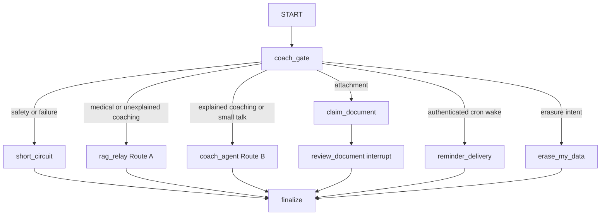

# Coach graph routing and safe catalog output

`langgraph.json` registers `coach` from `healthcare_rag/agent/__init__.py`; `build_coach_graph()` composes the coach runtime. It is separate from the monograph RAG [architecture](../architecture/overview.md), but Route A delegates to that graph.

Caption: `coach_gate` owns the mutually exclusive decision; terminal outputs pass through `finalize`.

## Gate order and trust boundary

`coach_gate()` in `agent/gate.py` extracts deterministic features and scrubs the question before creating the `HumanMessage`. Order is security-significant: it validates a `cron_wake` against active reminder/thread/user/token binding; admits attachments without a classifier; handles deterministic red flags, injection, and identifier recall; then applies `CoachSafetyGate.assess()` with a five-second timeout. Safety failures, timeout, or missing assessment are out-of-scope short circuits. Erasure then routes to erasure. Coaching with unexplained medical language routes Route A; explained coaching routes Route B; medical/drug/clinical-unit signals default Route A and small talk/contextual anaphora Route B.

`short_circuit.py` provides fixed safe output. Never turn a classifier fallback into Route B. `tests/agent/test_coach_gate.py` pins ordering, forged/valid cron wake, attachment precedence, classifier failures, and Route A/B examples.

## Route A and Route B

`rag_relay()` invokes the healthcare RAG child graph. Normal relay inherits parent-thread history. `HC_RAG_RELAY_MODE=pipeline` deliberately uses a fresh in-memory child thread, retaining safety stages but losing child multi-turn history. Child failure becomes `RELAY_ERROR_MESSAGE`, not a raw exception (`tests/agent/test_rag_relay.py`).

`build_route_b_agent()` in `coach_agent.py` builds a `create_agent` tool caller with server-derived `AgentContext(user_id, thread_id, human_msg_id)`. Route B owns coaching tools for member memory, metrics, injections, scheduling/reminders, and `compose_ui`; client identifiers do not define the context. `ToolCallLimitMiddleware` is the only tool-call cap for `change_schedule`.

## Catalog composition is a server-enforced contract

`compose_ui.py` validates tool output before it becomes renderable. The closed component set is `InjectionTracker`, `MiniCalendar`, `TrendCard`, `ActionCard`, `StatRow`, `ScoreRing`, `Timeline`, `Card`, `Tag`, `Label`, and `Button`. Clinical/fact-bearing properties must be `DataRef` objects pointing through a same-turn DATA envelope; static text/actions are constrained by allowlists. Unknown components/properties, literal facts, invalid pointers, wrong types, and cross-turn data fail validation.

`SafeModelResponseMiddleware` rewrites the first invalid composition into a tool error and empty tree for one model correction; a second invalid cycle yields `SAFE_FALLBACK`. Fixed document/memory/calendar/reminder cards bypass composable output. `finalize_coach()` scrubs and projects public output, clearing pending document state. Tests: `tests/agent/test_route_b.py` and shared data-reference fixtures also consumed by frontend tests.

See [member perimeter](member-perimeter.md) for the HTTP authority boundary, [member data lifecycle](member-data-lifecycle.md) for tool-owned records, and [member frontend](../frontend/member-frontend.md) for client hydration.

**Validation:** `uv run pytest tests/agent/test_coach_gate.py tests/agent/test_route_b.py tests/agent/test_rag_relay.py -q`; then `make eval-agent` for behavior changes.
