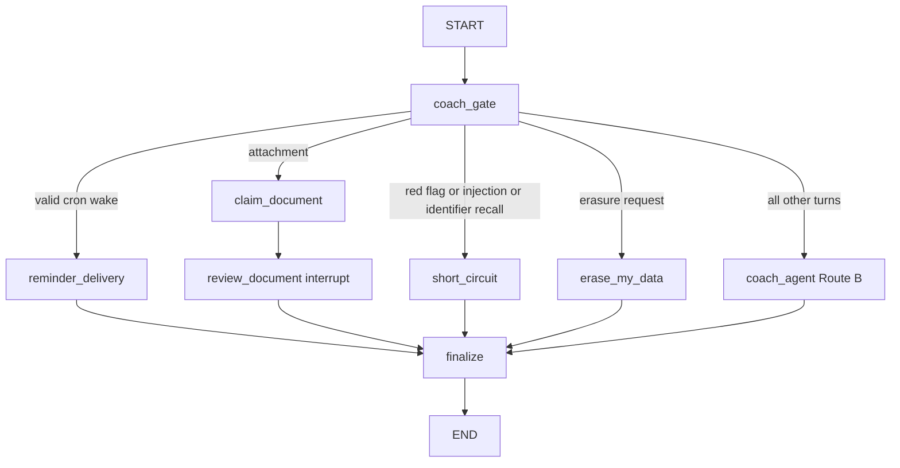

# Coach decision routing and data-bound UI

The deployed `coach` graph is registered from `healthcare_rag/agent/__init__.py` and constructed by `build_coach_graph()`. It has one deterministic entry node, `coach_gate`, and one terminal projection, `finalize`. The gate decides only operational and safety paths; it does **not** classify medical versus coaching questions and it does not make a model call. That choice is model-driven inside Route B through the constrained `medical_lookup` tool.



Caption: graph-level routing is a fixed precedence list; medical lookup is a Route B tool call rather than a gate destination.

## Deterministic entry gate and precedence

`coach_gate()` starts each turn by PHI-scrubbing `question`, clearing the untracked raw `question`, and adding the scrubbed value as a `HumanMessage`. It also clears `follow_ups`. Its early-return order is the routing contract:

1. A `cron_wake` is handled first. The gate looks up the reminder for non-member contexts and requires an active record, matching reminder, user, and configured thread IDs, plus a constant-time comparison of the wake token. It clears `cron_wake` in either case, sends a valid payload as `reminder_wake` to `reminder_delivery`, and sends an invalid or unresolvable wake to `short_circuit`.
2. Any `attachment_id` goes directly to `claim_document`, before text safety or erasure checks.
3. Deterministic red-flag terms, prompt-injection flags, and identifier-recall requests go to `short_circuit`.
4. A recognized erasure request goes to `erase_my_data`.
5. Every remaining turn, including medical questions, enters `coach_agent`.

This is intentionally distinct from the shared RAG [safety gate](../safety/gate.md): the coach entry gate reuses deterministic signal functions and fixed responses, but never delegates its final routing decision to an LLM classifier. `short_circuit()` performs no model call; it derives the matching emergency, injection, identifier-recall, or out-of-scope template from the scrubbed human message and suppresses follow-ups. If an AI message already exists, it does not add another response.

The graph exposes only `messages` and `follow_ups` as `CoachOutput`. `question`, attachment, and cron input fields are untracked state rather than output/checkpoint data. All ordinary terminal handlers feed `finalize_coach()`, which re-projects the entire message channel through `to_safe_message`, preserves follow-ups, and clears `pending_document_op_id`.

## Non-model operational branches

An attachment branch is deliberately outside the agent loop. `claim_document` authenticates the user, requires an unconsumed completed upload reservation bound to the configured thread, creates a deterministic pending operation, consumes the attachment, and continues to `review_document`. The review node interrupts for a validated accept/field decision; approved fields are privacy-sanitized before being written to the member profile. The result is a fixed `MemoryExtractionCard` payload rather than a `compose_ui` composition.

Reminder delivery is likewise deterministic. It revalidates the active reminder, configured thread, and wake token against the store before emitting one data envelope in an AI message; missing or invalid state yields no reminder content. The wake token is not included in the generated card. These branches—and their fixed document/reminder representations—must not be replaced with model-composed UI.

## Route B: model-selected tools, with a medical-only relay boundary

`coach_agent()` is the normal destination and invokes a checkpointer-free LangChain `create_agent` with only safe-projected messages. It derives `AgentContext(user_id, thread_id, human_msg_id)` on the server: the user comes from authenticated configuration, while the human-message ID is assigned if absent and placed in child configuration. This context scopes saved memory and tool data; client-supplied identifiers do not establish it.

The Route B catalog includes memory, metric and injection logging, schedule viewing/changing, reminder creation/edit/cancellation, `compose_ui`, `medical_lookup`, and browser-side `copy_to_clipboard`. The dynamic prompt appends profile and episodic facts only from the authenticated user's store namespaces. `ToolCallLimitMiddleware` limits `change_schedule` to one call per agent run; it is the relevant limit for its interrupt-producing operation.

Medical behavior is a prompt and middleware contract within this model-driven route:

- The prompt instructs the model to use `medical_lookup` for medication dose, adverse effects, interactions, warnings, and monograph questions; it must make that call alone and must not answer from model knowledge, diagnose, or provide personal dosing advice.
- `SafeModelResponseMiddleware` enforces the critical execution boundary when a model nevertheless emits a medical call: it removes assistant prose and drops every sibling tool call, retaining only `medical_lookup`.
- `medical_lookup` is `return_direct` and returns a content-and-artifact pair. `relay_medical_answer` converts its terminal `ToolMessage` to an AI message with exactly the tool content; `coach_agent` copies only the tool artifact's follow-ups to graph state.

The layered behavior matters: model prompting selects the tool, whereas middleware prevents mixed calls and untrusted preamble from reaching the member. Do not move medical routing back into `coach_gate` without changing this architecture and its tests.

## Medical relay behavior and operation mode

`medical_lookup` calls `relay_question()`, which invokes the complete healthcare RAG graph with the tool query and current configuration. By default the compiled child uses `checkpointer=True` and inherits the parent configuration, so child healthcare history and refusal boundaries remain scoped to the coach thread and tool checkpoint namespace. Its output is assembled as a monograph-prefixed answer and optional follow-up bullets. A child safety short circuit is returned byte-for-byte with no framing or follow-ups, and a child exception or missing answer becomes the fixed `RELAY_ERROR_MESSAGE`, never the raw exception.

`HC_RAG_RELAY_MODE=pipeline` is a deliberate degraded mode: each call compiles a fresh child graph with an `InMemorySaver` and a new UUID thread. It retains the child graph's safety and validation stages but loses child multi-turn history. Use it only when that loss of continuity is acceptable.

## Data-bound catalog compositions

`compose_ui` is a tool acknowledgement; `validate_composition()` is the server-side rendering authority. A composition may contain only these components: `InjectionTracker`, `MiniCalendar`, `TrendCard`, `ActionCard`, `StatRow`, `ScoreRing`, `Timeline`, `Card`, `Tag`, `Label`, and `Button`. Each component has an exact prop allow-list split between fact-bearing and static props.

Fact-bearing props cannot be literals. They must be `DataRef` objects shaped as `{"__ref":{"turn_scope_id","block_id","pointer"}}` and resolve through a JSON-pointer into a tool-message DATA envelope from the current turn scope. Validation rejects malformed schemas, unknown components or props, absent/wrong-scope blocks, invalid pointers, and values whose resolved JSON type does not match the prop. This makes a tool-generated envelope—not model text—the source of facts rendered by catalog components.

Static values are constrained too: strings must be registered dispatch IDs, enumerated presentation values, or allowlisted fixed copy without numeric/clinical-looking claims; booleans and recursively safe action objects/lists are allowed, while numeric and null static values are not. `static_copy_allowlist.py` owns the approved labels and dispatch IDs. Adding a component, prop, UI copy, action, or tool envelope is therefore a backend-and-frontend contract change, not a prompt-only change.

On the first invalid `compose_ui` call in a run, `SafeModelResponseMiddleware` replaces that call's tree with `[]` and injects an error tool message so the model can reply in plain text or correct itself. If the request history already contains an invalid composition cycle, the next invalid result becomes `SAFE_FALLBACK` with no tool calls. `to_safe_message` is applied before Route B state update and again in finalization; it scrubs content and tool args, preserves message and tool-call correlation IDs and error status, and drops provider metadata.

## Boundary-focused tests and change checklist

- `tests/agent/test_coach_gate.py` pins the precedence list, valid versus forged cron wake, attachment preservation, erasure routing, deterministic safety short circuits, and the safe public output shape.
- `tests/agent/test_route_b.py` pins invalid-composition correction/fallback, same-turn reference resolution, server-derived context behavior, schedule-call limiting, medical relay verbatim behavior and mixed-call dropping, final projection, and parent-thread-scoped child history.
- `tests/agent/test_rag_relay.py` pins relay framing, verbatim child refusal behavior, raw-error suppression/recovery, and the fresh saver/thread behavior of pipeline mode.
- Document and reminder changes also require `tests/agent/test_documents.py` and `tests/agent/test_reminders.py`, because they are gate-selected deterministic branches rather than catalog compositions.

Run focused checks with:

```bash
uv run pytest tests/agent/test_coach_gate.py tests/agent/test_route_b.py tests/agent/test_rag_relay.py tests/agent/test_documents.py tests/agent/test_reminders.py -q
make eval-agent
```

See [coach agent service](coach.md) for deployment context, [member perimeter](member-perimeter.md) for authority and state projection, and [member frontend](../frontend/member-frontend.md) for client hydration of server-approved payloads.
