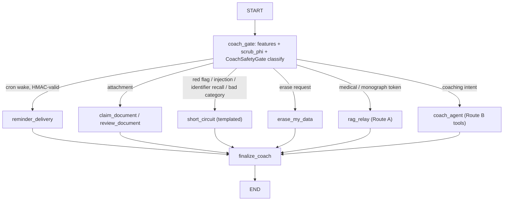

# Coach agent service

`healthcare_rag/agent/` is a second, deployed product surface next to the CLI
RAG graph: the **coach** LangGraph graph (a medication-adherence behavior
coach for members) served by the LangGraph Agent Server. `langgraph.json`
registers two graphs — `healthcare_rag` (the pipeline documented in
[architecture](../architecture/overview.md)) and `coach`
(`healthcare_rag/agent/__init__.py:coach`) — plus a LangGraph store
(`openai:text-embedding-3-small`, dims 1536), auth
(`healthcare_rag/agent/auth.py:auth`), and a custom Starlette HTTP app
(`healthcare_rag/agent/http_app.py:app`) with MCP/A2A disabled.

## Graph topology

`build_coach_graph` (`healthcare_rag/agent/build.py`) wires one entry gate that
routes to exactly one handler, every handler flows into `finalize`, then END:

- **`coach_gate`** (`agent/gate.py`) computes turn features
  (`agent/features.py`: attachment, erase request, anaphoric follow-up,
  unexplained medical token), scrubs the question with the shared
  `scrub_phi` → [PrivacySanitizer](../privacy/sanitizer.md), and classifies
  with `CoachSafetyGate`, a subclass of the RAG
  [safety gate](../safety/gate.md)'s `SafetyGate` that adds a 5 s
  `asyncio.timeout` and a deterministic `ambiguous` fallback when the
  classifier fails (failure then routes to `short_circuit`, never to Route A).
  `cron_wake` turns are validated with an HMAC `wake_token` against the store
  record before they can deliver a reminder.
- **Route A — `rag_relay`** (`agent/rag_relay.py`) runs the scrubbed question
  through the full healthcare RAG graph as a child compiled with
  `checkpointer=True`, so healthcare history and refusal boundaries persist
  per coach thread. `HC_RAG_RELAY_MODE=pipeline` is a degraded fallback that
  recompiles the graph with a fresh in-memory saver and a UUID thread per
  turn. Refusals and child failures surface as fixed strings, never raw
  errors.
- **Route B — `coach_agent`** (`agent/coach_agent.py`) is a LangChain
  `create_agent` with the tools `view_schedule`, `change_schedule`,
  `log_injection`, `log_metric`, `create/edit/cancel_reminder`, `remember_fact`,
  and `compose_ui`, behind `ToolCallLimitMiddleware` and a middleware that
  projects model output through `to_safe_message` and rejects invalid catalog
  compositions before state update. Its base prompt forbids medical advice,
  dosing decisions, diagnoses, and monograph claims. All member data goes
  through the store with privacy scans (`agent/store_data.py`,
  `agent/memory.py`, `agent/tools/`).
- **`erase_my_data`** (`agent/erase.py`) is the self-serve deletion path:
  it sets an `erasing` gate marker, deletes the user's crons and upload
  reservations via the deployment client, then `delete_all_for_user` on the
  store; the `erase_confirmation_v1` marker is emitted only if both remote
  cleanups succeeded (fail-closed). `scripts/forget_member.py`
  (`make forget-member`) drives this against a deployment.
- **Documents** (`agent/documents.py`) claim and review member uploads,
  backed by the `/coach/uploads` HTTP routes (`agent/uploads.py`).

## HTTP perimeter, auth, and deployment

The custom app (`agent/http_app.py`) serves `/coach/uploads`,
`/coach/uploads/{id}/status`, `/coach/feedback`, and an internal-only version
probe, wrapped in `MemberPerimeterMiddleware` (`agent/perimeter_middleware.py`,
composed with `agent/perimeter.py`) and CORS restricted to
`COACH_ALLOWED_ORIGINS`. Its lifespan fails startup unless
`LANGSMITH_FEEDBACK_PROJECT_ID` names a valid, probe-able LangSmith feedback
project — feedback is stored run-less, so it cannot leak member content into
traces. Auth (`agent/auth.py`) maps principals to member/coordinator roles;
`tests/agent/test_auth.py`, `tests/agent/test_perimeter_composed.py`, and
`tests/agent/test_server_perimeter.py` pin the perimeter.

**LangSmith Studio principals.** `langgraph.json` keeps
`auth.disable_studio_auth: false`, so workspace operators reach the deployment
as `StudioUser` principals. `MemberPerimeterMiddleware` passes them straight
through (`perimeter_middleware.py` — a Studio user is an operator, not a
member), and every authorization handler in `agent/auth.py` short-circuits
`_is_studio(ctx)` to an allow (`deny_all`, thread create/read/search/delete,
coach assistant read, cron scopes). Members and anonymous requests are held to
exactly the previous contract; `tests/agent/test_perimeter_studio.py` pins all
three outcomes and asserts the config flag stays false.

**Member thread deletion.** A member `DELETE /threads/{id}` is gated by an
ownership pre-check plus `prepare_thread_deletion` (`agent/cleanup.py`): it
writes a `cleanup_pending` gate marker, pauses the thread's reminders in the
store, then deletes their platform crons over the internal headers. If any
remote step fails the response is a retryable `503` with a "Reminders are
paused; deletion cleanup can be retried" notice — reminders stay paused, so a
retry cannot fire an orphaned cron. After the platform confirms deletion, the
middleware synthesizes `204` and clears the marker
(`clear_cleanup_marker`). Member-facing `GET .../state` responses are
re-projected through `perimeter.py:project_state`, which strips the private
sentinels `question`, `attachment_id`, `cron_wake`, and
`pending_document_op_id` (filtered out, not denied — the whole response is
never 500'd for their presence).

`langgraph.json` also pins the Presidio/spaCy models into the
deployed image via `dockerfile_lines` (see
[PrivacySanitizer](../privacy/sanitizer.md) for why exact versions matter).
Reminders fire through the cron client (`agent/cron_client.py`,
`agent/reminders.py`) with a wake-token handshake.

## Evaluating the coach

The coach has its own offline harnesses that run the graph in-process against
`evals/agent_cases.py` with fakes (`evals/offline_agent_fakes.py`):
`make eval-agent` (`evals/run_agent.py`) and `make eval-agent-multiturn`
(`evals/run_agent_multiturn.py`), reports via `evals/agent_report.py`, and a
coach parity gate (`evals/agent_parity.py`, `evals/check_agent_parity.py`).
Ten-check deployment validation is `make deployed-smoke`
(`scripts/deployed_smoke.py`) against `LANGGRAPH_DEPLOYMENT_URL`.

**Change guidance:** routing changes start in `coach_gate`/`RouteTarget`
(`agent/gate.py`) and are covered by `tests/agent/test_coach_gate.py` and
`tests/agent/test_route_b.py`; Route A wiring by `tests/agent/test_rag_relay.py`;
member-data tools by `tests/agent/test_store_data.py`,
`test_tool_log_metric.py`, `test_tool_log_injection.py`,
`test_tool_change_schedule.py`, `test_tool_view_schedule.py`; reminders by
`tests/agent/test_reminders.py`; the perimeter/auth contract by
`tests/agent/test_perimeter_composed.py` and
`tests/agent/test_perimeter_studio.py`. Deployed-surface changes
(`langgraph.json`, auth, perimeter, HTTP routes) additionally need
`tests/agent/test_deploy_config.py` plus `make deployed-smoke`. Run
`make test` first — all of `tests/agent/` is offline.
