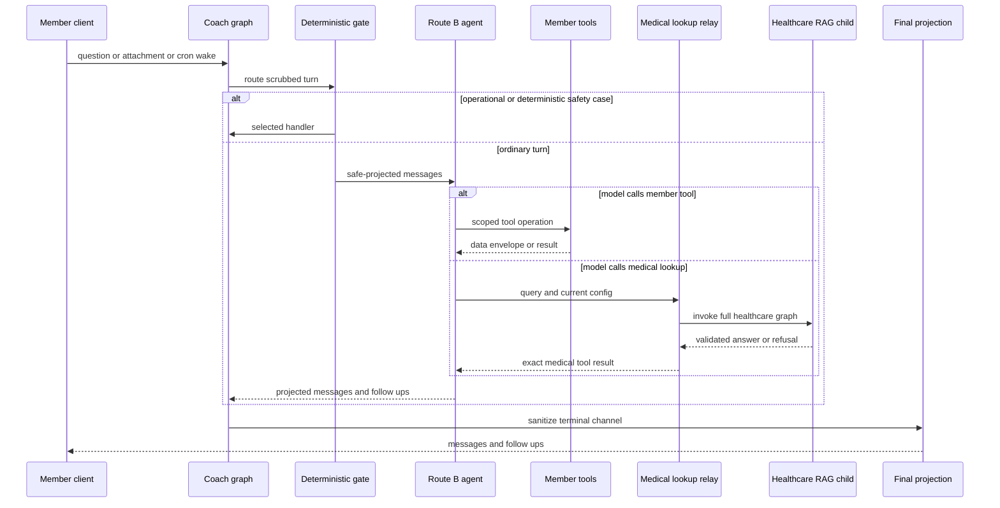

# Coach agent architecture and medical relay

The `coach` graph is the member-facing LangGraph workflow. Its graph builder defines a distinct state/input/output contract and compiles a graph named `coach`; it is not the healthcare RAG graph. The normal coach path is a tool-using agent for planning and member-data interactions. It does **not** own medical-answer safety: medication and monograph content must travel through `medical_lookup` to the complete healthcare RAG child graph, whose safety and validation behavior remains in force.

For the adjacent authorization, storage, deletion, and browser contracts, see [member perimeter](member-perimeter.md), [member data lifecycle](member-data-lifecycle.md), and [member frontend](../frontend/member-frontend.md). [Coach routing](coach-routing.md) is the detailed routing and catalog reference.

## Request flow and ownership



Caption: the coach owns operational dispatch, member tools, and response projection; the healthcare RAG child owns the medical-answer pipeline.

`CoachState` deliberately keeps raw request fields such as `question`, `attachment_id`, and cron payloads as untracked values. The public `CoachOutput` contains only `messages` and `follow_ups`. At terminal handling, `finalize_coach()` re-projects the complete message channel through `to_safe_message()` and clears pending document-operation state. The projection recursively PHI-scrubs content and tool arguments, retains message/tool correlation and tool error status, and drops provider metadata before state is retained or returned.

## Deterministic entry gate

`coach_gate()` is a fixed precedence list, not an LLM classifier and not a medical-intent router. It first scrubs the question, replaces it with a scrubbed `HumanMessage`, clears the raw untracked question, and resets follow-ups. It then selects exactly one target:

1. A cron wake is checked first. A valid wake requires an active stored reminder with matching reminder, user, and configured thread IDs plus a constant-time wake-token comparison. The payload is cleared in either outcome; valid wakes go to `reminder_delivery`, while forged or unresolvable wakes go to `short_circuit`.
2. An attachment goes to `claim_document` before text safety or erasure handling.
3. Deterministic red-flag, prompt-injection, or identifier-recall signals go to `short_circuit`.
4. Recognized erase phrasing goes to `erase_my_data`.
5. Every other turn—including a medical question—goes to `coach_agent`.

The graph registers document, reminder, short-circuit, Route B, erasure, and finalization nodes. Ordinary terminal handlers feed `finalize`; document claiming hands off to its document-review flow. `short_circuit()` makes no model call: it selects the appropriate fixed emergency, injection, identifier-recall, or out-of-scope response from the scrubbed human message and produces no follow-ups.

This ordering is an important extension boundary. Add a new deterministic branch only when it must outrank ordinary tool use, then update the gate tests for precedence and safe output shape. Do not add a medical branch here merely to enforce medical safety: the supported architecture is a constrained Route B tool call into the healthcare graph.

## Route B: bounded tool ownership

`coach_agent()` invokes a fresh, checkpointer-free LangChain agent with only safe-projected messages. It derives `AgentContext(user_id, thread_id, human_msg_id)` server-side: the user comes from authenticated configuration and a missing human-message ID is generated before the call. The dynamic prompt reads saved profile and episodic facts only from namespaces under that authenticated user.

The fixed tool catalog owns member-facing operations: memory, metric and injection logging, schedule viewing/changing, reminder create/edit/cancel, `compose_ui`, `medical_lookup`, and browser-side `copy_to_clipboard`. Tool policy is not just prompt text:

- The base prompt prohibits self-generated medical answers, diagnoses, and personal dosing advice; it requires a medical turn to call `medical_lookup` alone.
- `SafeModelResponseMiddleware` safe-projects model output. If the model includes `medical_lookup`, it removes assistant prose and discards sibling tool calls, so no preamble or concurrent member mutation accompanies the medical result.
- `ToolCallLimitMiddleware` permits only one `change_schedule` invocation per agent run. Its interrupt-producing behavior therefore cannot be multiplied in one run.
- The terminal medical tool message is converted to an AI message containing exactly its tool content. The agent extracts follow-ups only from the tool artifact.

These controls make the model choose a tool but prevent a model response from becoming an alternative medical-answer authority. They also establish the safe-change rule: adding a member capability requires a tool contract, authenticated data scope, response projection, and focused tests—not only a prompt update.

## Medical relay: healthcare graph remains the authority

`medical_lookup` is a `return_direct` tool that delegates its query and runtime configuration to `relay_question()`. The relay invokes a complete compiled healthcare graph. In the default mode the child was compiled with `checkpointer=True` and receives the caller configuration, so healthcare conversation history and refusal boundaries persist within the coach thread under the tool's checkpoint namespace.

For a normal validated result, the relay adds the fixed monograph introduction and optional follow-up bullets. A healthcare-child safety short circuit is returned unchanged, without framing or follow-ups. A child error, missing answer, or exception becomes the fixed retrieval-failure message rather than exposing an internal exception.

`HC_RAG_RELAY_MODE=pipeline` changes this lifecycle deliberately: each lookup compiles a full child graph with a new in-memory saver and a UUID thread. It retains the child safety and validation stages but loses child multi-turn memory. Use this degraded mode only where that continuity loss is acceptable; it is not a way to bypass medical safety.

## Generated UI is data-bound, not model-authored fact text

`compose_ui` itself is an acknowledgement tool. The enforcement point is `validate_composition()`, called before the model output enters state. It accepts only a closed component catalog and each component's exact fact-bearing/static prop allow-list.

Fact-bearing props must be `__ref` objects that name the current turn scope, a tool DATA-envelope block, and an RFC 6901 JSON pointer. Validation rejects unknown components or props, malformed references, references from another turn, absent blocks or pointers, and values whose resolved JSON type does not match the prop. Static values are constrained to allowlisted copy, dispatch IDs, presentation enums, and safe structures; literal numeric or clinical-looking claims cannot be used as static copy.

On the first invalid composition in an agent run, middleware replaces its tree with an empty tree and supplies an error tool message so the model can correct itself or respond in plain text. A further invalid cycle yields `SAFE_FALLBACK` with no tool calls. This means a new catalog component, prop, action, copy string, or tool envelope is a backend/frontend contract change; coordinate it with the member frontend's same-turn hydration and closed dispatch behavior.

## Offline behavioral evaluation boundary

`CoachEngine` builds the real coach topology with `InMemorySaver` and `InMemoryStore`, temporarily substitutes an offline Route B agent, and installs offline graph resources/search. It invokes normal graph turns with member configuration, reads checkpoints to identify healthcare-child lineage, and resolves retrieved contexts against a local chunk catalog. This supports deterministic assertions about routing, medical-child history/boundaries, documents, reminders, and catalog validation without a deployed service or live model.

`make eval-agent` runs the in-process single-turn harness. It checks informational and refusal healthcare-child cases, non-medical Route B behavior, document decisions, reminder delivery/caps, and catalog reference acceptance/rejection, then writes baseline and candidate reports. `make eval-agent-multiturn` replays the `mt-017` scripted conversation and fails when its expected child boundary behavior, safety drift, or boundary-violation counters do not match.

These are behavioral regression gates, not deployment certification: they use deterministic fake gateway/search resources and in-memory persistence. Pair them with focused unit tests and deployment/perimeter testing when changing real credentials, persistence, runtime configuration, or HTTP integration.

## Focused verification

- `tests/agent/test_coach_gate.py` pins deterministic gate routing, valid versus forged cron wakes, attachment handling, erasure routing, and the untracked/safe output boundary.
- `tests/agent/test_route_b.py` pins medical-tool exclusivity and verbatim relay rendering, parent-thread child history, composition rejection/fallback, same-turn references, schedule limiting, and final projection.
- `tests/agent/test_rag_relay.py` pins output framing, unchanged child refusals, raw-error suppression/recovery, and the fresh saver/thread semantics of pipeline mode.

Run the focused suite and offline behavioral checks with:

```bash
uv run pytest tests/agent/test_coach_gate.py tests/agent/test_route_b.py tests/agent/test_rag_relay.py -q
make eval-agent
make eval-agent-multiturn
```
