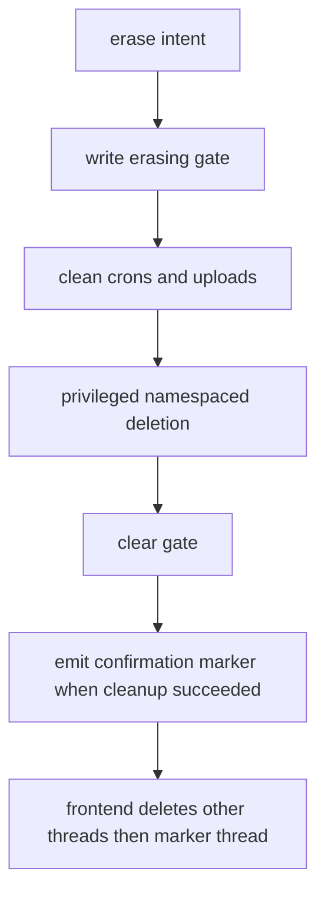

# Member data, documents, reminders, and erasure

`agent/store_data.py` owns member persistence through the closed namespace form `("users", user_id, collection)`. Writable collections include metrics, injections, reminders, feedback, upload registry, profile/episodic memory, operations, events, and the erasure gate. Tools derive `user_id` from authenticated configuration, not a client field. Writes call the privacy sanitizer, revalidate typed records, and use `index=False`; invalid namespaces, cross-user paths, scanner failure, and write-during-erasure fail closed.

## Documents: reserve, consume, review

`post_upload()` manually parses bounded multipart input. It accepts one PDF/JPEG/PNG only when extension and magic match, caps it at 10 MiB, creates an atomic owner/thread-bound 15-minute reservation, and keeps raw bytes only in the request buffer. Status moves `uploading → scanning → extracting → done` or `error`; only a scrubbed proposal can enter storage and the buffer is cleared in `finally`.

On a valid one-time stream admission, `claim_document()` creates an idempotent operation before `review_document()` consumes/deletes the registry record and creates a member-review interrupt. Accepted fields pass `sanitize_memory_field()` before profile write; declined or unsafe fields are not remembered. Missing/expired/replayed reservations produce a generic unavailable result, not data recovery.

## Reminders and schedule events

Schedule state is derived from append-only `ApprovalEvent`s sorted by `(created_ts, event_key)`; stale reschedule/cancel targets become `declined-stale`. Reminder records validate local time, IANA zone, title, active state, binding, and wake token. The cap is ten active reminders per user. Editing rotates the token; cancellation is soft.

A reminder is persisted inactive before cron creation, reconciles ambiguous creation/duplicates, then becomes active. Cron delivery is accepted only when active reminder, thread, user, and wake token all match; member requests cannot originate a cron wake. Queue conflict is retryable at the server scheduler boundary rather than authorization bypass.

## Erasure ordering

`erase_my_data()` writes the erasing gate, cleans remote crons/upload reservations, calls privileged `delete_all_for_user()`, clears the gate in `finally`, and emits `erase_confirmation_v1` only after successful remote cleanup. The privileged capability is not client-forgeable. The frontend then snapshots owned threads, deletes non-current threads first, and deletes the confirmation-bearing current thread last; a failure is fail-stop and retryable so the marker survives.

Caption: confirmation is deliberately downstream of cleanup and deletion; partial failure preserves a retryable boundary.

## Focused evidence

`tests/agent/test_store_data.py` covers namespaces, scrubbing, pagination, schedule fold/idempotency, reminder caps/tokens, data scopes, write gate, and privileged deletion. `tests/agent/test_documents.py` covers no-spooling parsing, claim-before-consume, review, scrub/drop, and crash recovery. `tests/agent/test_reminders.py` covers create/edit/cancel/delivery/cleanup. Run those plus the tool tests named in `AGENTS.md` after changing a record schema. Route selection is [coach routing](coach-routing.md); incoming authorization is [member perimeter](member-perimeter.md).
