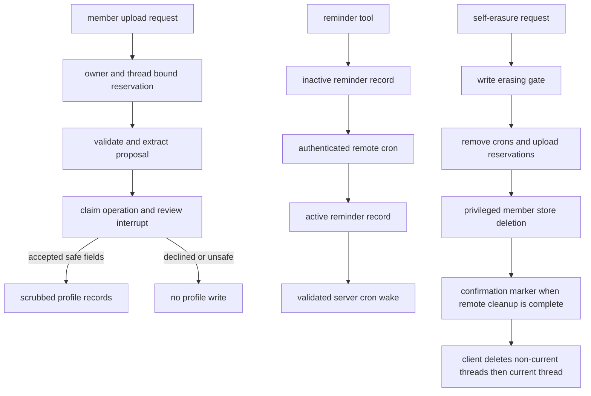

# Member data lifecycle, reminders, uploads, and erasure

The coach keeps application-owned member records in the LangGraph `BaseStore` under the closed namespace `("users", user_id, collection)`. The permitted collections are metrics, injection logs, reminders, feedback, upload registry entries, profile and episodic memory, operation records, schedule events, and gate records. Namespace validation binds every helper to its requested user and allowlisted collection; persisted values are privacy-scrubbed, validated where a typed model applies, and written with `index=False`. The authenticated principal supplies `user_id` to graph tools rather than a client-provided field. See [member perimeter](member-perimeter.md) for the request boundary and [privacy sanitizer](../privacy/sanitizer.md) for the sanitizer.

## Lifecycle at a glance

Caption: upload, reminder, and erasure paths persist enough state to reject replay or recover safely, while raw upload bytes are kept only for the request lifetime.

## Persistence and schedule state

The store helpers provide the common persistence boundary for records such as metrics, injections, profile memory, reminders, upload reservations, and idempotent operations. Before ordinary writes, `guard_user_write()` rejects the operation when the member's `gate/erasing` record exists. A privacy scan exception therefore prevents the write, and the gate prevents concurrent normal writes during self-erasure.

Schedule state is not a separate mutable collection. Approved `ApprovalEvent` records are read in `(created_ts, event_key)` order and folded into active `ScheduleEntry` values. An operation id is idempotent: a repeated append returns the existing event. A reschedule or cancel whose target is absent or already inactive is persisted as `declined-stale`, leaving derived state unchanged. This permits deterministic pagination and recovery without treating a stale approval as a new mutation.

## Upload admission and review

`POST /coach/uploads` is the HTTP entrypoint. Its multipart reader requires exactly `upload_id`, `thread_id`, and one file, bounds the request including multipart overhead, and accepts PDF, JPEG, or PNG only when the MIME type, filename extension, and later file signature agree. The maximum file size is 10 MiB. It does not use framework multipart spooling; it holds the request body in a `bytearray` and clears that buffer in `finally`.

Before extraction, the handler verifies that the authenticated member owns the supplied target thread. It creates a deterministic reservation thread with owner and intended-thread metadata plus a 15-minute TTL, then stores a matching upload-registry record. Repeating the same reservation returns its current stage only if the reservation metadata matches; a conflicting upload id is rejected. Processing advances through `uploading`, `scanning`, `extracting`, and either `done` or `error`. The stored proposal contains privacy-scrubbed candidate fields and non-content metadata; no raw upload bytes are persisted. Status lookups also require the requesting member to own the registry record and distinguish missing from expired uploads.

The member perimeter admits an attachment only once for a run, after rechecking owner, intended thread, completion status, and expiry. It records `admitted` rather than `consumed`, so the graph may make the first claim; a resend is denied at the perimeter.

`claim_document()` derives the authenticated user and current thread from graph configuration. It accepts only a non-expired, completed, unconsumed registry record bound to that thread and containing a proposal. It hashes the canonical claim data into an idempotent pending `OpRecord`, clears the attachment from graph state, and moves to `review_document`. Absent, expired, replayed, cross-thread, malformed, or otherwise invalid input returns the same re-upload message instead of recovering document data.

`review_document()` first removes the registry entry, then uses the persisted operation payload for its interrupt and replay behavior. If the operation has already reached a terminal state, it returns the saved result rather than applying it again. On an accepted decision, each selected field is passed through `sanitize_memory_field()` before a deterministic profile record is written. A declined decision writes no profile facts; an unsafe accepted field is discarded with a privacy notice. The terminal operation records `applied` or `declined`, making resumed review exactly-once for the resulting profile writes.

## Reminders and authenticated cron delivery

A `ReminderRecord` stores an owner-scoped reminder id, title, weekday, local `HH:MM` time, IANA timezone, active flag, remote cron id, originating thread id, wake token, and next-run date. The store validates time and timezone and limits a member to ten active reminders across all of their threads. Titles are independently passed through `sanitize_memory_field()` before scheduling. Every edit rotates the wake token; cancellation is a soft cancel that sets the record inactive and clears its cron id.

Creation is deliberately two stage: `create_reminder_impl()` persists an inactive record first, creates the remote cron, then finalizes the record as active with the cron id and next date. Remote requests carry platform and internal credentials plus the internal owner, schedule a `coach` run for the record's thread, and use enqueue semantics. If a create or update has an ambiguous network outcome, the implementation searches remote crons by member and reminder metadata, chooses one canonical cron, and removes duplicates. A definite create failure leaves the local record inactive; an edit failure likewise leaves its rotated record inactive. These outcomes prevent a stale credential from authorizing an old scheduled wake.

A delivery wake carries the reminder id, member id, thread id, and wake token. The gate does not accept it in member context, and `reminder_delivery()` independently requires a valid, active stored record with matching reminder, thread, and constant-time wake-token comparison. Invalid wakes are cleared without creating a message. A valid wake produces a reminder card without model or memory access and does not expose the wake token.

Cleanup supports both individual and broader deletion. Cancellation pauses local state before deleting the recorded cron and any remote cron matching the reminder metadata; incomplete remote cleanup reports a retryable failure. `cleanup_user_crons()` deletes known crons, searches for metadata-orphaned crons, and succeeds only when a final search is empty. `sweep_upload_reservations()` similarly removes owner-filtered reservation threads and registry records and requires both sets to be empty. For ordinary thread deletion, the perimeter calls `prepare_thread_deletion()`: it places a cleanup marker, pauses reminders associated with that thread, and removes matching remote crons before allowing the thread deletion. A cleanup error leaves deletion retryable rather than deleting the thread first.

## Two-phase self-erasure

A recognized erasure request is routed by the model-free coach gate to `erase_my_data()`. The node writes `("users", user_id, "gate")/"erasing"` before cleanup. It then uses the deployment cron client to remove all known and orphaned member crons and all member upload reservation threads and registry entries. It calls `delete_all_for_user()` only with the module-private coordinator capability. That deletion first enumerates and validates every namespace below the member prefix, then deletes every item from every allowlisted non-gate namespace; malformed namespaces fail before deletion begins. The erasing gate is intentionally excluded until the `finally` block removes it.

The graph emits `erase_confirmation_v1` only when both remote cleanup routines report exact-zero remaining resources. If remote cleanup reports incomplete after the store deletion, no confirmation is emitted, so the external phase cannot start; exceptions still clear the gate and surface as a failed graph run. The marker is therefore a completion latch, not merely an acknowledgement of intent.

The `scripts/forget_member.py` member-side procedure is phase two. It waits for the erase run to reach EOF or a non-busy status, verifies the marker from the stream or current thread state, snapshots every owned thread before deleting any, deletes sorted non-current threads, and deletes the marker-bearing current thread last. Any missing marker, polling timeout, or deletion failure stops the procedure; because the current thread remains until last, the marker gives a retry boundary.

## Configuration and focused tests

The remote cron and reservation client targets `LANGGRAPH_API_URL` (default `http://localhost:2024`) and authenticates service calls with `LANGSMITH_API_KEY` and `COACH_INTERNAL_TOKEN`. Upload reservation calls use the same internal credentials. Deployment setup and the meaning of these service credentials belong in [deployment operations](../operations/deploy.md).

Focused coverage is in `tests/agent/test_store_data.py` for namespaces, sanitizer failure, event folding, reminder limits, expiry, write gates, and capability-protected paginated deletion; `tests/agent/test_documents.py` for bounded non-spooled parsing, raw-buffer release, claim/review replay, scrubbing, and invalid attachment rejection; and `tests/agent/test_reminders.py` for inactive-first scheduling, reconciliation, failure states, validated delivery, and erasure cleanup. `tests/test_forget_member.py` covers the second-phase marker latch, polling, complete thread snapshot, and fail-stop deletion order.
