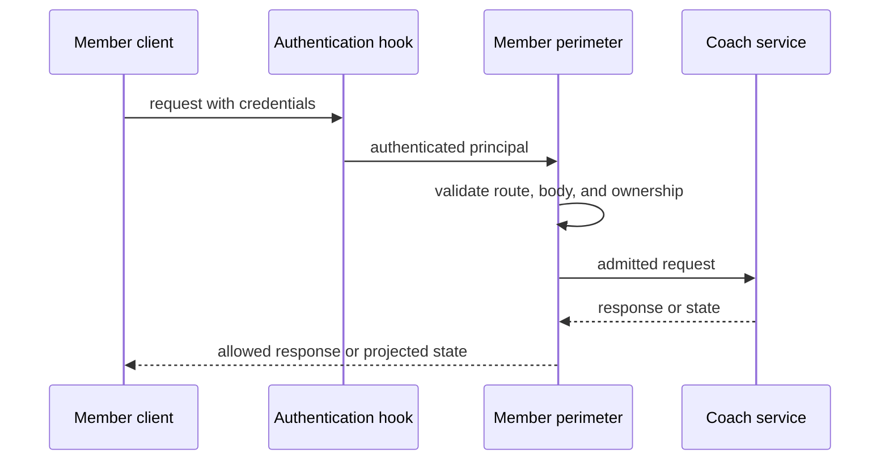

# Member authorization perimeter

The member API is protected in layers rather than trusting the client protocol. `langgraph.json` wires the LangGraph auth object and custom Starlette app, runs authentication before middleware (`auth_first`), protects custom routes (`enable_custom_route_auth`), and leaves MCP and A2A unmounted (`disable_mcp`/`disable_a2a`). The custom app installs `MemberPerimeterMiddleware`; the middleware validates the member-facing HTTP contract before dispatch and applies selected response checks afterwards. The same `healthcare_rag/agent/auth.py:auth` object and the same `MemberPerimeterMiddleware` are also loaded by the [clean-room agent server](../server/agent-server.md) (`server/`), which enforces them through an independent policy engine described below.



Caption: authentication precedes member request validation, and state is projected only after a successful downstream response.

## Principals and authorization scope

`supabase_bearer()` handles three principal types:

- **Member.** A Bearer request is verified against the configured Supabase user endpoint. The resulting principal is identified by the returned user ID and assigned the `member` role. A bounded, control-character-free display name may be copied from `app_metadata`; browser-writable `user_metadata` is not read. Missing configuration, malformed identity, HTTP failure, or invalid JSON produces 401.
- **Internal service.** Requests carrying internal headers must satisfy both configured secrets; the implementation uses constant-time comparison. The route signature derives a narrow `reservation` or `cron_ops` sub-role. Reservation traffic cannot nominate an internal owner; cron operations must carry an owner before they can obtain owner scope.
- **CORS preflight.** `OPTIONS` receives an authenticated preflight principal so the configured CORS middleware can respond without member credentials.

Authorization handlers establish the data boundary independently of request validation. A member thread creation overwrites metadata with the authenticated `user_id`; thread read, search, delete, and run creation are scoped to that ID. Members cannot submit `cron_wake`. Assistant reads are available to the platform authorization layer, while the perimeter restricts member assistant search to `coach`; this accommodates the platform's metadata-only assistant filtering without allowing a member to select a different graph. Run cancellation is likewise scoped to the owning member. Internal reservation access is limited to upload-reservation threads, and internal cron operations are owner-scoped. An internal graph-run wake is accepted only in its exact expected shape and only with matching thread and user scope.

## Member contract and ownership checks

Except for `/ok`, a request without a principal is rejected with 401. Internal traffic can reach native resources and only its dedicated internal-version custom route; it is denied from other `/coach/` routes. Member traffic goes through `validate_member_request()`, which rejects noncanonical paths, unlisted methods/routes, unexpected query strings, malformed JSON, and fields outside each route's contract.

The allowlist is intentionally small. It includes thread creation, constrained thread search, owned thread read/delete/copy, state read, coach assistant search plus its `schemas` and `graph` subresources, and a fixed run-stream endpoint. It also admits the custom upload, upload-status, and feedback endpoints, whose handlers perform their own validation and member ownership checks. Thread search permits only a defined public projection and bounded pagination. Thread creation accepts either an empty object or a UUID thread ID with empty metadata; middleware replaces the body with authenticated ownership metadata before the native handler receives it.

The middleware performs checks that require live state rather than just syntax:

- Copy first loopbacks to the owned source thread and rejects a non-owned source. It also verifies that the returned copied thread has the caller's ownership metadata, and returns 502 if the copy response is unreadable or its ownership does not match the caller.
- Before deleting a thread, it verifies (via a loopback self-call) that the caller still owns the thread, then invokes reminder/cron cleanup. If cleanup is not ready, it returns a retryable 503 instead of deleting first. After the native delete response, it re-checks that the thread is gone before treating the delete as final; only then does it clear the cleanup marker and return 204.
- An attachment on a stream run must reference a completed, unexpired upload-registry record owned by the caller and bound to the URL thread. The middleware marks it admitted before graph execution, preventing a second admission. The associated upload flow and later document claim are documented in [member data lifecycle](member-data-lifecycle.md).

## Run and stream constraints

For the direct member run envelope, the assistant is fixed to `coach`, subgraphs are off, durability is `exit`, and existing-run behavior is `reject`. The body contains exactly one of a constrained `input` or a constrained resume `command`. Input admits `question` and, only with the exact document-review question, `attachment_id`; a resume consists of `accept` and optional string key/value fields. Arbitrary run options, state updates, graph selection, and cron input are not part of this contract.

`HC_RAG_MEMBER_STREAM_PERIMETER` is read at import and defaults to `v1`. In v1, the direct run stream is updates-only, non-resumable, and rejects a concurrent task. In v2, its stream modes must include `updates` and may additionally include `messages` or `values`; resumability is on and concurrent turns are enqueued. V2 also admits owned history, run join and join-stream reads, and a constrained cancel query. The matching browser build setting is `NEXT_PUBLIC_HC_RAG_MEMBER_STREAM_PERIMETER`; deployment must align it with the server mode because the accepted wire contract differs. Production deployment configuration selects v2.

V2 also enables ThreadStream transport: `POST /threads/{id}/stream/events` accepts a validated subscription, and `POST /threads/{id}/commands` accepts only `run.start`, `input.respond`, `state.get`, `state.listCheckpoints`, and `state.fork` with method-specific parameter validation. Checkpoint configuration cannot bind a different thread, interrupt responses are root-namespace only, and unknown commands or mutation-oriented fields fail with 400. V1 rejects both ThreadStream routes.

The perimeter additionally recognizes the measured CopilotKit/AG-UI run shape on the regular stream endpoint. It permits only enumerated adapter fields and stream modes, a `coach` graph identifier or resolved assistant UUID, validated client-state fields, and its narrowly tolerated resume echo. This is a compatibility exception for the browser adapter, not a general-purpose run envelope.

## Safe response and custom-route boundaries

A successful `GET /threads/{id}/state` is decoded and reduced to `values`, `interrupts`, `tasks`, and `next`. `pending_document_op_id` is removed recursively. If the resulting payload contains a non-null private state channel—including raw question, attachment identifier, cron wake, or pending document operation—the entire response is replaced by a 500 unsafe-state error rather than returning a partial response. Malformed or non-bufferable state responses fail the same way. Keeping `tasks` and `next` is intentional: the CopilotKit adapter consumes them after a run.

Custom routes are also inside the authenticated perimeter. Upload status reads the caller's own registry namespace; feedback first confirms the caller can read the nominated thread and state, finds the nominated message, and stores feedback in the caller's namespace. CORS for these routes permits `COACH_ALLOWED_ORIGINS`, credentials, `GET`/`POST`/`DELETE`/`OPTIONS`, and authorization/content-type headers.

## Two enforcement engines, one authorization object

The same `healthcare_rag/agent/auth.py:auth` instance is enforced by two independent runtimes:

- **LangGraph platform deployment.** `langgraph.json`'s `auth.path` registers `auth` with the LangGraph platform's own SDK middleware, which authenticates, calls the `@auth.on` handlers, and applies the returned scope filters to native resources.
- **Clean-room agent server.** `server/auth.py` loads the identical `Auth` instance (`load_auth_instance`) and re-implements the same contract itself: `AuthMiddleware` authenticates every request except the public `/ok` and `/info` paths, and `AuthPolicyEngine.run_policy` looks up and invokes the same `@auth.authenticate`/`@auth.on` handlers, translating a handler result of `None`/`True` into an allow, `False` into a 403, and a `dict` into a scope filter.

The clean-room server's route modules (`server/threads.py`, `server/runs.py`, `server/crons.py`, `server/assistants.py`, `server/protocol_stream.py`) apply that scope filter with two distinct, deliberately different failure shapes: `require_scope_match()` compares a specific resource's metadata against the filter (supporting `$eq`/`$contains` terms) and raises 404, not 403, on a mismatch, so a member cannot distinguish another member's resource from one that does not exist; `merge_scope_filter()` instead folds the filter into a search/list query, so a scope mismatch simply omits results rather than raising an error. An explicit `False` from a handler (for example `deny_all`) still surfaces as 403.

## Studio and failure-closed behavior

LangSmith Studio auth remains enabled (`disable_studio_auth: false`). A `StudioUser` is allowed through authorization handlers and bypasses the *member* request-shape middleware: it is a workspace operator/development path, not a member principal. This exception does not make anonymous traffic valid; missing principals remain unauthorized, and ordinary member requests retain the strict contract.

The clean-room server has a second, narrower development exception. `SERVER_LOCAL_DEV` (env-controlled, default off) is read only by `server/auth.py`'s `AuthMiddleware`: when true, *any* 401 raised by the authenticate handler — missing credentials, an unrecognized `x-api-key`, or otherwise malformed authorization — is remapped to a `StudioUser("langgraph-studio-user")` principal with full authorization-handler access, mirroring the platform Studio bypass. This is strictly a local-development convenience: production images set `SERVER_LOCAL_DEV=0` and deployment configuration deliberately leaves it unset, so a 401 on the deployed server always stays a 401.

The boundary is designed to reject rather than infer authority: missing or failed authentication returns 401; invalid member routes/envelopes normally return 403 (or 400 for malformed JSON and designated stream protocol errors); ownership and attachment failures are denied (403 in the member perimeter, or 404 for a clean-room scope mismatch on a specific resource); unsafe state projection returns 500; failed deletion preparation returns 503; and a corrupted or ownership-mismatched copy response returns 502. The graph and storage layer remain responsible for their own checks, so perimeter admission does not replace owner-scoped native authorization.

## Configuration and focused tests

Relevant configuration is `langgraph.json` (auth/custom-app registration, `auth_first`, custom-route authentication, Studio auth, and disabled MCP/A2A), `COACH_ALLOWED_ORIGINS` (CORS; the clean-room server warns at startup if it names origins absent from its own `CORS_ALLOW_ORIGINS`), `HC_RAG_MEMBER_STREAM_PERIMETER`/`NEXT_PUBLIC_HC_RAG_MEMBER_STREAM_PERIMETER` (server and browser stream contract, must match), and `SERVER_LOCAL_DEV` (clean-room server Studio-bypass-on-401 exception, must stay unset/`0` in production). Deployment-specific values and the requirement that production not use local-development settings are covered in [deployment topology and release acceptance](../operations/deploy.md); API hosting behavior is covered by the [clean-room agent server](../server/agent-server.md).

Run focused checks with:

```bash
uv run pytest tests/agent/test_auth.py tests/agent/test_perimeter_composed.py tests/agent/test_perimeter_studio.py tests/agent/test_perimeter_v2.py tests/agent/test_perimeter_copilotkit.py tests/server/test_auth_engine.py -q
```

These tests cover principal construction, dual-secret internal access, member scoping, allowlist/envelope rejection, state projection, Studio bypass, version-gated streaming, ThreadStream command validation, the supported browser-adapter wire shape, and the clean-room server's scope-match/local-dev semantics.
