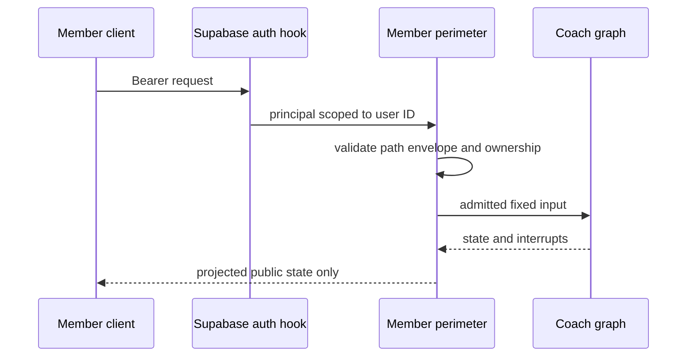

# Member authentication and API perimeter

The client protocol is a convention; server authorization is the security control. `langgraph.json` configures `healthcare_rag/agent/auth.py:auth`, `healthcare_rag/agent/http_app.py:app`, auth-first ordering, and custom-route auth. `http_app.py` and the hosting server install `MemberPerimeterMiddleware`.

## Principals and scope

`supabase_bearer()` validates a member Bearer token through Supabase and retains only its `id`, not email. Missing configuration, malformed identity, or verification failure returns 401. Internal calls require both constant-time compared `LANGSMITH_API_KEY` and `COACH_INTERNAL_TOKEN`; route-derived subroles narrow them to `reservation` or `cron_ops`. `OPTIONS` gets a preflight principal; `SERVER_LOCAL_DEV` is a development-only Studio bypass, not production authentication.

Auth hooks overwrite member-created thread metadata with the authenticated user ID, scope member read/search/delete operations to that ID, forbid member `cron_wake`, and restrict members to assistant `coach`. An internal cron call must have the exact server-generated shape and matching thread/user scope.

## Strict member protocol

`validate_member_request()` in `agent/perimeter.py` allowlists health, selected thread/state operations, run streaming, uploads/status, and feedback. It rejects arbitrary native routes, noncanonical paths, unwanted query strings, unknown JSON fields, malformed IDs, and non-fixed run envelopes. A member run uses assistant `coach`, updates-only streaming, exit durability, and exactly one of input or resume command. Input admits only `question` plus optional `attachment_id`; an attachment needs the exact review sentinel. Resume is only `{accept, fields?}`.

The middleware rechecks thread ownership on copy/delete, injects identity on create, admits an attachment only once when owner/thread/status/TTL are valid, and projects state to public `{values, interrupts}`. Private channels such as raw question, attachment ID, cron wake, and pending document operation never leave the boundary; projection failure is a 500 rather than a partial leak.

Caption: identity and request shape are validated before graph execution; response projection is enforced after it.

## Failure and test evidence

Cross-user, expired, replayed, or cross-thread attachments fail closed. Client-provided user IDs, assistant IDs, cron wakes, metadata, state channels, and arbitrary streaming modes never gain authority. Studio may bypass member-shape checks but is not a member principal.

Run `uv run pytest tests/agent/test_auth.py tests/agent/test_perimeter_composed.py tests/agent/test_perimeter_studio.py tests/agent/test_server_perimeter.py -q`. These tests establish dual-secret internal auth, member scoping, envelope grammar, Studio behavior, CORS, attachment admission, and feedback isolation. The frontend mirror is [member frontend](../frontend/member-frontend.md); data cleanup is [member data lifecycle](member-data-lifecycle.md).
