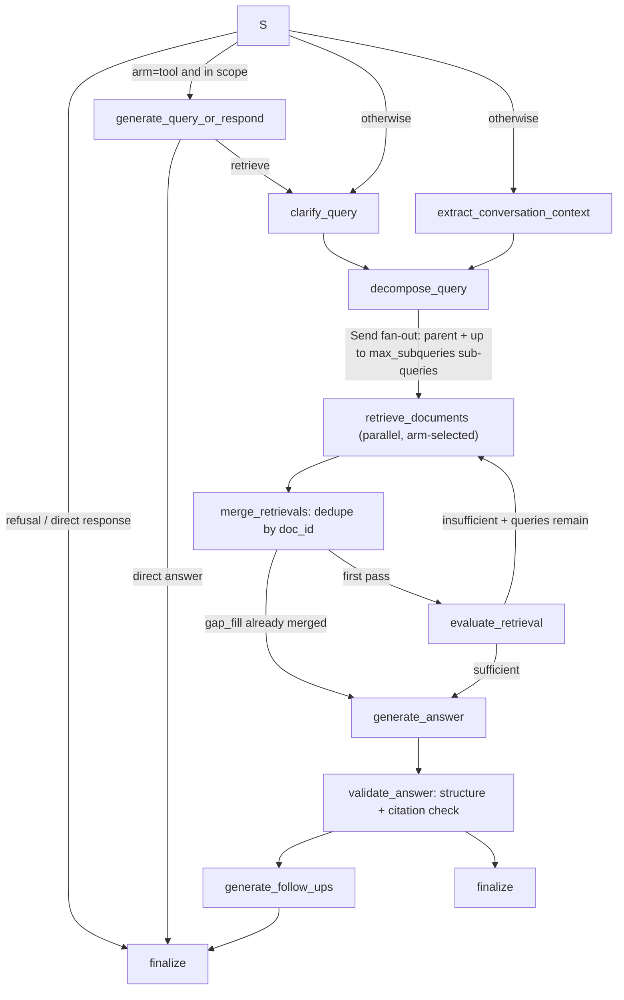

# LangGraph runtime architecture

The runtime is a LangGraph `StateGraph` — the speculative orchestrator (`healthcare_rag/orch/`) and the old linear `MedicalRAG` pipeline were removed in the Phase-2 cleanup. The CLI enters at `healthcare_rag/__main__.py`, loads `.env`, and calls `build_engine()` to get a `GraphEngine` (`healthcare_rag/cli/interactive.py`); the engine owns the compiled graph, its checkpointer, and per-thread history (`healthcare_rag/graph/engine.py`). The same graph is served by the local LangGraph Agent Server (`langgraph.json` → `healthcare_rag/graph/__init__.py:graph`, `make dev`); `langgraph.json` also serves the separate [coach agent](../agent/coach.md) graph (`coach`) with its own auth and HTTP app.

## Graph topology

`build_graph()` (`healthcare_rag/graph/build.py`) composes the public graph from `add_pipeline` plus the terminal-side nodes `safety_gate`, `generate_query_or_respond`, and `finalize`. In the **public graph**, `START → safety_gate`; a gate terminal decision enters `finalize`, then the explicit `finalize → END` edge ends the request. In the internal `build_pipeline()`, there is no gate/finalizer: `START` fans to preprocessing and the `validate_answer` path map sends its `finalize` label directly to LangGraph `END`. Node names are canonical constants in `healthcare_rag/graph/routers.py` (`NODE_SAFETY`, `NODE_QUERY_OR_RESPOND`, `NODE_CLARIFY`, `NODE_CONTEXT`, `NODE_DECOMPOSE`, `NODE_RETRIEVE`, `NODE_MERGE`, `NODE_EVALUATE`, `NODE_GENERATE`, `NODE_VALIDATE`, `NODE_FOLLOW_UPS`, `NODE_FINALIZE`). Decision-owning nodes (`safety_gate`, `generate_query_or_respond`, `decompose_query`, `merge_retrievals`, `evaluate_retrieval`) return `Command[Literal[...]]`; their `goto` owns outgoing routing, while ordinary sequencing is wired as explicit edges. `tests/graph/test_router_typing.py` pins every literal to the constants, node annotations, and compiled edges.

Caption: one safety pass, optional tool-arm routing decision, parallel preprocessing, capped retrieval fan-out via LangGraph `Send` (per-arm search + optional rerank), at most one gap-fill round, then generate → validate → follow-ups → finalize.

### Routing rules (`graph/routers.py`)

* `route_after_gate`: a `safety_response` (refusal) or a `direct_response` (deterministic-arm social answer) goes straight to `finalize`; when `response_action == "query_or_respond"` or (`query_response_arm == "tool"` and the gate said `in_scope_informational`), the turn goes to `generate_query_or_respond`; otherwise safe queries fan in to `[clarify_query, extract_conversation_context]`, which both edge into `decompose_query`.
* `route_after_query_or_respond`: a `direct_response` finalizes; anything else fans into the two preprocessing nodes.
* `route_after_decompose`: always `Send`s the parent (working) query to `retrieve_documents`; if `decomposed`, it also sends up to `settings.max_subqueries` sub-queries (the `HC_RAG_MAX_SUBQUERIES` cap is now enforced here directly; there is no separate hard-coded fan-out constant). There is no supersession — all retrievals append into state.
* `route_after_merge`: after a gap-fill merge (`gap_filled`) skip re-evaluation and go to `generate_answer`; otherwise `evaluate_retrieval`.
* `route_after_evaluate`: if `gap_pending` (evaluation said `is_sufficient=False`, `gap_round == 0`, and nonempty `additional_queries` capped at 3), `Send` the gap-fill queries back to `retrieve_documents` with `phase=1, kind="gap_fill"`; otherwise `generate_answer`. Only **one** gap-fill round ever runs.
* `route_after_validate`: follow-ups (when enabled) or finalize.

### Nodes

* **`safety_gate`** (`graph/nodes/safety.py`, classification adapter in `nodes/safety_classifier.py`): wraps `SafetyGate.evaluate` via `LangChainSafetyGate` (LLM adapter is fail-soft). Emits a full per-turn **reset** of all downstream state — now including `direct_response`, `response_action`, `query_router` — so a checkpointed thread cannot leak stale results from a previous turn, then the scrubbed query, `SafetyOutcome`, refusal/direct template, and notices. When `HC_RAG_REFUSAL_BOUNDARY` is on, a matching persisted refusal in `refusal_boundaries` short-circuits **before** any LLM call (`boundary_replay`), and new qualifying refusals are upserted into that state field. Full policy on the [safety gate](../safety/gate.md) page; the scrubber itself is the [Presidio privacy sanitizer](../privacy/sanitizer.md).
* **`generate_query_or_respond`** (`graph/nodes/query_or_respond.py`): runs only when `HC_RAG_QUERY_RESPONSE_ARM=tool`. One tool-calling LLM decision (`LangChainLLMGateway.aquery_or_respond`, prompt `query_or_respond.yaml.j2`, single `retrieve_monographs` tool, `parallel_tool_calls=False`) either answers directly or defers to retrieval. Benign-social turns (gate-validated `benign_social` + `social_intent`) get the deterministic `social_response(intent)` text on any fallback; a direct answer is only emitted after passing the [direct-output policy](../privacy/sanitizer.md); every other outcome falls through to retrieval. Telemetry lands in the `query_router` state channel. Focused tests: `tests/graph/test_query_or_respond.py`, `test_query_or_respond_direct_safety.py`, `test_query_or_respond_privacy.py`.
* **`extract_conversation_context`** / **`clarify_query`** / **`decompose_query`** (`graph/nodes/preprocess.py`): typed structured calls with fail-soft defaults. Clarify only runs with history context and records a `clarified` branch event when the text changes; decompose applies the complexity gate and `HC_RAG_MAX_SUBQUERIES` cap.
* **`retrieve_documents`** (`graph/nodes/retrieve.py`): routes the query with `gateway.aroute_tools` (fail-soft), resolves the configured retrieval arm (`_ARMS`: `weaviate` → `hybrid_search`, `pageindex` → `pageindex_search`, `pinecone` → `pinecone_search`; an injected `resources.hybrid_search` always wins), optionally asks for `rerank_candidates` and reranks down to `rerank_top_k` (see [retrieval arms](../retrieval/arms-and-reranking.md)), retries up to 3 times (1 s/2 s backoff on the arm's SDK error class), `union_results` dedupes by `doc_id`, and appends an envelope (`phase`/`kind`/`index`/`branch`/results) to `retrievals`. Non-gap-fill retrievals also append `branch_events` (COMPLETED/FAILED). See [retrieval](../retrieval/weaviate-and-ingestion.md).
* **`merge_retrievals`**: sorts envelopes by `(phase, kind rank, index)` (`initial/clarified < decomposed < gap_fill`) and merges into `merged`; sets `gap_filled` when a phase-1 merge added documents.
* **`generate_answer`**: no merged documents → fixed fallback `"I'm sorry, I don't know the answer to that question."`; otherwise one plain completion with the conversation summary context, producing `plain_answer`, `formatted_docs`, `prompt_id_map`. The model answer is PHI-scrubbed before it enters state.
* **`validate_answer`**: `validate` disabled in `HC_RAG_DISABLE_STAGES` → passes the scrubbed raw answer through; missing merged docs → `(None, None)` without a call; otherwise runs `AnswerValidator.structure_and_validate_async` (threshold 85) inside try/except — validation must never fail open, exceptions yield `(None, None)`. Structured statements and citations are scrubbed before persisting. See [answer validation](../processors/validation.md).
* **`generate_follow_ups`**: only when a validated answer and `user_id` exist; disabled or failure yields `[]`.
* **`finalize`** (`graph/nodes/safety_finalize.py`): refusal answers join notices + template; `direct_response` answers pass through unchanged (and clear retrieval/generation state); normal answers are `render_display_answer(validated, notices)` (notices prefixed). Everything is scrubbed again on write. Appends the `HumanMessage`/`AIMessage` pair (with ISO `ts`) to `messages` **only when the answer is nonempty** — that pair is the persisted conversation.

## State and engine

`RAGState` (`graph/state.py`) is JSON-native; the exceptions are `messages` (LangGraph `add_messages` channel) and the append-only `retrievals`/`route`/`branch_events` reducers. `refusal_boundaries` holds serialized persisted refusals (see [safety gate](../safety/gate.md)). `RetrieveInput` is the per-`Send` retrieval payload.

`GraphEngine` (`graph/engine.py`):

* Compiles `build_graph()` with an `InMemorySaver`, or an async SQLite saver when `HC_RAG_CHECKPOINT=sqlite:...` (requires the `graph-sqlite` extra). Engine startup also calls `get_resources().privacy.initialize()` — a failed Presidio/spaCy init fails the turn, not silently disables scrubbing (see [privacy sanitizer](../privacy/sanitizer.md)).
* `process_query`/`run_turn` stream the graph with `stream_mode="updates"`, `durability="exit"`, feeding node updates to the `QueryMonitor`, capturing first-answer and finalize timings (direct responses surface at finalize), and folding the final checkpointed state via `build_result` into the legacy eval record (contexts, chunk/page/source IDs, folded branch statuses, direct response, usage, latency, error). A raised `PrivacyScanError` is recorded as its error code rather than a generic pipeline failure. Root inputs are PHI-scrubbed for LangSmith (`_redact_root_inputs` fails closed).
* `seed_history` writes scrubbed legacy turns into the thread checkpoint as messages (`graph/history.py`); conversation memory is now the checkpointer, not the old file-backed store — there is no `data/conversations` reader any more.
* `UsageRecorder` (an `AsyncCallbackHandler`) accumulates per-LLM-call model/tokens/latency for eval usage; one instance belongs to one turn.
* `describe()` reports engine config (`safety`, `max_subqueries`, `decompose_only_complex`, `structured_strict`, models, `reasoning_effort`) — read it when comparing experiments.

`fold_branches` (`graph/engine_record.py`) deterministically orders append-only `branch_events` by `(phase, kind rank, index)` — arrival order never changes telemetry — and marks the selected branch FAILED when validation produced nothing (and not a refusal, and validate not disabled).

## Shared resources

`Resources` (`graph/resources.py`) is the lazy process-wide owner: `PromptRegistry`, the `LangChainLLMGateway` (ChatOpenAI clients cached by tier/model/temperature/effort), the lazily-connected async Weaviate client (raises if `OPENAI_API_KEY` is unset), lazy Pinecone client/index handles (needed by the `pinecone` arm *and* the reranker), and the `PrivacySanitizer`. Tests override it via `override(Resources())` — see `tests/graph/conftest.py` (`FakeGateway`, `FakeRetriever`). The gateway's stage→tier rule: `validate_answer` uses the validator model, everything else the default model; `HC_RAG_STRUCTURED_STRICT=true` enables strict JSON-schema structured output. Sampling rules live in `services/model_sampling.py` (see [model configuration](../configuration/models-and-runtime.md)).

## Changing the graph safely

* Adding a node: define it in `graph/nodes/`, add its `NODE_*` constant (and matching `Literal` target — `test_router_typing.py` will catch drift), wire it in `build.py` (or `add_pipeline`), add state fields to `RAGState`, and reset the field in `safety_gate`'s per-turn reset if it must not leak across turns.
* Changing fan-out or the gap-fill round changes cost and retrieval breadth; validate with `make test` (`tests/graph/test_graph_routing.py`, `test_graph_flow.py`) plus a filtered eval.
* The graph tests in `tests/graph/` run offline against fakes; `tests/graph/test_graph_integration.py` and `test_graph_safety.py` cover end-to-end flow and gate behaviour; `tests/graph/test_prompt_fidelity.py` pins which prompt stage each node invokes; `tests/graph/test_direct_graph_integration.py` covers the tool-arm direct path end to end. `make eval-smoke` remains the end-to-end smoke.
