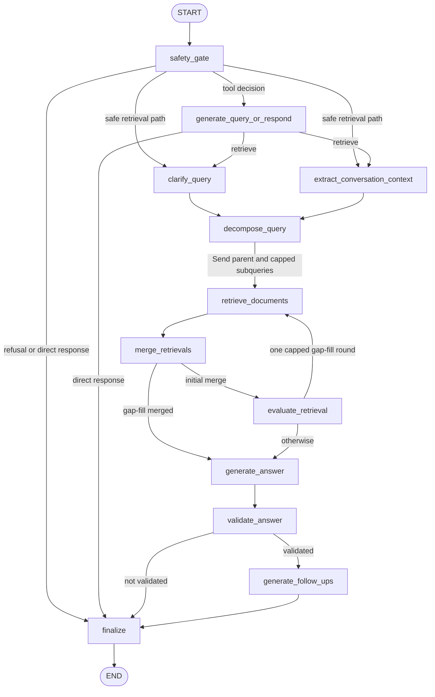

# LangGraph RAG runtime architecture

The active RAG runtime is a LangGraph `StateGraph`. `build_graph()` supplies the public graph with constrained `GraphInput` and `GraphOutput`; `GraphEngine` compiles and executes it for the CLI and other in-process callers. The LangGraph server separately exports the compiled `healthcare_rag` graph from `healthcare_rag/graph/__init__.py`; `langgraph.json` also registers a distinct `coach` graph (`healthcare_rag/agent/`). There is no `healthcare_rag/orch/` package in this codebase: any prior orchestrator of that name was removed during the Phase 2 port (commit `3435caf`), and `build_engine()` now states that the LangGraph engine is "the only runtime since the Phase-2 cleanup."

## Compiled graph and control ownership

The public graph starts at `safety_gate` and ends only after `finalize`. `add_pipeline()` provides the post-gate stages, while `build_pipeline()` is an internal, trusted post-gate variant: it starts directly with the two preprocessing nodes and maps validation's terminal path to `END` rather than `finalize`.

Decision nodes own their transitions by returning `Command` with a typed `goto`: `safety_gate`, `generate_query_or_respond` (via `route_after_query_or_respond`), `decompose_query`, `merge_retrievals`, and `evaluate_retrieval`. Ordinary sequencing is declared in the builder (`build.py`) as plain `add_edge`/`add_node` calls. `validate_answer` is deliberately different: a conditional edge (`add_conditional_edges` with `route_after_validate`) maps its `finalize` label to `finalize` in the public graph or to `END` in the internal pipeline — a fixed `Command` `Literal` cannot express a target that differs by builder. Canonical node-name constants (`NODE_*` in `routers.py`) and router target `Literal` aliases are pinned against the nodes' `Command` annotations and the compiled graph's edges by `tests/graph/test_router_typing.py`, and the full compiled topology is pinned against the committed `docs/graph.mmd` artifact by `tests/graph/test_graph_build.py`, so dynamic routes cannot silently drift from the topology.

This is the public compiled graph: safety or direct answers short-circuit to finalization; retrieval work fans out through `Send`, then rejoins before generation. The edges above are the same edges LangGraph renders for the compiled graph (`docs/graph.mmd`, enforced by `test_compiled_graph_mermaid_matches_committed_artifact`), simplified only in presentation (dashed `Command`-routed edges are drawn as labeled solid edges here for readability).

### Routing invariants

- The gate finalizes a refusal or precomputed direct response (`route_after_gate`, deterministic code reading state already set by the gate). A tool-arm turn enters `generate_query_or_respond` when `response_action == "query_or_respond"` or the configured `query_response_arm` is `"tool"` and the model-driven safety classification's category is `in_scope_informational`; otherwise a safe retrieval turn fans out to `clarify_query` and `extract_conversation_context`, both of which must complete (LangGraph's `add_edge([NODE_CLARIFY, NODE_CONTEXT], NODE_DECOMPOSE)` join) before decomposition.
- The query-or-respond node can finalize only a direct response (`route_after_query_or_respond`). All other outcomes rejoin the same two-node preprocessing fan-out.
- Decomposition (`route_after_decompose`) always sends the parent working query to `retrieve_documents` with `kind="clarified"` or `"initial"`. When decomposition is enabled and appropriate (a model-driven `decompose_query` decision, capped by settings), it additionally sends at most `max_subqueries` subqueries with `kind="decomposed"`. Each `Send` carries `phase`, `kind`, `index`, and `branch` metadata used later for deterministic ordering.
- Retrieval envelopes append to state (`retrievals` uses the `operator.add` reducer) rather than replacing each other. `merge_retrievals` sorts them deterministically by phase, kind, and index (via `RETRIEVAL_KIND_RANK`) before unioning results, then routes (`route_after_merge`) to `evaluate_retrieval` for an initial merge or directly to `generate_answer` once `gap_filled` is set.
- Evaluation (`route_after_evaluate`) can launch only one additional gap-fill round: it requires insufficient retrieval, `gap_round == 0`, and nonempty additional queries from the model's structured `evaluate_retrieval` judgment. The router caps that round at three `Send`s (`_GAP_FILL_CAP`), and the evaluation update advances `gap_round` to `1` before routing. A later merge therefore cannot re-enter evaluation.

## Nodes and data lifecycle

### Safety and response shortcuts

`safety_gate` first derives scrubbed, token-bounded history views (`build_history_views`) from checkpointed messages, then resets all per-turn downstream channels (`retrievals`, `merged`, `evaluation`, `gap_round`/`gap_pending`/`gap_filled`, `generation`, `validated`, `route`/branch-related fields, `error`, etc., via an `Overwrite`/reset update) before processing the new question. The reset is essential for a reused checkpointed thread: it clears prior retrievals, generation, validation, route events, direct-response fields, and error state. The gate writes a scrubbed question and working query, a model-driven safety classification outcome, notices, and either a refusal/direct response or (deterministically, via `route_after_gate`) a route into the retrieval pipeline.

When refusal boundaries are enabled, the gate can replay a persisted matching refusal (`boundary_hit`) before invoking the classifier; qualifying new refusals are upserted into `refusal_boundaries` (`upsert_boundary`). Classification adapter failures return the classifier default rather than propagating from that adapter.

`generate_query_or_respond` is active only when `query_response_arm == "tool"`. It makes one model-driven gateway decision (`aquery_or_respond`, a tool-call-shaped LLM invocation) and records safe router telemetry (`_telemetry`). A benign social turn (`out_of_scope` + `benign_social` + valid `social_intent`) may return a direct response; an in-scope informational turn is forced onto retrieval (`response_action = "retrieve"`) rather than accepting medical free text as a direct answer, guarding against the model incorrectly treating a clinical question as social chit-chat. `finalize` renders refusals with notices, preserves direct answers, or renders a validated answer with notices. It scrubs answer and follow-ups again at this output boundary.

### Retrieval, answer, and validation

The preprocessing fan-out has distinct responsibilities: clarification acts only when history context exists, context extraction summarizes relevant history, and decomposition decides (model-driven, subject to `decompose_only_complex` and similar settings) whether to create subqueries. Structured-call defaults make context extraction and decomposition continue with safe defaults when no model result is returned.

Each retrieval send (`retrieve_documents`, keyed by `RetrieveInput`) scrubs its query, uses tool routing (`aroute_tools`, fail-soft) to select collection queries, then dispatches the configured retrieval arm — `weaviate` (`hybrid_search`), `pageindex` (`pageindex_search`), or `pinecone` (`pinecone_search`); a resource-injected `hybrid_search` override always takes precedence over the configured arm. Routing failures are fail-soft (an empty tool-call list, logged as `RETRIEVAL_ROUTING_FAILED`). Weaviate and Pinecone transient SDK errors (`WeaviateBaseError`, `PineconeException`) are retried up to three times with one- then two-second delays (`_RETRY_DELAYS`); a terminal failure produces an empty envelope for that `Send` branch, allowing other fan-out branches to survive. Optional reranking (`reranker != "none"`) fetches a wider candidate set and trims it to `rerank_top_k`.

`generate_answer` returns a fixed unknown-answer fallback when the merged result has no documents; otherwise it generates (model-driven) from formatted retrieved documents and relevant conversation context, then scrubs the model output. `validate_answer` passes through a scrubbed answer only when validation is disabled (`disabled_stages`). With no merged data it produces no validated answer; otherwise citation/structure validation uses an 85 quote-match threshold and treats exceptions as validation failure, never as approval — this fail-closed rule means a validator crash cannot be mistaken for a validated answer. Follow-ups run only for a validated answer with a `user_id`; expected gateway failures return an empty list.

## State, durable history, and result projection

`RAGState` (`healthcare_rag/graph/state.py`) is primarily JSON-native. `messages` is the exception: it uses LangGraph's `add_messages` reducer for `HumanMessage` and `AIMessage`; `retrievals`, `route`, and `branch_events` are append-only reducer channels (`operator.add`), and `question` is deliberately `UntrackedValue` so the raw input question is not persisted in checkpoint history beyond the turn that produced it. `RetrieveInput` is intentionally narrower than full graph state and is the payload for each retrieval `Send`. The public `GraphOutput` exposes only answer, follow-ups, safety, selected branch data, and error — the graph's compiled `input_schema`/`output_schema` constrain what external callers can pass in (`GraphInput`: `question`, `user_id`) or see, independent of the much larger internal `RAGState`.

The checkpoint is the conversation store for an engine instance. `finalize` appends a scrubbed human/AI pair with a shared ISO-8601 timestamp only when there is a nonempty answer. On the next turn, the gate scrubs stored messages, token-trims them, and derives processed history and history text. `seed_history()` supports migration-style insertion of scrubbed legacy turns into a thread checkpoint as messages, applied via `aupdate_state(..., as_node="finalize")` so seeded turns look like normal finalized history.

`GraphEngine` uses `InMemorySaver` by default (empty `HC_RAG_CHECKPOINT`). `HC_RAG_CHECKPOINT=sqlite:...` selects an async SQLite saver (`langgraph.checkpoint.sqlite.aio.AsyncSqliteSaver`), initializes its schema (`saver.setup()`), and requires the `graph-sqlite` extra — its absence raises a `RuntimeError` at initialization rather than falling back silently. A checkpointer is supplied at compile time only by the engine (`build_graph().compile(checkpointer=saver, ...)`); the server-exported graph in `healthcare_rag/graph/__init__.py` is compiled without that engine-owned saver. This is the main graph-engine boundary: nodes describe state transitions and resource use, while the engine owns compilation lifecycle, checkpoint choice, thread configuration, execution telemetry, and projection to the legacy/evaluation-shaped result.

During a turn the engine streams updates with `stream_mode="updates"` and `durability="exit"`, forwards node status and answers to an optional `QueryMonitor`, and retrieves the final checkpoint snapshot (`aget_state`). It creates one `UsageRecorder` per turn (a LangChain callback passed via `config["callbacks"]`). `build_result()` (`engine_record.py`) converts persisted state into answer, raw answer, contexts and retrieval identifiers, branch status, usage, timing, router telemetry, and error fields, scrubbing router-sensitive telemetry keys (`ROUTER_SENSITIVE_KEYS`) along the way. `fold_branches()` sorts append-only branch events deterministically by phase/kind/index before folding, so parallel completion order does not alter reported branch telemetry, and marks the selected branch `FAILED` when validation was enabled but produced no validated answer.

## Failure and privacy boundaries

`GraphEngine.__init__` rejects the unavailable `semantic_router` safety-classifier selection immediately, raising `SafetyClassifierUnavailableError`. Engine initialization (`_initialize`) calls `PrivacySanitizer.initialize()` before compilation, so missing privacy runtime prerequisites fail initialization rather than silently disabling scrubbing. At the request boundary, `_redact_root_inputs` scrubs the traced root question and tracing fails closed to an empty input map (`{}`) if scrubbing itself raises, so LangSmith never retains an unscrubbed argument.

The engine catches unhandled turn exceptions in `_run`: `PrivacyScanError` is retained as its specific error string; other failures become `PIPELINE_EXECUTION_FAILED`. If state cannot be read after a non-privacy error (`aget_state` raises), it reports `PIPELINE_STATE_READ_FAILED` and projects an empty state. These errors are returned in the result record (and surfaced to `QueryMonitor.set_error` when present) rather than re-raised by `run_turn` or `process_query`.

## Safe extension and operations

When adding a stage, add its state contract and reset behavior in `safety_gate`'s reset map, a canonical `NODE_*` constant and typed router target in `routers.py`, builder registration/wiring in `build.py`, and focused routing/flow tests. Do not use a state field across turns unless the gate intentionally preserves it. A node that both updates state and decides the successor should compute its `Command.goto` from the post-update state (as `safety_gate`, `evaluate_retrieval`, and `decompose_query` do via helper functions like `_gate_command`/`_evaluate_command`), not from the state it was called with.

Changing decomposition caps, gap-fill behavior, retriever/reranker settings, disabled stages, query-response arm, or checkpoint URI changes runtime cost or behavior; `GraphEngine.describe()` reports the effective safety, retrieval, model, reranking, structured-output, and query-response settings for experiment comparison. Focused graph tests (`tests/graph/test_graph_build.py`, `test_graph_routing.py`, `test_graph_flow.py`, `test_branch_fold.py`, `test_engine_record.py`, `test_router_typing.py`) compile both graph variants, pin dynamic router behavior and the Mermaid topology against `docs/graph.mmd`, exercise deterministic merging and capped fan-out, and cover fail-soft retrieval and validation behavior. Run `make test` before changing graph topology; use the evaluation workflow for behavior and cost comparisons.
