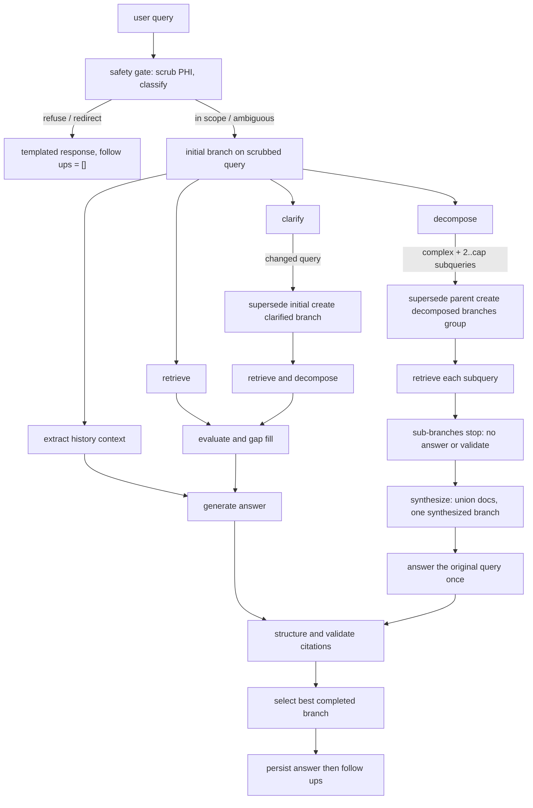

# Speculative execution architecture

The shipped CLI enters at `healthcare_rag/__main__.py#L8-L11`, builds `MedicalRAG` via `setup_medical_rag`, then calls `RefactoredOrchestrator.process_query` (`healthcare_rag/cli/interactive.py#L24-L44`). `MedicalRAG` is the composition root: one OpenAI client, prompt manager and parser service; one router; common-tier processors; and a validator-tier `AnswerValidator` (`healthcare_rag/pipeline/medical_rag.py#L63-L105`). See [processor map](../processors/overview.md) and [runtime configuration](../configuration/models-and-runtime.md).

## Orchestrated path

Each request resets orchestrator state, loads the user's last five history entries, and — when the [safety gate](../safety/gate.md) is on (default) — scrubs identifiers from history context and entries, then classifies the message before anything else (`healthcare_rag/orch/orchestrator.py#L101-L169`). A short-circuit decision (personal advice, emergency, out-of-scope, injection) returns a templated response with no follow-ups and never launches the pipeline. Otherwise the pipeline runs on the **scrubbed** query: history extraction starts, an `initial` branch is created (`healthcare_rag/orch/orchestrator.py#L171-L178`), and the branch launches **clarify**, **decompose**, and **retrieve** concurrently. History extraction is concurrent too, but answer generation waits for it.

This shows actual branch creation, the decomposition synthesis fan-in, and the answer dependency on both evaluated retrieval and history context.

### Branch lifecycle and ordering

`ProcessingBranch` owns query text, parent ID, task map, retrieval/merged results, raw/validated answer, and status `ACTIVE`, `SUPERSEDED`, `COMPLETED`, or `FAILED` (`healthcare_rag/orch/branch.py#L18-L53`). `launch_task` tracks asyncio tasks by branch; a failed task marks its active branch failed and cancels its remaining tasks (`healthcare_rag/orch/scheduler.py#L18-L45`, `#L67-L123`).

* **Safety short-circuit:** `_respond_from_policy` renders the templated refusal, may answer the classifier's `safe_reformulation` in a throw-away sub-orchestrator (`skip_safety_gate = True`, empty user id, branches copied back) and append it only if it passes the dosing/numeric addendum gates, persists the scrubbed query, and sets the monitor's raw-answer event so a waiting UI does not stall (`healthcare_rag/orch/orchestrator.py#L215-L270`). Gate behaviour, categories, and templates are documented on the [safety gate](../safety/gate.md) page.
* **Clarify:** if `clarified_query != branch.query`, cancel the source branch and create a `clarified` child with retrieve + decompose. No changed text leaves it alive.
* **Decompose (gated and capped):** fan-out only happens when the query is genuinely complex and multi-part. With `HC_RAG_DECOMPOSE_ONLY_COMPLEX` on (default), decomposition is skipped unless the decomposer labelled `query_complexity == "complex"`; fewer than two sub-queries never fans out; and the fan-out is truncated to `HC_RAG_MAX_SUBQUERIES` (default 3) with a warning logging the dropped sub-queries. When it does fan out, the parent is superseded, `decomposed_N` children retrieve independently, and the group is registered in `decomposition_groups` (`healthcare_rag/orch/handlers.py#L58-L113`). See [runtime configuration](../configuration/models-and-runtime.md) for the env vars and the F06/F07 rationale.
* **Retrieve → evaluate:** retrieval is copied to `merged_results`; evaluation only launches when results are nonempty. Evaluation may append results from additional routed queries. A synthesis sub-branch with empty retrieval contributes nothing and is treated as done.
* **Synthesis fan-in:** while `HC_RAG_SYNTHESIS` is true (default), sub-branches of a decomposition **stop after retrieve+evaluate** — they never generate or validate their own answer. When every child of a group has finished, `_synthesize_group` supersedes any still-active children, deduplicates the union of the parent's and children's documents by `doc_id` (first wins, grouped per source), and creates one `synthesized` branch answering the **original** query. Zero documents marks the synthesis branch FAILED. Answer generation waits for the history summary; if the summary task already failed, it answers with an empty context rather than stranding the branch (`healthcare_rag/orch/orchestrator.py#L271-L398`).
* **Evaluate + history → answer → validate:** an evaluated branch starts generation immediately if history summary already exists; otherwise `_trigger_answers_with_summary` starts it when the summary completes. That trigger skips synthesis children and branches still retrieving/evaluating, so a branch never starts two answer tasks. Answer always launches validation. A nonempty validated string completes the branch; empty validation fails it (`healthcare_rag/orch/handlers.py#L42-L210`).
* **Follow-ups:** only after a final answer is selected, it is persisted and a follow-up call runs. Failure returns `Error generating follow-ups.` rather than failing the answer (`healthcare_rag/orch/orchestrator.py#L110-L136`).

A retrieved branch with no documents never launches evaluation, therefore never acquires an answer task. A cancelled/superseded task result is ignored rather than reviving its branch (`healthcare_rag/orch/scheduler.py#L84-L105`).

**Scheduler invariant:** `get_active_branch_tasks` must **not** filter on `task.done()`. A task that finished during the loop's 10 ms sleep is still in `active_tasks` until its result is processed; dropping it would let the loop's exit condition fire and silently lose the result (regression: `tests/test_scheduler_fast_tasks.py`). Any change to task tracking must keep done-but-unprocessed tasks visible.

### Winner rule

Only `COMPLETED` branches with `validated_answer_str` compete. The winner is the first branch with the lexicographically greatest `(synthesized, clarified, decomposed, gap_filled)` trait tuple (`BranchTraits.to_priority_tuple`); ties retain dictionary insertion order. `synthesized` outranks every other trait, so when synthesis runs, the merged answer to the original query beats any single sub-branch or clarification branch. `gap_filled` means merged document count exceeded initial retrieval count. This is preference ordering, **not** a quality score or citation count (`healthcare_rag/orch/orchestrator.py#L440-L533`). Never change branch types or result mutation without checking this rule and [evaluations](../observability/evaluations.md)'s `used_refined_branch` metric.

Setting `HC_RAG_SYNTHESIS=false` restores the pre-synthesis behaviour: every sub-branch answers and validates on its own and this rule picks among them — including the F06 defect where a single sub-question's answer was returned.

## Other public execution surfaces

`MedicalRAG.process_query_simple` is a separate linear API: [safety gate](../safety/gate.md) (same gate, same templates, no addendum), optional history extraction, route, evaluate, generate, then validate and follow-ups; it persists the final answer (`healthcare_rag/pipeline/medical_rag.py#L140-L213`). Unlike the orchestrator it has no branches, cancellation, monitor, or winner selection. Crucially, when validation is absent/empty after a non-default answer it keeps the **unvalidated** plain answer; the orchestrator instead treats an empty validation as branch failure. Use this API only when callers deliberately accept that semantic difference.

`AnswerGenerator.generate_answer_stream` is another extension seam. It formats the same documents and sends `stream=True`, yielding chunks and optionally calling a callback; no results yields the standard unknown-answer string, empty formatting yields `I encountered an issue processing the information.`, and an exception after partial output does not emit the fallback (`healthcare_rag/processors/generation.py#L121-L203`). It does **not** invoke structuring, citation validation, history persistence, or follow-ups. A consumer adding streaming must compose those responsibilities explicitly.

## State and validation

The CLI creates one random session user ID; history is file-backed by user ID and final answers are saved after selection. It displays the first raw branch answer as preliminary before final validation completes (`healthcare_rag/cli/interactive.py#L69-L144`). Read [safety posture](../safety/posture.md) before exposing that event elsewhere, and [answer validation](../processors/validation.md) before changing terminal behavior.

**Focused validation:** `make test` runs the offline pytest suite, which now covers orchestration directly: `tests/test_orchestrator_synthesis.py` drives the real orchestrator with a fake `MedicalRAG` (no network, Weaviate, or OpenAI) through 13 cases — synthesis of a complex query, complexity gate on/off, cap truncation and configurability, failing/empty sub-branches, `synthesized` outranking other traits, late-summary wait, and summary failure; `tests/test_scheduler_fast_tasks.py` locks the done-but-unprocessed scheduler invariant, and `tests/test_safety_gate.py` covers the gate's orchestrator wiring (short-circuit, scrubbed history persistence, addendum append/drop, ablation switch). Tests pin `HC_RAG_SYNTHESIS`/`HC_RAG_MAX_SUBQUERIES`/`HC_RAG_DECOMPOSE_ONLY_COMPLEX` via an autouse fixture so a developer's `.env` cannot change them, and `tests/conftest.py` forces tracing off unless `HC_RAG_TEST_TRACING=true`. Run `make eval-smoke` for end-to-end behavior and `uv run python -m evals.run_baseline --category ambiguous_followup --no-judges` after clarification/history changes.
