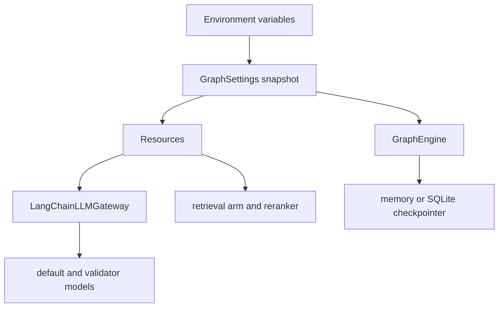

# Model configuration, runtime controls, and cost boundaries

`GraphSettings.from_env()` is the configuration boundary for a graph run. It creates an immutable environment snapshot; `GraphEngine`, `Resources`, and the model gateway retain the snapshot with which they were constructed. Set variables before creating the runtime and reconstruct or restart it after a change—editing the process environment does not update an existing settings object.

This shows ownership: settings select behavior, resources lazily own external clients, and the engine owns graph compilation and checkpoint lifecycle.

## Settings, entry points, and lifecycle

`GraphEngine` is the in-process entry point: its first use initializes the privacy sanitizer, selects and initializes a checkpointer, and compiles the graph. Use `async with GraphEngine(...)` or call `await engine.aclose()`; closing exits an engine-owned SQLite context and closes resources held by the process-wide `Resources` owner. `Resources.get()` returns that singleton, while `override()` replaces it for test injection. Constructing resources does not connect to Weaviate, Pinecone, or OpenAI.

`GraphEngine.describe()` reports effective safety, model, sampling, retrieval/reranking, structured-output, and routing choices. Record this output with an experiment or rollout so a result can be attributed to the actual snapshot rather than an assumed environment.

## Models and sampling compatibility

| Variable | Default | Effect |
|---|---:|---|
| `HC_RAG_LLM_MODEL` | `gpt-5.6-luna` | Default tier for routing, preprocessing, retrieval evaluation, generation, and follow-ups. |
| `HC_RAG_VALIDATOR_MODEL` | `gpt-5.6-terra` | Validator tier used for the `validate_answer` structured stage. |
| `HC_RAG_REASONING_EFFORT` | `none` | Reasoning control supplied for recognized GPT-5.x and o-series names. |
| `HC_RAG_STRUCTURED_STRICT` | `false` | Enables `strict=True` for JSON-schema structured output. |

The model getters trim whitespace and fall back on blank values. `LangChainLLMGateway` centralizes client construction, selects default versus validator tier, uses three retries, and caches each `ChatOpenAI` client by tier, model, requested temperature, and reasoning effort. Structured stages fail soft: exceptions log a stage warning and return their supplied default rather than escaping from the gateway.

### GPT-5.x reasoning controls are not temperature

`reasoning_effort` and `temperature` are distinct inputs. `sampling_params(model, temperature, reasoning_effort)` recognizes case-insensitive names starting `gpt-5`, `o1`, `o3`, or `o4` as reasoning models. For a GPT-5.x reasoning model it sends `reasoning_effort`, and sends a supplied temperature only when the effective effort is `none`. For o-series models, `none` is converted to `low`, so temperature is not sent. A non-reasoning model receives a supplied temperature and no reasoning parameter.

Do not bypass the gateway with a direct `ChatOpenAI` construction or hard-code a sampling combination. The compatibility rules protect a model-name swap from an unsupported parameter combination; they do **not** establish a quality, latency, or cost improvement. Measure any such effect with the [evaluation workflow](../observability/evaluations.md).

## Stage switches, routing choices, and fan-out boundaries

`HC_RAG_DISABLE_STAGES` is an ablation switch, not a production safety or cost control. It is a comma-separated, case-normalized list limited to `safety`, `clarify`, `decompose`, `evaluate`, `validate`, and `followups`; an unknown stage raises `ValueError` while settings are built. Each switch short-circuits its corresponding work: clarification returns no change, decomposition uses the parent query default, and evaluation proceeds without gap fill. Disabling `safety` also disables the gate; do not use it as a production safety bypass.

| Variable | Default | Validation and behavior |
|---|---:|---|
| `HC_RAG_SAFETY_GATE` | `true` | Enabled only when this boolean is true and `safety` is not disabled. |
| `HC_RAG_REFUSAL_BOUNDARY` | `true` | Allows matching safety refusals to be persisted and replayed per thread; the safety node reads this flag live each turn. |
| `HC_RAG_MAX_SUBQUERIES` | `3` | Integer at least 1; decomposition always retrieves the parent and can add at most this many subquery branches. |
| `HC_RAG_DECOMPOSE_ONLY_COMPLEX` | `true` | Requires at least two proposals and a `complex` label unless disabled. |
| `HC_RAG_HISTORY_MAX_TOKENS` | `4000` | Integer token cap for history-aware gateway calls and history views. |
| `HC_RAG_QUERY_RESPONSE_ARM` | `current` | Exact, case-sensitive choice: `current`, `deterministic`, or `tool`. |
| `HC_RAG_SAFETY_CLASSIFIER` | `llm` | Exact choice: `llm` or `semantic_router`; this build rejects the latter at engine construction. |

Boolean controls accept case-insensitive `1`, `true`, `yes`, `on`, `0`, `false`, `no`, or `off`; blank values use their default and other values fail parsing. `HC_RAG_STRUCTURED_STRICT` follows the same token rule. The two routing enums do not normalize whitespace or case: blank, differently cased, and unknown values are errors. Although `semantic_router` parses, it cannot execute in this build and raises `SafetyClassifierUnavailableError`; use `llm`.

The graph has two explicit fan-out limits. Decomposition sends the parent query plus the capped subqueries. Retrieval evaluation can request only one gap-fill round: it requires `gap_round == 0`, retains at most three additional queries, marks the round used before routing, and the merge after gap fill routes directly to generation. These are behavioral bounds, not evidence of a measured saving.

## Retrieval and reranking

| Variable(s) | Default | Effect |
|---|---:|---|
| `HC_RAG_RETRIEVER` | `weaviate` | Selects `weaviate`, `pageindex`, or `pinecone`; invalid values fail parsing. |
| `HC_RAG_PAGEINDEX_DIR` | `data` | Directory containing cached PageIndex trees and chunks. |
| `HC_RAG_PAGEINDEX_MAX_NODES` / `HC_RAG_PAGEINDEX_MAX_CHUNKS` | `4` / `8` | Positive limits for PageIndex selection and chunk expansion. |
| `HC_RAG_RERANKER` | `none` | Selects `none` or `pinecone`; invalid values fail parsing. |
| `HC_RAG_RERANK_CANDIDATES` / `HC_RAG_RERANK_TOP_K` | `12` / `4` | Positive candidate-fetch and survivor limits when reranking is selected. |
| `HC_RAG_RERANK_MODEL` | `bge-reranker-v2-m3` | Pinecone Inference rerank model. |
| `HC_RAG_PINECONE_INDEX` / `HC_RAG_PINECONE_SPARSE_MODEL` | `healthcare-rag` / `pinecone-sparse-english-v0` | Pinecone index and sparse embedding model. |
| `HC_RAG_PINECONE_ALPHA` | `0.65` | Dense hybrid weight, inclusive range 0.0–1.0. |
| `HC_RAG_EMBEDDING_MODEL` | `text-embedding-3-small` | Dense embedding model for the Pinecone arm. |

The arm changes only the per-collection search callable; routing, merging, and downstream graph stages remain shared. Weaviate and Pinecone open their clients only when selected. PageIndex reads cached JSON and opens no retrieval client, but requires its tree and chunk files; missing files instruct the operator to run `make index-pageindex`.

Reranking is part of retrieval. When `HC_RAG_RERANKER=pinecone`, a limit-aware search fetches `rerank_candidates`, then Pinecone reranks each result to `rerank_top_k`. A rerank failure or empty ranking falls back to the search order truncated to `top_k`, preserving turn availability. See [retrieval arms and reranking](../retrieval/arms-and-reranking.md) for arm-specific behavior and evaluation gates.

### Credentials and lazy connections

`OPENAI_API_KEY` is required by Weaviate on first use and is supplied as `X-OpenAI-Api-Key`; the Pinecone arm also needs it when it creates query embeddings. `PINECONE_API_KEY` is required when a Pinecone client is first needed—either for the Pinecone retrieval arm or a Pinecone reranker on another arm. Missing credentials fail at that lazy boundary. A failed Weaviate connection is not cached, so a subsequent request can retry. `Resources.aclose()` closes only clients it owns, including gateway HTTP clients, a connected Weaviate client, and closeable Pinecone handles.

## Checkpoints and conversation history

`HC_RAG_CHECKPOINT` selects an engine-owned saver at initialization:

* Empty or any value not beginning `sqlite:` selects `InMemorySaver`.
* `sqlite:<path>` enters an `AsyncSqliteSaver` context using the suffix path and runs schema setup.
* SQLite requires `pip install healthcare-rag[graph-sqlite]`; otherwise initialization raises `RuntimeError` with that instruction.

The compiled graph keys state by `thread_id`. `seed_history()` writes scrubbed legacy turns as `HumanMessage`/`AIMessage` checkpoint state. For each new turn, history views scrub messages, token-trim them to `HC_RAG_HISTORY_MAX_TOKENS`, retain at most five completed pairs newest-first, and render the latest three exchanges oldest-first for context. Choose SQLite storage deliberately for durable history and close the engine so its context is released.

The LangGraph deployment reads `.env`, exposes the `healthcare_rag` graph, and separately configures an `openai:text-embedding-3-small` store index with 1,536 dimensions. That deployment store configuration is not a replacement for the engine's `HC_RAG_CHECKPOINT` choice.

## Safe model or runtime change procedure

1. **State scope and rollback.** Identify the single intended model/configuration change, retain the previous environment, and distinguish a production change from an ablation. Never make `HC_RAG_DISABLE_STAGES=safety` a production rollout.
2. **Validate a fresh snapshot.** Check enum spelling and case, boolean/numeric bounds, selected-arm prerequisites, required credentials, PageIndex artifacts if applicable, and the `graph-sqlite` extra for SQLite. Construct a new engine and capture `GraphEngine.describe()`.
3. **Preserve sampling compatibility.** Keep calls behind `LangChainLLMGateway`; do not conflate GPT-5.x reasoning effort with temperature. Run `uv run pytest tests/test_model_sampling.py` after changing model-family or sampling logic.
4. **Exercise the changed path.** Run `uv run pytest tests/test_routing_settings.py tests/graph/test_settings.py` for routing/settings changes, plus focused graph, retrieval, reranking, resource, or history tests for the modified control.
5. **Evaluate before asserting outcomes.** Compare a baseline and treatment that differ only in the intended setting. Use smoke/deterministic checks and, for behavior or model changes, the relevant judge and multi-turn evaluations from [evaluations](../observability/evaluations.md). Review safety, correctness, groundedness, latency, usage, and cost only where the harness records them. Do not assert savings without a measured comparison.
6. **Roll out and observe.** Monitor initialization and lazy credential/connection failures, retrieval and rerank warnings, and outcome telemetry; keep the tested rollback configuration. See the [runbook](../operations/runbook.md) for setup, commands, and service recovery.

## Focused tests

`tests/test_model_sampling.py` fixes model defaults/blank fallback, case-insensitive reasoning-family detection, the sampling matrix, environment fallback, and the identity-preserving `services.models` facade. `tests/test_routing_settings.py` locks default and malformed routing settings and the early `semantic_router` rejection. Resource tests verify lazy connection retry and that closing resources permits fresh model and Weaviate clients. These are configuration contracts, not replacements for an end-to-end evaluation of a model or retrieval change.
