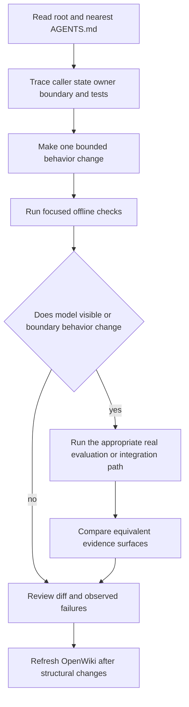

# AI-assisted contributor workflow

Use this workflow for human-led and tool-assisted changes. Configuration for OpenWiki or an MCP server establishes an available integration, **not** that a tool ran successfully or that its output is correct. Current source and focused tests are authoritative; generated OpenWiki is navigation and context. Recheck source when it conflicts with this page, and report only commands and outcomes actually observed.

## Read before changing

1. Start with root `AGENTS.md`: it defines the healthcare scope, dependency authority, safety categories, and cross-system hazards.
2. Read the nearest applicable instructions before editing. For RAG work, descend through `healthcare_rag/`, then `graph/` or `processors/`; for coach, frontend, evaluation, or server work, read the corresponding `AGENTS.md`. Local rules refine the root rules.
3. Trace the change through its caller, state owner, public boundary, and focused tests—not merely the selected source file. Start with [runtime architecture](../architecture/overview.md) for RAG topology, [evaluation governance](../observability/evaluation-governance.md) for behavior evidence, and the [runbook](../operations/runbook.md) for service operations.
4. Identify configuration and persistence effects before changing an environment knob, prompt, model, schema, or state field. A fixture, capability branch, prompt text, or report file is not proof that a behavior was measured or deployed.

The repository has related but distinct runtimes. The LangGraph `StateGraph` in `healthcare_rag/graph/` owns the RAG request pipeline. The separate coach graph owns member-facing routing and invokes the RAG graph through its `medical_lookup` relay. The frontend and clean-room `server/` are integration boundaries; they must preserve, rather than replace, the RAG safety and member-authorization contracts.

This ladder narrows the edit first and widens verification only when the changed contract requires it.

## Protected artifacts and configuration boundaries

- Keep credentials in `.env`; do not commit or print secrets. `pyproject.toml` and `uv.lock` own Python resolution. Understand lockfile impact before changing either.
- `make ingest` and `make ingest-pinecone` invoke storage loaders with `--delete-all`; treat corpus rebuilding as destructive and follow it with a retrieval check.
- PageIndex trees in `data/pageindex_tree_*.json` and material under `evals/results/` are generated artifacts. Regenerate reports rather than editing them, and rescore comparison runs when evaluator semantics change.
- `frontend/src/design/` is copied verbatim from the design system. Use its classes or update its owning process; do not patch the copied surface directly.
- `make wiki-update` runs `openwiki code --update -p`. The scheduled workflow performs a full-history checkout, executes `openwiki code --update --print`, and opens a documentation PR. This automation is a refresh mechanism, not evidence that a particular update was accepted as accurate.

## Invariants to preserve

### RAG graph, safety, and validation

The public RAG graph starts with `safety_gate`. On each turn it derives scrubbed history views and resets downstream per-turn channels before routing, preventing retrieval, generation, validation, route, and error state from leaking through a reused checkpoint. Safety uses the scrubbed question as its working query; deterministic signals may escalate classification but should not relax it. Terminal safety and direct-response routes proceed to finalization rather than retrieval and generation; refusal templates must not introduce a number paired with a clinical unit.

Graph topology is a typed contract. A node that both updates state and selects its successor returns `Command[Literal[...]]`; its literal target, router constants, and graph wiring must remain aligned. Add a new `RAGState` channel together with deliberate reset/reducer behavior, especially when state is checkpointed. Prompt work is also a coupled change: package-shipped Jinja YAML templates are rendered through the prompt registry and structured stages map to Pydantic response models, so update prompt, model, registration/wiring, and prompt-fidelity coverage together.

Generation retains formatted documents and the prompt-ID map for citation validation. With no merged retrieval result it returns a fixed unknown-answer fallback. Validation rejects missing merged data and converts exceptions into an unvalidated result rather than passing raw model output through.

### Coach, frontend, and member data

The coach graph has a deterministic pre-agent gate: server-originated `cron_wake`, attachments, safety short circuits, and erasure are handled before other turns reach the coach agent. `cron_wake` validation includes thread, user, reminder, and token checks; member inputs must not gain this server-originated capability. Medical content is obtained through the `medical_lookup` RAG relay. The default relay inherits the calling checkpointer so RAG history and refusal boundaries remain scoped to the coach thread; the explicitly selected pipeline fallback uses a fresh in-memory thread and therefore loses that inner multi-turn state.

Catalog claims must stay grounded in same-turn data. The backend composition validator accepts fact-bearing props only as a `__ref` targeting a current-turn envelope and accepts literal static copy only through its allowlists. The frontend repeats this boundary through wire schemas and a closed dispatch map: unknown action identifiers emit telemetry and do nothing rather than invoking arbitrary behavior. Keep network, timer, and randomness seams injected through `CoachChatDeps` instead of introducing direct dependencies that make component tests non-hermetic.

Member state is authenticated-user namespaced and write-gated during erasure. Upload reservation is atomic and has a 15-minute TTL; the request buffer is cleared in a `finally` block, while only a scrubbed proposal is persisted. Erasure first sets the user erasure gate, attempts remote cron and reservation cleanup, deletes owner data through a privileged capability, and emits its marker only after both remote cleanups report success. The perimeter middleware performs the later thread deletion protocol; preserve its fail-stop/retry behavior rather than swallowing an intermediate failure.

### Clean-room server compatibility

The server is a behavioral-parity target for LangGraph Agent Server surfaces, not a place to redesign the API. `create_storage()` selects memory storage by default or Postgres storage when configured; Postgres owns a shared pool, durable saver/store and registries. Code must work across both paths: memory does not promise restart durability, while durable Postgres runs redact persisted payloads. Server changes therefore need focused unit coverage; Postgres-path changes need the Postgres lane, and compatibility changes need the pinned oracle/parity suite.

## Safe command ladder

Start with the smallest command that can disprove the intended behavior. Preserve complete failure output, distinguish a command from its result, and widen only for the affected surface.

| Change surface | Start here | Widen when appropriate |
|---|---|---|
| RAG graph, state, router, processor, or prompt contract | Focused `tests/graph/` or relevant `tests/test_*.py`, then `make test` | `make eval-smoke`, then comparable `make eval PREFIX=name` and/or multi-turn evaluation for model-visible behavior |
| Safety, privacy, refusal, or history | `tests/test_safety_gate.py`, `tests/test_refusal_boundary.py`, privacy and graph-safety tests | Full or targeted evaluation plus `make eval-multiturn PREFIX=name` for cross-turn behavior |
| Retrieval arm, reranker, corpus, or ingestion | Focused retrieval tests and a narrow retrieval check | Run `uv run python -m evals.pageindex_gate --json` for an adoption decision; do not substitute historical scores |
| Coach routing, perimeter, uploads, reminders, or erasure | Relevant `tests/agent/` tests | `make eval-agent`, `make eval-agent-multiturn`, then `make deployed-smoke` only when the deployed boundary changed and is configured |
| Frontend protocol, chat behavior, or catalog | `bun --cwd frontend run test` | `bun --cwd frontend run build`; use `bun --cwd frontend run playwright` for an end-to-end member flow |
| Clean-room server | `make server-test` | `make server-test-pg` for Postgres work and `make parity` for compatibility changes |

`make test` is the repository's offline pytest command. `make test-judges` invokes judge-marked tests and may call OpenAI. CI runs the frozen-dependency offline suite without an OpenAI key or Weaviate endpoint; server-relevant pull requests separately run units, OSS contract/license checks, and a pinned `langgraph-api` 0.12.6 oracle job. These definitions describe available checks, not an assertion that they passed for a change.

## Evaluation and real-system checks

Use an evaluation plan whenever a change affects model output, retrieval, safety, prompts, or evaluator meaning:

1. Add or update the focused regression where practical. For a discovered product regression, add a golden case or multi-turn conversation; define `must_hold` before relying on a multi-turn contract.
2. Keep dataset, evaluator, prompt/model settings, thresholds, flags, and comparison scope equivalent. A changed evaluator requires rescore/re-run work before prior results are comparable.
3. Treat `evals/results/` as output. Record exact commands, report names, comparison scope, and failures in the review context rather than editing an artifact into an apparent result.
4. For a retrieval adoption decision, use the paired two-stage gate. It first compares eligible retrieval page recall, then runs paired full-pipeline evidence under frozen thresholds; a smoke run or historical report does not meet that decision boundary.

After focused checks establish local correctness, use a real path appropriate to the integration:

- **Base RAG:** `make weaviate`, `make ingest`, then `make run`. Ingestion is destructive, and the CLI's preliminary streamed answer is not validated final output.
- **Coach:** use offline coach harnesses first. `make deployed-smoke` targets `LANGGRAPH_DEPLOYMENT_URL`; `make forget-member` exercises the deployed self-erasure route.
- **Frontend:** hermetic Playwright starts its offline stack, real local graph server, and production Next server. Prefer it to an ad hoc browser check for a member-facing workflow.
- **Server:** `make server-dev` enables a local development principal. It is not production acceptance; validate storage topology and parity separately when those contracts change.

## Review handoff

Before requesting review:

- Confirm the root and nearest instructions, behavior owner, caller/boundary, and relevant persistence/state owner were inspected.
- Inspect the complete diff for generated files, secrets, destructive corpus changes, lockfile churn, and changed defaults.
- Name focused tests and commands actually run, their observed outcome, and meaningful commands deliberately not run. Never imply a paid, networked, deployed, or destructive command succeeded merely because it is configured.
- Attach comparable evaluation or gate evidence for behavior claims, including safety and retrieval gates when required.
- Refresh OpenWiki after structural changes with `make wiki-update`, while leaving source and tests as the authority for disputes with generated documentation.
