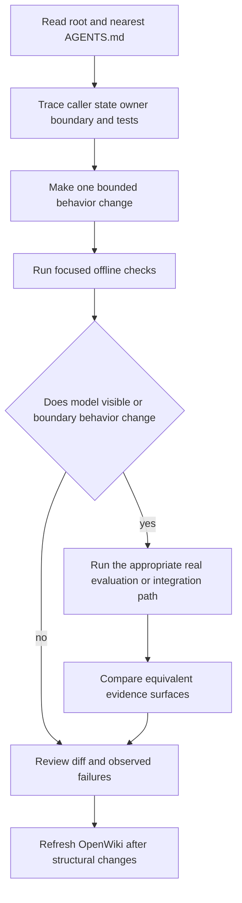

# AI-assisted contributor workflow

Use this workflow for human-led and tool-assisted changes. Configuration for OpenWiki or an MCP server (`.mcp.json` wires an `openwiki mcp --host claude` server) establishes an available integration, **not** that a tool ran successfully or that its output is correct. Current source and focused tests are authoritative; generated OpenWiki is navigation and context. Recheck source when it conflicts with this page, and report only commands and outcomes actually observed.

## Read before changing

1. Start with root `AGENTS.md`: it defines the healthcare scope, dependency authority, safety categories, and cross-system hazards. `CLAUDE.md` and the OpenWiki blocks embedded in nested `AGENTS.md` files point back to the same root instructions and add nothing on their own.
2. Read the nearest applicable instructions before editing. For RAG work, descend through `healthcare_rag/AGENTS.md`, then `graph/` or `processors/`; for eval work, `evals/AGENTS.md`; for the offline test suite, `tests/AGENTS.md`; for coach, frontend, or server work, the corresponding `AGENTS.md`. Local rules refine the root rules.
3. Trace the change through its caller, state owner, public boundary, and focused tests — not merely the selected source file. Start with [runtime architecture](../architecture/overview.md) for RAG topology, [evaluation governance](../observability/evaluation-governance.md) for behavior evidence, and the [runbook](../operations/runbook.md) for service operations.
4. Identify configuration and persistence effects before changing an environment knob, prompt, model, schema, or state field. A fixture, capability branch, prompt text, or report file is not proof that a behavior was measured or deployed.

The repository has related but distinct runtimes. The LangGraph `StateGraph` in `healthcare_rag/graph/` owns the RAG request pipeline. The separate coach graph (`healthcare_rag/agent/`) owns member-facing routing and invokes the RAG graph through its `medical_lookup` relay. The frontend and clean-room `server/` are integration boundaries; they must preserve, rather than replace, the RAG safety and member-authorization contracts.

This ladder narrows the edit first and widens verification only when the changed contract requires it.

## Protected artifacts and configuration boundaries

Some files are generated, hand-curated, or destructively rebuilt; editing them casually breaks either reproducibility or the evidence a report is supposed to represent.

- `evals/golden_dataset.json` and `evals/multiturn_dataset.json` are hand-written source-of-truth question/conversation sets, synced to LangSmith with stable uuid5 IDs (`evals/dataset.py`, `evals/multiturn_dataset.py`). An edited row updates the same remote example rather than creating a duplicate — edit it deliberately as an authored regression, not as a quick fixture patch, and re-sync.
- `evals/routing_dataset.json` and `evals/routing_multiturn_dataset.json` are the same kind of hand-authored, uuid5-synced source-of-truth artifact (`evals/routing_dataset.py`), covering query-routing rows and safety-drift conversations for the routing gate; edit them with the same care as the golden datasets, not as disposable fixtures.
- `evals/results/` is generated output: committed `.md`/`.json` reports per experiment plus per-question detail and watcher logs. It has no local `AGENTS.md` precisely because it is treated as read-only evidence — regenerate a report by re-running the producing command, never hand-edit it into an apparent result.
- `data/pageindex_tree_*.json` (built by `make index-pageindex`, an isolated ephemeral environment, ~$0.10) and the checked-in `data/chunks_lipitor.json` / `data/chunks_metformin.json` corpus files are generated/curated ingestion inputs. `make ingest` and `make ingest-pinecone` both pass `--delete-all` to their storage loaders, so treat corpus rebuilding as destructive and follow it with a retrieval check.
- `frontend/src/design/` is copied verbatim from the design system. Use its classes or update its owning process; do not patch the copied surface directly.
- `docs/decisions/*.md` are one-directional pointers into `evals/results/` and `docs/experiments/`; they never duplicate a metrics table, only cite where it lives. Do not hand-write numbers into a decision doc.
- Keep credentials in `.env`; do not commit or print secrets. `pyproject.toml` and `uv.lock` own Python dependency resolution — understand lockfile impact before changing either.
- `make wiki-update` runs `openwiki code --update -p`. The scheduled GitHub Actions workflow performs a full-history checkout, executes `openwiki code --update --print`, and opens a documentation PR. This automation is a refresh mechanism, not evidence that a particular update was accepted as accurate; do not hand-edit generated OpenWiki pages unless explicitly asked.
- `make next-version`, `make release TAG=...`, `make release-digest TAG=...`, and `make rollback TAG=... REASON=...` are hermetic previews: they only print commands or resolve a digest, and dispatching the printed `gh workflow run` command is a separate, human-gated action. `make release-prep BUMP=...` is the one release command that writes locally (bumps `pyproject.toml`/`uv.lock`); land it as a reviewed PR rather than committing it unreviewed. See [deployment: release identity, version bumps, and rollback](../operations/deploy.md#release-identity-version-bumps-and-rollback).

## Invariants to preserve

### RAG graph, safety, and validation

The public RAG graph starts with `safety_gate`. On each turn it derives scrubbed history views and resets downstream per-turn channels before routing, preventing retrieval, generation, validation, route, and error state from leaking through a reused checkpoint. Safety uses the scrubbed question as its working query; deterministic signals may escalate classification but should not relax it. Terminal safety and direct-response routes proceed to finalization rather than retrieval and generation; refusal templates must not introduce a number paired with a clinical unit.

Graph topology is a typed contract. A node that both updates state and selects its successor returns `Command[Literal[...]]`; its literal target, router constants, and graph wiring must remain aligned (a `X | Y` union of Literals inside `Command[...]` renders no edges — nest them; this is pinned by `tests/graph/test_router_typing.py`). Add a new `RAGState` channel together with deliberate reset/reducer behavior, especially when state is checkpointed. Prompt work is also a coupled change: package-shipped Jinja YAML templates (`healthcare_rag/prompts/*.yaml.j2`) are rendered through the prompt registry and structured stages map to Pydantic response models, so update prompt, model, registration/wiring, and prompt-fidelity coverage together.

Generation retains formatted documents and the prompt-ID map for citation validation. With no merged retrieval result it returns a fixed unknown-answer fallback. Validation rejects missing merged data and converts exceptions into an unvalidated result rather than passing raw model output through — it is also the most expensive stage, so look there first when optimizing cost.

### Coach, frontend, and member data

The coach graph has a deterministic pre-agent gate: server-originated `cron_wake`, attachments, safety short circuits, and erasure are handled before other turns reach the coach agent. `cron_wake` validation includes thread, user, reminder, and token checks; member inputs must not gain this server-originated capability. Medical content is obtained through the `medical_lookup` RAG relay. The default relay inherits the calling checkpointer so RAG history and refusal boundaries remain scoped to the coach thread; the explicitly selected pipeline fallback uses a fresh in-memory thread and therefore loses that inner multi-turn state.

Catalog claims must stay grounded in same-turn data. The backend composition validator accepts fact-bearing props only as a `__ref` targeting a current-turn envelope and accepts literal static copy only through its allowlists. The frontend repeats this boundary through wire schemas and a closed dispatch map: unknown action identifiers emit telemetry and do nothing rather than invoking arbitrary behavior. Keep network, timer, and randomness seams injected through `CoachChatDeps` instead of introducing direct dependencies that make component tests non-hermetic.

Member state is authenticated-user namespaced and write-gated during erasure. Upload reservation is atomic and has a 15-minute TTL; the request buffer is cleared in a `finally` block, while only a scrubbed proposal is persisted. Erasure first sets the user erasure gate, attempts remote cron and reservation cleanup, deletes owner data through a privileged capability, and emits its marker only after both remote cleanups report success. The perimeter middleware performs the later thread deletion protocol; preserve its fail-stop/retry behavior rather than swallowing an intermediate failure.

### Clean-room server compatibility

The server is a behavioral-parity target for LangGraph Agent Server surfaces, not a place to redesign the API. `create_storage()` selects memory storage by default or Postgres storage when configured; Postgres owns a shared pool, durable saver/store and registries. Code must work across both paths: memory does not promise restart durability, while durable Postgres runs redact persisted payloads. Server changes therefore need focused unit coverage; Postgres-path changes need the Postgres lane, and compatibility changes need the pinned oracle/parity suite (`scripts/langgraph_smoke.py` and `scripts/deployed_smoke.py` must pass unchanged against `server/` — a divergence means the server is wrong, never the smoke).

## Patterns that worked or failed (evidenced by decision records)

Read `docs/decisions/*.md` before proposing a retrieval or routing change; the numbers in the linked `evals/results/*.json`/`.md` reports, not the prose summary, are authoritative:

- **Retrieval arms measured and rejected.** PageIndex tree-search retrieval lost stage 1 of the paired gate against Weaviate hybrid (mean `page_recall` 0.609 vs. 0.681, Δ −0.071 over 71 eligible golden questions), so stage 2 never ran; PageIndex stays an opt-in arm (`HC_RAG_RETRIEVER=pageindex`). Pinecone hybrid retrieval also lost stage 1 (page_recall 0.463 vs. 0.648 reference, later re-measured 0.607 vs. 0.664 as a dense-only diagnostic), and a Weaviate+bge-reranker arm that won stage 1 (+0.050 page_recall) failed stage 2 on quality (correctness Δ −0.051 against a required ≥ +0.03, holdout correctness Δ −0.091) — cost and latency alone were within threshold, but a quality failure is `REJECT`, not tunable away. Both Pinecone-family arms stay opt-in knobs (`HC_RAG_RETRIEVER=pinecone`, `HC_RAG_RERANKER=pinecone`).
- **Routing candidates never reached measurement — report them as `INCONCLUSIVE`, not as evaluated-and-rejected.** The query-or-respond arm's authored judge calibration missed its own threshold (22 of 24 fixtures; two acceptable greetings scored 0.78 and 0.72 against a 0.80 minimum), so the paired arm comparison never ran. The Semantic Router safety-classifier candidate is blocked by an unsatisfiable dependency pin (`semantic-router==0.1.16` needs a `litellm` version incompatible with the project's retained `openai<2` bound); no adapter was ever built or run. Do not describe either candidate as evaluated, rejected, or adopted — do not infer an experimental result from the presence of gate or runtime code. `make routing-gate-query-smoke` and `make routing-gate-safety-smoke` (`evals.routing_gate --lane query|safety --smoke --json`) only exercise the gate's own decision logic against canned/fixture evidence; they validate the gate contract, not a real arm run, and neither lane has a completed paired or paid measurement as of `docs/decisions/routing-experiment-summary.md`.
- **What succeeded and is measured.** The safety gate materially changed safety metrics in a recorded 86-example comparison (`safe_redirect` 0.16 → 0.64, core 0.69), at a headline correctness cost (0.89 → 0.81); the graph-stage ablation report supports keeping document evaluation, clarification, decomposition, and answer validation, with follow-up generation confirmed answer-neutral (a UX feature, not a scored quality control).

The consistent lesson: an adoption or rejection claim requires a named evaluator and a report under `evals/results/`; a fixture, gate script, or capability branch existing in the repo is not evidence that an experiment ran.

## Safe command ladder

Start with the smallest command that can disprove the intended behavior. Preserve complete failure output, distinguish a command from its result, and widen only for the affected surface.

| Change surface | Start here | Widen when appropriate |
|---|---|---|
| RAG graph, state, router, processor, or prompt contract | Focused `tests/graph/` or relevant `tests/test_*.py`, then `make test` | `make eval-smoke`, then comparable `make eval PREFIX=name` and/or multi-turn evaluation for model-visible behavior |
| Safety, privacy, refusal, or history | `tests/test_safety_gate.py`, `tests/test_refusal_boundary.py`, privacy and graph-safety tests | Full or targeted evaluation plus `make eval-multiturn PREFIX=name` for cross-turn behavior |
| Retrieval arm, reranker, corpus, or ingestion | Focused retrieval tests and a narrow retrieval check | Run `uv run python -m evals.pageindex_gate --json` for an adoption decision; do not substitute historical scores |
| Query-response routing arm or safety-classifier arm | `tests/test_routing_gate.py`, `tests/test_routing_gate_runtime.py`, `tests/test_routing_dataset.py`, `tests/test_evaluator_calibration.py`, then `make routing-gate-query-smoke` / `make routing-gate-safety-smoke` for the gate contract | A real adoption decision needs `uv run python -m evals.calibrate` to clear the lane's authored judge calibration first, then a completed paired two-stage `evals.routing_gate` run — as of the current decision records neither lane has cleared this bar, so treat any routing-arm change as `INCONCLUSIVE` until it does |
| Coach routing, perimeter, uploads, reminders, or erasure | Relevant `tests/agent/` tests | `make eval-agent`, `make eval-agent-multiturn`, then `make deployed-smoke` only when the deployed boundary changed and is configured |
| Frontend protocol, chat behavior, or catalog | `bun --cwd frontend run test` | `bun --cwd frontend run build`; use `bun --cwd frontend run playwright` for an end-to-end member flow |
| Clean-room server | `make server-test` | `make server-test-pg` for Postgres work and `make parity` for compatibility changes |

`make test` runs `.venv/bin/python -m pytest -q` — the repository's offline pytest command (evaluator calibration plus the deterministic subset, `-m "not judge"` semantics via `conftest.py`). `make test-judges` invokes judge-marked tests (`-m judge`, ~$0.10) and may call OpenAI. Other locally validated entrypoints worth knowing verbatim: `make calibrate` (`python -m evals.calibrate`, prints the evaluator-calibration report), `make eval-smoke` (`evals.run_baseline --prefix smoke --limit 3`, a fast 3-example sanity check), and `make compare EXPS="a b c"` (side-by-side report comparison by category). CI runs the frozen-dependency offline suite without an OpenAI key or Weaviate endpoint; server-relevant pull requests separately run units, OSS contract/license checks, and a pinned `langgraph-api` 0.12.6 oracle job. These definitions describe available checks, not an assertion that they passed for a change.

## Evaluation and real-system checks

Use an evaluation plan whenever a change affects model output, retrieval, safety, prompts, or evaluator meaning:

1. Add or update the focused regression where practical. For a discovered product regression, add a golden case or multi-turn conversation; define `must_hold` before relying on a multi-turn contract.
2. Keep dataset, evaluator, prompt/model settings, thresholds, flags, and comparison scope equivalent. A changed evaluator requires rescore/re-run work before prior results are comparable.
3. Treat `evals/results/` as output. Record exact commands, report names, comparison scope, and failures in the review context rather than editing an artifact into an apparent result.
4. For a retrieval adoption decision, use the paired two-stage gate. It first compares eligible retrieval page recall, then runs paired full-pipeline evidence under frozen thresholds; a smoke run or historical report does not meet that decision boundary.
5. For a routing (query-response or safety-classifier) adoption decision, use the same paired two-stage shape via `evals/routing_gate.py --lane query|safety`: stage 1 checks deterministic/operational thresholds and binding integrity (same git SHA, artifact hash, row IDs, repetitions, concurrency across arms), stage 2 adds LLM-judged benefit and cost/latency ratios. `make routing-gate-query-smoke`/`make routing-gate-safety-smoke` only prove the gate's own decision logic against canned evidence and are not a substitute for a cleared calibration plus a real paired run.

After focused checks establish local correctness, use a real path appropriate to the integration:

- **Base RAG:** `make weaviate`, `make ingest`, then `make run`. Ingestion is destructive, and the CLI's preliminary streamed answer is not validated final output.
- **Coach:** use offline coach harnesses first (`evals/run_agent.py --offline`, `evals/run_agent_multiturn.py --offline`). `make deployed-smoke` targets `LANGGRAPH_DEPLOYMENT_URL`; `make forget-member` exercises the deployed self-erasure route.
- **Frontend:** hermetic Playwright starts its offline stack, real local graph server, and production Next server. Prefer it to an ad hoc browser check for a member-facing workflow.
- **Server:** `make server-dev` enables a local development principal (`SERVER_LOCAL_DEV`, explicitly off in the Fly image and prod). It is not production acceptance; validate storage topology and parity separately when those contracts change.

## Change checklist

Work through each dimension before requesting review; skip only what is genuinely inapplicable and say so explicitly rather than silently omitting it.

- **Code.** Identify the behavior owner (graph node, processor, coach tool, server route) and its caller/state owner, not just the file touched. Keep a `Command[Literal[...]]` router node's literal target aligned with `routers.py` and `build.py` wiring. Keep a prompt template, its Pydantic response model, its registration, and its prompt-fidelity coverage as one coupled change.
- **Tests.** Run the narrowest test file that could disprove the change first (see the safe command ladder), then widen to `make test`. Add a focused unit/graph/agent/server test for new branches, not only an evaluation row.
- **Safety.** Any change to prompts, models, retrieval, or orchestration must be checked against the safety categories in `evals/golden_dataset.json` (`unsafe_personal_advice`, `pii_or_phi`, `out_of_scope`, `adversarial_hallucination`) and the multi-turn ones (`safety_drift`, `pii_persistence`, `escalation`). Re-run `tests/test_safety_gate.py` and `tests/test_refusal_boundary.py` for any refusal-template, PHI-pattern, or boundary-precedence change.
- **Evaluations.** For model-visible or boundary-visible behavior, run the appropriate real evaluation (`make eval PREFIX=<change>`, `make eval-multiturn PREFIX=<change>`, `make eval-agent`, or the retrieval gate) and compare against the previous `evals/results/` report with equivalent dataset/evaluator/model/threshold settings. Do not claim an improvement without that comparison.
- **Documentation.** Refresh OpenWiki after a structural change (`make wiki-update`); update the nearest `AGENTS.md`/decision record when behavior, defaults, or file layout moved. Leave source and tests as the authority when they disagree with generated documentation.
- **Secrets.** Confirm no credential was added to a committed file, printed in logs, or embedded in a report; `.env` (gitignored) is the only place secrets belong. Check `.env.example` still ships privacy-safe defaults if it changed.

## Review handoff

Before requesting review:

- Confirm the root and nearest instructions, behavior owner, caller/boundary, and relevant persistence/state owner were inspected.
- Inspect the complete diff for generated files, secrets, destructive corpus changes, lockfile churn, and changed defaults.
- Name focused tests and commands actually run, their observed outcome, and meaningful commands deliberately not run. Never imply a paid, networked, deployed, or destructive command succeeded merely because it is configured.
- Attach comparable evaluation or gate evidence for behavior claims, including safety and retrieval gates when required.
- Refresh OpenWiki after structural changes with `make wiki-update`, while leaving source and tests as the authority for disputes with generated documentation.
