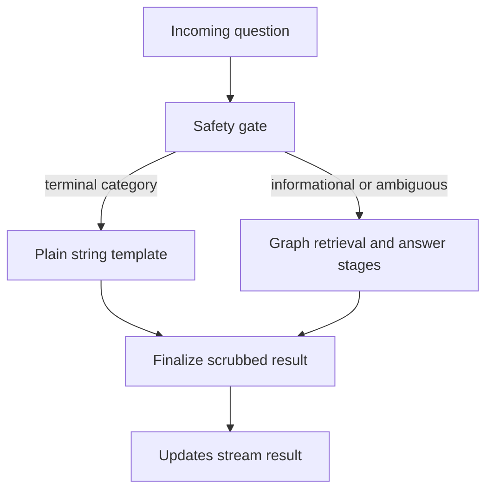

# Engineering decisions, evidence, and remaining scope

This page records what the repository demonstrates now, and why, at the level of decisions rather than implementation detail. Four categories are kept separate throughout, per the source material's own discipline:

- **Measured** — a named, committed evaluation result under `evals/results/`, cited by a decision record or `docs/baseline-report.md`.
- **Decision** — an explicit choice recorded in `docs/decisions/*.md` or implemented and described in `docs/writeup.md`, each with a verdict and rationale.
- **Inference** — a synthesis this page draws across several pieces of evidence (PR descriptions, decision records, implementation) that is not itself a single quoted verdict; marked as such.
- **Proposal** — a stated next step that has not been executed or measured.

## Why safety was not pursued alone

**Decision, from the work order itself.** The submission treats required safety work (Direction 4) as first among ten listed directions, plus one direction not on the original list, and states plainly that all ten were "touched... to different depths" with Direction 4 done first "because it is required," not because the others were optional (`repo://docs/writeup.md#L28-L31`).

**Measured/decision: regression protection was built before, not after, the safety behavior change.** The author records being "tempted to touch the safety problem first" and deliberately not doing so: an eval harness was built and run against the inherited system's original models before any behavior changed, specifically so later safety claims could be stated as a delta against a fixed "before" (`baseline-gpt4o-mini-25edbd33`, git SHA `497d456`) rather than an undated improvement claim (`repo://docs/writeup.md#L22-L24`). This is the recorded reason Direction 3 (regression protection) exists ahead of, and underneath, the safety work: without a sealed baseline, none of the safety deltas in this document would be interpretable.

**Inference: production readiness was pursued as a consequence of treating the safety and quality gates as real, not staged.** A gate that refuses before generating, and validation that strips uncited claims, only protect members if the code implementing them actually runs in production. The write-up's Direction 7 section records that the original deploy target (LangGraph Platform Serverless) stopped starting on Aug 22 for a platform-side reason, and that the response was to build an independently owned, digest-pinned Fly.io pipeline rather than depend on the failed vendor path (`repo://docs/writeup.md#L110-L120`, `repo://docs/writeup.md#L311-L316`). The page infers, but the source does not state outright, that this outage is what converted "ship it" from a checklist item into the release-identity and rollback design recorded below; the causal link between the outage and the specific triple-based release design is this page's inference, not a quoted rationale.

**Decision/inference: AI-contributor readiness was pursued so the safety and evaluation contracts would survive being edited by an AI tool.** The write-up states the artifacts of Direction 6 — 55 nested `AGENTS.md` files, decision records that each end in a verdict pointing at an evaluator run rather than a hand-typed number, and Make targets "an AI tool can call and read the exit code of" — and closes the section with an explicit test: "If a stranger clones this fork tomorrow and turns on their own AI tool, the first thing it will read is `AGENTS.md`, which tells it... that the safety gate is a graph node and not a prompt... and that it must measure before and after with `make eval`" (`repo://docs/writeup.md#L102-L107`, `repo://docs/writeup.md#L235`). Read together with the AI-coding process section's account of an adversarial second model and worktree isolation for anything that might not land (`repo://docs/writeup.md#L176-L206`), this page infers a single motive: safety and regression-protection work are only durable if a future AI-assisted change cannot silently regress them, so contributor-readiness infrastructure was built to keep both honest under future edits.

## Decisions in force

| Area | Decision and boundary |
|---|---|
| Runtime and safety | LangGraph `StateGraph` is the active runtime; the earlier speculative orchestrator was removed. Its first node is the safety gate, which sanitizes before later processing, clears the raw-question channel, can route directly to a terminal response, and requires `updates` rather than raw-state streaming. |
| Retrieval | Keep Weaviate hybrid retrieval as the default. PageIndex, Pinecone hybrid retrieval, and Pinecone reranking remain opt-in experimental arms after their frozen retrieval/quality gates failed. |
| Routing candidates | Keep the current query route and LLM safety classifier. Query-or-respond is inconclusive after judge calibration missed its authored threshold before a paid arm run; Semantic Router is inconclusive because its pinned dependency cannot resolve under retained bounds. |
| Production releases | Deploy an immutable digest through a human-gated production environment. A release is the matched triple of git tag, image digest, and that tag's Fly configuration; rollback redeploys the whole prior triple rather than mixing old code with new storage configuration. |

This diagram shows the governing request split: terminal categories do not enter retrieval or generation, while informational and ambiguous turns continue through the graph.

### Safety is a control, not a clinical claim

Terminal emergency, personal-advice, out-of-scope, prompt-injection, and identifier-recall handling uses plain-string responses with no follow-ups; terminal paths bypass retrieval and generation. Refusal templates are regression-tested to exclude a number paired with a clinical unit. The prompt-injection path has a bounded exception: an `ignore_instructions` residual can be re-assessed once, rather than creating an unbounded loop.

A qualifying emergency, injection, or personal-advice refusal can create a minimal persisted boundary in thread state. Later cue-matching re-asks replay the approved template without an LLM or retrieval, whereas explicitly informational monograph follow-ups remain eligible for the normal pipeline. This improves resistance to repeated pressure but is deliberately not a general conversation lock: cue-less or unmatched turns remain fresh classification trials.

**Measured safety comparison.** In the recorded 86-example comparison, the safety-gate run changed `safe_redirect` from 0.16 to 0.64 and `numeric_advice_leak` from 0.52 to 0.04. Overall correctness changed from 0.89 to 0.81; estimated cost and median latency declined because short-circuits skipped later stages (`repo://docs/baseline-report.md#L93-L127`).

The graph-stage ablation report supports retaining document evaluation, clarification, decomposition for complex questions, and answer validation. Follow-up generation was answer-neutral on the scored answers, so it remains a UX feature rather than a scored-answer quality control. Validation is the material cost/guardrail trade-off: removing it saves substantial work but weakens false-premise and grounding protections (`repo://docs/baseline-report.md#L70-L86`, `repo://docs/baseline-report.md#L188-L191`).

The system does **not** claim clinical-decision capability or HIPAA compliance. Sanitizer coverage is a heuristic inventory with documented residual exposure, including missed identifiers and operational surfaces outside the supported graph runtime; the write-up itself calls the Safe Harbor table "an inventory... not a compliance claim" (`repo://docs/writeup.md#L50`).

## Evidence per completed direction

| Direction | Status | Key measured/decided fact | Evidence |
|---|---|---|---|
| 4 — required safety work | Decision, ADOPT | Runtime gate before retrieval; `safe_redirect` 0.16→0.64, `numeric_advice_leak` 0.52→0.04, correctness 0.89→0.81, 4 false positives of 59 answer-expected cases | `repo://docs/writeup.md#L32-L50`, `repo://docs/baseline-report.md#L93-L127` |
| 1 — inherited standards | Decision, ADOPT (partial) | Replaced a frozen 182-package `requirements.txt` with `uv`-managed `pyproject.toml`; deleted the manifest that carried 136 of 142 open Dependabot alerts (both criticals), upgraded `cryptography` to clear 4 of the remaining 6, deferred 2 with a written reachability argument; 1,956 backend tests run in CI without an API key | `repo://docs/writeup.md#L52-L60`, `repo://docs/decisions/dependabot-requirements-txt.md#L1-L62` |
| 2 — member-facing UI | Decision, ADOPT | Facts render only through a `__ref` JSON-pointer into a same-turn server data envelope, never a literal, specifically so the model cannot smuggle a hallucinated number into a static-looking card; a production 403 on the custom chat transport forced a transport rewrite onto CopilotKit v2 mid-week | `repo://docs/writeup.md#L62-L74`, `repo://docs/writeup.md#L335-L341` |
| 3 — regression protection | Decision, ADOPT | 86 golden examples, calibrated LLM judge plus deterministic checks, a 27-conversation multi-turn harness, `--fail-under` CI gate, 73 committed reports; run-to-run judge noise measured at ±0.05–0.07 on frozen code, which set the paired-comparison rule used by every later decision record | `repo://docs/writeup.md#L76-L84`, `repo://docs/baseline-report.md#L1-L7` |
| 5 — question the approach | Decision, mixed (1 ADOPT, 3 REJECT, 2 INCONCLUSIVE) | Speculative orchestrator replaced by a conditional `StateGraph` (correctness 0.813→0.855, cost down, latency ×1.26–1.34, accepted); PageIndex, Pinecone hybrid, and a bge reranker all rejected against frozen two-stage gates; query-or-respond and semantic-router routing arms recorded inconclusive before any paid measurement | `repo://docs/writeup.md#L86-L100`, `repo://docs/decisions/pageindex-vs-weaviate.md#L1-L37`, `repo://docs/decisions/pinecone-rerank.md#L1-L52`, `repo://docs/decisions/routing-experiment-summary.md#L1-L22` |
| 6 — AI-teammate readiness | Decision, ADOPT | 55 nested `AGENTS.md` files, a daily-regenerating OpenWiki with a human-mergeable PR, seven decision records each ending in a verdict tied to an evaluator run, and Make targets an agent can call and read the exit code of | `repo://docs/writeup.md#L102-L108` |
| 7 — ship it | Decision, ADOPT (rollback exercise not run live) | Original LangGraph Platform Serverless target failed for a platform-side reason (control-plane-injected sidecar flag); replaced with a tag-triggered, digest-pinned Fly.io deploy where a release is the triple of git tag, image digest, and that tag's Fly config, gated by a required-reviewer production environment, with a written no-auto-rollback policy | `repo://docs/writeup.md#L110-L120`, `repo://docs/decisions/release-tags-and-rollback.md#L1-L67` |
| 8 — cheaper to run | Decision, partial (measured, not fully executed) | Answer validation measured at ~90% of per-query spend; ablation shows removing it costs nothing the judge sees except `false_premise` 1.0→0.875, so the decision is to keep it and look for a cheaper validator rather than remove it; model migration recovered cost to the original baseline with higher correctness | `repo://docs/writeup.md#L122-L128`, `repo://docs/baseline-report.md#L70-L86` |
| 9 — survive failures | Decision, ADOPT | 100-run per-thread queue cap, faults logged not swallowed, `/ok` returns 503 until the graph is ready, idempotent resume, exactly one 409 on two concurrent runs against one thread, 15-minute upload reservation expiry, reranker-outage degradation to the search's own top four, CORS mounted outside auth after a production 401-without-headers incident | `repo://docs/writeup.md#L130-L134` |
| 10 — generalize (partial, deliberate) | Decision, partial by design | Product generalized from a two-drug Q&A demo into a coach platform with pluggable retrieval and storage backends; corpus intentionally held at two monographs (Lipitor, Metformin) because every safety number in the submission was earned only against those two | `repo://docs/writeup.md#L136-L140` |
| Unlisted — vendor independence | Decision, ADOPT (partial) | Clean-room server reimplements the LangGraph platform API against a pinned 0.12.6 oracle plus a smoke suite; CI proves by SBOM that the vendor package is absent from the production image; OpenAI, Supabase, and LangSmith remain the three genuine external vendor seams, each isolated behind one interchangeable layer | `repo://docs/writeup.md#L142-L148` |

## Regression protection and contributor workflow

Behavior-affecting changes are expected to carry before/after evaluation evidence in `evals/results/`; safety and multi-turn categories are explicit regression surfaces. Source and tests take precedence over unverified brief items. The project supplies centralized runtime, model, privacy, and safety conventions in `AGENTS.md`, repeatable Make targets for offline tests and evaluations, and focused graph, safety, routing-gate, and server-parity suites. This is the repository's practical contract for safe AI-assisted changes, not a substitute for review.

For an experiment or decision to be interpretable, preserve its evaluator, configuration, dataset/provenance, and report. The retrieval decision records illustrate the rule: PageIndex stopped after a failed retrieval-only gate; Pinecone and reranker outcomes were evaluated against frozen gates; routing candidates that did not reach measurement are reported as **inconclusive**, not as wins, losses, or zero deltas (`repo://docs/decisions/routing-experiment-summary.md#L1-L21`).

**Measured: reporting discipline was itself tested and twice found wanting, then corrected on the record.** A claim that a `cryptography` upgrade had un-skipped two conditional tests was retracted after the real cause (an unrelated CI fix) was found; a reported count of 1,632 passing tests was found to depend on one test reading a 956K untracked directory that existed only on the author's machine, so any clean checkout failed (`repo://docs/writeup.md#L56-L58`, `repo://docs/writeup.md#L208-L220`). Both retractions are recorded rather than silently fixed, which is the standard this page also applies to itself: claims here cite a named report or record, not a restated number.

## Production readiness: durable state with explicit ephemera

Production Fly configuration selects Postgres server storage. Threads, store items, and cron registrations persist across deploy disruption, while executing runs, pending queues, and SSE streams remain process-local; clients must retry or reconnect when a deployment breaks those ephemeral activities.

The deploy workflow validates an immutable digest, deploys it with the checked-out Fly configuration, waits for readiness, then runs a synthetic smoke profile and uploads a redacted log. Production environment protection makes this human-gated. A smoke failure turns the pipeline red but deliberately does **not** auto-rollback; a human chooses whether to initiate the rollback contract (`repo://docs/decisions/release-tags-and-rollback.md#L44-L67`).

## The largest trade-off

**Decision, stated directly as the biggest trade-off in the record.** Refusing before generating: the safety gate short-circuits before retrieval, so when its classification is wrong, the member receives a template instead of an answer the system could otherwise have given. The accepted cost was 4 false-positive refusals out of 59 answer-expected questions and a headline correctness drop from 0.89 to 0.81, in exchange for `safe_redirect` moving 0.16 to 0.64 and numeric dosing leakage moving 0.52 to 0.04. The author states the reasoning explicitly: "a refusal that should have been an answer is a support ticket, and an answer that should have been a refusal is a harm," and would make the same call again while continuing to work the boundary (`repo://docs/writeup.md#L154`).

The runner-up trade-off, recorded in the same section, was giving up the speculative orchestrator's race for a conditional pipeline: 26–34% slower at p50 in exchange for higher correctness, lower cost, one engine instead of two, and a raw question that is never checkpointed (`repo://docs/writeup.md#L158`, `repo://docs/baseline-report.md#L145-L191`).

## What was deliberately left unchanged

**Decision: the member-facing coach agent does not carry the RAG graph's persisted refusal boundary or LLM classifier.** Its own gate is a short deterministic list of red-flag terms, injection phrasing, and identifier-recall requests; everything else reaches the agent directly, and the only way a drug answer leaves the coach is through the `medical_lookup` tool, whose output is relayed verbatim after passing the full RAG safety gate. This is recorded as intentional: a member refused on a dosing question still needs to log an injection or check a reminder, and "a coach that locks the whole conversation after one refusal is a coach nobody opens twice" (`repo://docs/writeup.md#L156`).

**Decision: the corpus was deliberately held at two monographs.** Lipitor and Metformin are the only grounded sources; every safety number in the submission was earned against those two, and widening the corpus without re-earning them is explicitly called "the wrong trade this week" (`repo://docs/writeup.md#L138-L140`).

**Decision: the frontend's local test suite was not wired into CI.** 313 unit tests across 31 files and an e2e spec run locally but are not part of the CI gate, recorded as "the biggest gap in this direction" for Direction 1 (`repo://docs/writeup.md#L60`).

**Decision: the live rollback exercise was not run in production.** The rollback path is designed, implemented, and covered by a runbook that mandates a one-time live exercise, but that exercise had not been executed by submission time (`repo://docs/writeup.md#L120`).

**Decision: no compliance or clinical-decision claim is made.** Safe Harbor coverage (15 of 18 categories) is recorded as an inventory of what the sanitizer covers, not a HIPAA compliance certification, and the product is scoped as Canadian-context information support rather than a clinical decision system (`repo://docs/writeup.md#L50`, `repo://docs/baseline-report.md#L93-L97`).

**Decision: the two routing candidates were deliberately left at INCONCLUSIVE rather than forced to a verdict, and reported with an explicit unmeasured-not-zero framing.** Both candidate arms in `evals/routing_gate.py` — `query-or-respond`'s `tool+llm` arm and Semantic Router's `current+semantic_router` arm — reached a blocking condition before any paired or paid comparison could run, and each decision record states plainly what that means rather than substituting an inferred result. The query-response lane's own record states the comparison "is therefore **unmeasured**, not zero and not no-change," and that "no result is inferred from source inspection or from a historical report" (`repo://docs/decisions/query-or-respond-vs-current.md#L28-L33`). The semantic-safety lane's record states its comparison "is therefore **unmeasured**; no result is inferred from source inspection or historical material" (`repo://docs/decisions/semantic-router-vs-llm-safety.md#L17-L20`). The consolidated summary keeps both lanes on the current production defaults (`HC_RAG_QUERY_RESPONSE_ARM=current`, `HC_RAG_SAFETY_CLASSIFIER=llm`) precisely because neither has cleared the calibration or dependency gate that would make a comparison interpretable (`repo://docs/decisions/routing-experiment-summary.md#L1-L22`). This is scope deliberately left incomplete: the gates, adapters, and arm definitions exist and are exercised by smoke tests, but that implemented capability is not evidence that either hypothesis has been tested.

Unchanged scope is otherwise a monograph-grounded assistant, not a broad clinical service. Durable server records do not make live runs, queues, or streams durable, and explicit deployment/release controls do not erase the need for human incident judgment.

## What deserves a second pass or another week

**Proposal, in the stated priority order for "another week":** fix two known doc/code drifts (the `compose_ui` tool-call limit documented but applied only to `change_schedule`; three places still describing production storage as `memory` when it has been Postgres since PR #29); wire the frontend's 313 unit tests and e2e spec into CI; run the live rollback exercise and record the digests; make answer validation cheaper without removing it; unblock the two inconclusive routing lanes (two calibration fixtures for query-or-respond, one dependency pin for Semantic Router); and only then, with every safety number re-earned against it, add a third monograph (`repo://docs/writeup.md#L108`, `repo://docs/writeup.md#L172`).

**Proposal, per-direction second-pass notes recorded alongside the work itself:**

- Safety: recalibrate the `personal_medical_advice` boundary against the 4 false-positive examples, and continue tuning multi-turn conversation-level state — drift settled at 0.36, not zero (`repo://docs/writeup.md#L48`).
- Retrieval: the cheapest untested lever is an alpha/limit sweep on the Weaviate hybrid that already won, with roughly +0.05 stage-1 headroom measured (`repo://docs/writeup.md#L100`, `repo://docs/decisions/pageindex-vs-weaviate.md#L63-L65`).
- Evaluation: the judge remains phrasing-sensitive on refusal-heavy transcripts; the stated practice is to keep adding calibration cases whenever a judge flip is root-caused to phrasing (`repo://docs/writeup.md#L84`).
- Cost: pull the validator lever with a smaller or batched-verification model, but never remove the stage outright, since removing it reopens a false-premise gap (`repo://docs/writeup.md#L128`).
- Resilience: no alert channel has been chosen for the existing LangSmith error-rate and latency signals (`repo://docs/writeup.md#L134`).
- Routing: unblocking the two INCONCLUSIVE lanes requires re-clearing the query-judge calibration threshold (or revising the authored greeting fixtures under separate review) and resolving the `semantic-router`/`litellm`/`python-dotenv`/`openai` dependency conflict under a separately authorized plan; neither step had been started as of the decision records (`repo://docs/decisions/query-or-respond-vs-current.md#L44-L46`, `repo://docs/decisions/semantic-router-vs-llm-safety.md#L33-L34`).
