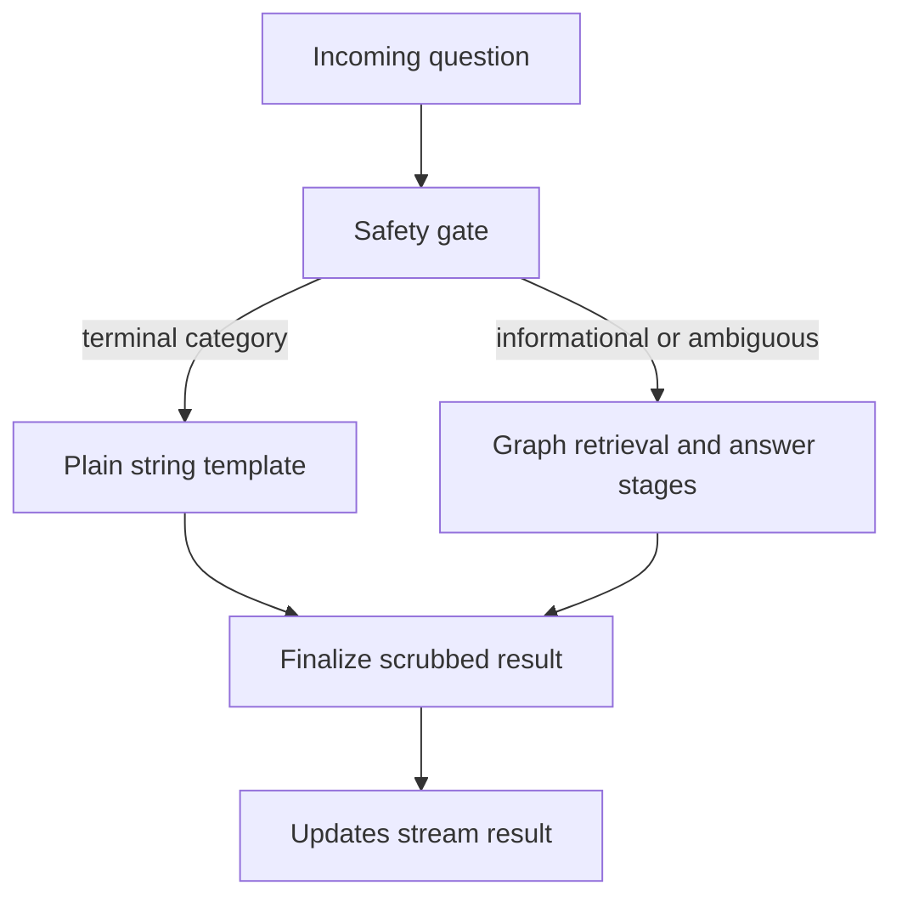

# Engineering decisions, evidence, and remaining scope

This page records what the repository demonstrates now. **Measured** means a named committed evaluation result; **decision**, **inference**, and **proposal** are labeled so that they are not mistaken for certification or delivered behavior.

## Decisions in force

| Area | Decision and boundary |
|---|---|
| Runtime and safety | LangGraph `StateGraph` is the active runtime; the earlier speculative orchestrator was removed. Its first node is the safety gate, which sanitizes before later processing, clears the raw-question channel, can route directly to a terminal response, and requires `updates` rather than raw-state streaming. |
| Retrieval | Keep Weaviate hybrid retrieval as the default. PageIndex, Pinecone hybrid retrieval, and Pinecone reranking remain opt-in experimental arms after their frozen retrieval/quality gates failed. |
| Routing candidates | Keep the current query route and LLM safety classifier. Query-or-respond is inconclusive after judge calibration missed its authored threshold before a paid arm run; Semantic Router is inconclusive because its pinned dependency cannot resolve under retained bounds. |
| Production releases | Deploy an immutable digest through a human-gated production environment. A release is the matched triple of git tag, image digest, and that tag’s Fly configuration; rollback redeploys the whole prior triple rather than mixing old code with new storage configuration. |

This diagram shows the governing request split: terminal categories do not enter retrieval or generation, while informational and ambiguous turns continue through the graph.

### Safety is a control, not a clinical claim

Terminal emergency, personal-advice, out-of-scope, prompt-injection, and identifier-recall handling uses plain-string responses with no follow-ups; terminal paths bypass retrieval and generation. Refusal templates are regression-tested to exclude a number paired with a clinical unit. The prompt-injection path has a bounded exception: an `ignore_instructions` residual can be re-assessed once, rather than creating an unbounded loop.

A qualifying emergency, injection, or personal-advice refusal can create a minimal persisted boundary in thread state. Later cue-matching re-asks replay the approved template without an LLM or retrieval, whereas explicitly informational monograph follow-ups remain eligible for the normal pipeline. This improves resistance to repeated pressure but is deliberately not a general conversation lock: cue-less or unmatched turns remain fresh classification trials.

**Measured safety comparison.** In the recorded 86-example comparison, the safety-gate run changed `safe_redirect` from 0.16 to 0.64 and `numeric_advice_leak` from 0.52 to 0.04. Overall correctness changed from 0.89 to 0.81; estimated cost and median latency declined because short-circuits skipped later stages. These are observations of that comparison, not a general quality guarantee.

The graph-stage ablation report supports retaining document evaluation, clarification, decomposition for complex questions, and answer validation. Follow-up generation was answer-neutral on the scored answers, so it remains a UX feature rather than a scored-answer quality control. Validation is the material cost/guardrail trade-off: removing it saves substantial work but weakens false-premise and grounding protections.

The system does **not** claim clinical-decision capability or HIPAA compliance. Sanitizer coverage is a heuristic inventory with documented residual exposure, including missed identifiers and operational surfaces outside the supported graph runtime.

## Regression protection and contributor workflow

Behavior-affecting changes are expected to carry before/after evaluation evidence in `evals/results/`; safety and multi-turn categories are explicit regression surfaces. Source and tests take precedence over unverified brief items. The project supplies centralized runtime, model, privacy, and safety conventions in `AGENTS.md`, repeatable Make targets for offline tests and evaluations, and focused graph, safety, routing-gate, and server-parity suites. This is the repository’s practical contract for safe AI-assisted changes, not a substitute for review.

For an experiment or decision to be interpretable, preserve its evaluator, configuration, dataset/provenance, and report. The retrieval decision records illustrate the rule: PageIndex stopped after a failed retrieval-only gate; Pinecone and reranker outcomes were evaluated against frozen gates; routing candidates that did not reach measurement are reported as **inconclusive**, not as wins, losses, or zero deltas.

## Production readiness: durable state with explicit ephemera

Production Fly configuration selects Postgres server storage. Threads, store items, and cron registrations persist across deploy disruption, while executing runs, pending queues, and SSE streams remain process-local; clients must retry or reconnect when a deployment breaks those ephemeral activities.

The deploy workflow validates an immutable digest, deploys it with the checked-out Fly configuration, waits for readiness, then runs a synthetic smoke profile and uploads a redacted log. Production environment protection makes this human-gated. A smoke failure turns the pipeline red but deliberately does **not** auto-rollback; a human chooses whether to initiate the rollback contract.

## Trade-offs, unchanged scope, and justified second pass

The intentional trade-off is conservative safety against answer coverage: short-circuiting and validation can refuse or suppress an otherwise answerable response. Recorded metrics show both safety gains and correctness or retrieval regressions in particular experiments; they do not prove universal improvement.

Unchanged scope is a monograph-grounded assistant, not a broad clinical service or a compliance certification. Durable server records do not make live runs, queues, or streams durable, and explicit deployment/release controls do not erase the need for human incident judgment.

**Second-pass proposals, not completed work.** First add focused fixtures and a sealed evaluation plan, then record execution separately. Evidence-backed candidates are: broaden classifier coverage for dialect and third-person emergency language; define operational retention, access, deletion, and backup controls for durable records; and revisit routing or retrieval alternatives only through their existing frozen gates. No adoption claim should be made until that work is actually measured.
