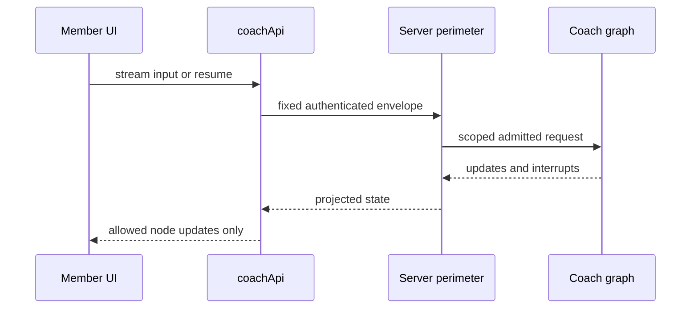

# Member frontend and coach protocol

The frontend mirrors the perimeter protocol but does not enforce its security. `frontend/src/chat/coachProtocol.ts` defines fixed `coach` stream inputs, resume shape, allowed rendered nodes, attachment sentinel, and status constants. `coachApi.ts` is the sole client surface for thread CRUD/state, upload/status, feedback, and streamed runs; `createCoachFetch()` refreshes/stamps a Supabase Bearer token. It never has internal secrets, cron authority, stores, or arbitrary assistant access.

## Thread and stream lifecycle

`streamRun` sends either a fixed input envelope or a fixed resume command. `applyStreamPart` consumes only update events from `RENDERED_NODE_NAMES`; unknown node updates are discarded with telemetry, and raw model tokens are not rendered. Projected state uses only public `values.messages` and `interrupts`. `useCoachChat` permits one active run per thread and injects network/timer/random dependencies for deterministic tests.

Caption: client filtering improves robustness; the [member perimeter](../agent/member-perimeter.md) is the authoritative enforcement point.

Uploads use the exact attachment sentinel and server-reported lifecycle state; polling does not invent progress. Feedback uses its dedicated endpoint. Erasure phase 2 snapshots all paginated owned threads and deletes the marker thread last; failure preserves retry state. See [member data lifecycle](../agent/member-data-lifecycle.md) for the backend record/cleanup protocol.

## Member stream perimeter v2 (live in production)

`NEXT_PUBLIC_HC_RAG_MEMBER_STREAM_PERIMETER` (baked at `next build`) mirrors the server's [member perimeter v2](../agent/member-perimeter.md) flip and must always match the deployed server's version. `useCoachStream.ts` uses `@copilotkit/react-core/v2/headless`'s `useAgent`; under v2 the UI additionally supports: thread history and time-travel (`TimeTravel`, fork from a checkpoint), branching (copy a branch, fork from a checkpoint), joining/rejoining an in-flight or resumable run after a reload, a client submission queue (`QueueBar`) that lets a member submit a turn while one is already streaming (server-side `multitask_strategy=enqueue`), and editing a prior human turn (`MessageList`'s `canEdit`, gated on v2). Under v1 these UI paths are gated off and the corresponding specs skip (`frontend/e2e/history.spec.ts`).

Focused tests: `frontend/src/chat/__tests__/timeTravel.test.tsx`, `branching.test.tsx`, `rejoin.test.tsx`, `queue.test.tsx`, `protocol.test.ts` (perimeter-exact request bodies for both versions). Run with `bun --cwd frontend run test`; the hermetic Playwright suite (`COACH_E2E_PERIMETER=v2 bun --cwd frontend run playwright`) exercises the full v2 protocol against a live server.

## Catalog and data envelopes

`src/catalog/` has schemas, registry, hydration, rendering, dispatch, and telemetry for the same 11 composable backend components. The pipeline validates recursive wire shape, component schema, closed dispatch ID, same-turn `DataRef`, RFC-6901 pointer resolution, and then concrete hydrated values. Invalid node/subtree renders `null` while valid siblings survive with typed telemetry.

Fact props cannot be literals: `createHydrator()` resolves only the current turn's envelope and marks a same block from another turn `cross_turn`. Action IDs are closed to logging, schedule/reminder, upload, and confirm/decline actions; unknown actions fail closed. Fixed-contract document/memory/calendar/reminder cards bypass free model composition. Backend validation/retry/fallback is documented in [coach routing](../agent/coach-routing.md).

## Evidence and validation

- `frontend/src/chat/__tests__/protocol.test.ts` and `forbiddenModes.test.ts` pin request bodies and forbid extra modes.
- `streamWire.test.ts` pins rendered-node filtering; `erase.test.ts` pins pagination/marker-last/fail-stop semantics.
- `frontend/src/catalog/__tests__/catalog.test.tsx` and `dataRef.fixture.test.ts` cover render containment and shared backend/frontend data-reference grammar.
- `frontend/e2e/smoke.spec.ts` is the browser-level surface.

Use Bun as defined in `frontend/package.json`: `bun --cwd frontend run test`, then `bun --cwd frontend run build`; run the configured Playwright command when UI/integration behavior changes. The client protocol must change in lockstep with the perimeter contract and its Python tests.
