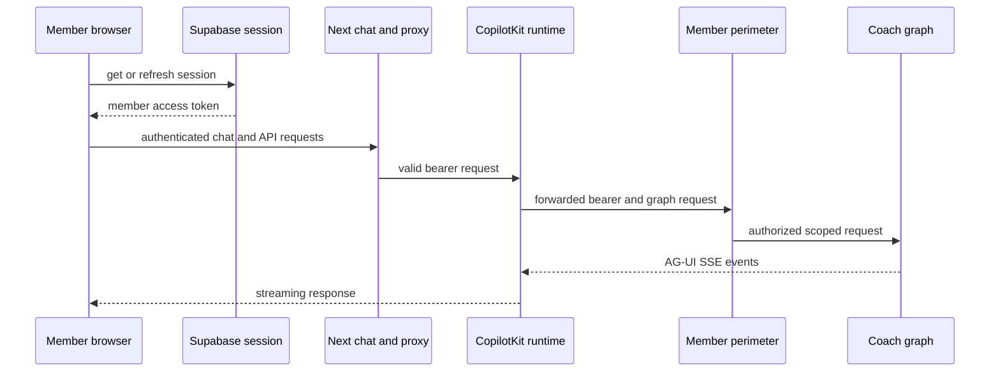

# Member frontend and CopilotKit transport

The member frontend is the browser-facing Next.js App Router application for coach conversations. It owns session-aware UI, member thread operations, chat projection, and presentation. It is **not** the authorization authority: browser checks and the proxy's bearer-format/thread probes improve the boundary, but the downstream member perimeter authorizes the Supabase identity and thread ownership. See [member perimeter](../agent/member-perimeter.md), [coach routing](../agent/coach-routing.md), and [agent server](../server/agent-server.md) for the server-side transport and protocol contract this app mirrors and talks to.

## Entry and authentication boundary

`/chat` first obtains the Supabase session in the browser (`getSupabase().auth.getSession()`). A missing email or a session lookup failure redirects to `/login`. Before rendering chat it calls `refreshCopilotKitAuthorization()` (`src/lib/copilotkit-auth.ts`), which fetches the current Supabase access token and caches it as `Authorization: Bearer <token>` in a module-level variable that the synchronous `copilotKitHeaders()` function later reads. Only then does it mount the CopilotKit v2 provider in multi-route mode (`useSingleEndpoint={false}`), selecting agent `coach` at the same-origin `/api/copilotkit` endpoint and passing `copilotKitHeaders` as the header source. Production dependencies (`createBrowserDeps()`) are constructed only after this gate. The chat controller also re-calls `refreshCopilotKitAuthorization()` immediately before every run, resume, and reconnect (`useCoachStream.ts`'s `run`/`respond`/`getThread`), so the cached header is not left to go stale across a long-lived session; a run additionally waits up to a 15-second readiness deadline for the CopilotKit core to finish registering its agent before submitting.

This is a client-side readiness and credential-propagation check, not server authorization. The client may send a current member bearer, but all direct member API calls and the proxy's downstream calls must be treated as untrusted requests by the server perimeter.



Caption: the browser obtains and refreshes a session, while the downstream perimeter remains the authority for identity and ownership.

## CopilotKit proxy and AG-UI transport

The catch-all `/api/copilotkit` route (`src/lib/copilotkit-runtime.ts`) lazily builds a `CopilotRuntime` with a `LangGraphAgent` (subclassed as `CoachLangGraphAgent`) for graph `coach` and an `InMemoryAgentRunner`. Its `onRequest` hook is the *only* every-route gate: it rejects any request whose `Authorization` header is missing or does not match `Bearer <token>` with 401 before the runtime ever dispatches it. Default CopilotKit header forwarding — not a platform key — carries that bearer to the LangGraph deployment named by `LANGGRAPH_DEPLOYMENT_URL`. No `intelligence`/license-key option or CORS configuration is present, since Next serves the route same-origin. See [agent server](../server/agent-server.md) for the authoritative protocol this proxy forwards into.

`CoachLangGraphAgent` overrides `getSchemaKeys()` to return a pinned member-visible schema (`question`, `attachment_id`, `ag-ui`, `copilotkit` inputs; `messages` output) because the OSS agent server keeps `/assistants/:id/schemas` at 501; without the override, AG-UI's HTTP-error fallback would drop the question and adapter markers instead of forwarding them.

The runtime's in-memory thread list is global rather than member-scoped, so it has no notion of per-bearer ownership. Accordingly:

- `GET /api/copilotkit/threads` intentionally returns an empty page (`{threads: [], nextCursor: null}`) rather than every member's thread ids; the sidebar instead reads threads through the direct member thread API (`coachApi.ts`).
- For any URL-addressed thread, stop operation, or run/connect request that names a body `threadId`, the proxy's `authorizeThreadAccess()` first performs `GET /threads/{id}` upstream with the same bearer. An inaccessible or erased thread is answered with a uniform 404 (the same shape as a perimeter denial, so thread existence is never leaked) before the runtime can read, stop, connect, or recreate it. This probe is required because every legitimate thread is created through the direct member surface (`ensureThread`) before its first run, so a body `threadId` unknown upstream is never legitimate here.
- The proxy re-wraps SSE responses (`asByteStream()`) to encode string chunks to bytes without buffering, for Node/undici compatibility, keeping the stream live end to end.

Request logging is deliberately narrow: method, pathname, status, and an unverified JWT `sub` decoded solely for correlation (`principalId()`). It never logs request bodies, query values, or bearer tokens, and the decoded `sub` is never used as an authorization decision — only the perimeter's own identity check is.

## Chat state, projection, and recovery

`useCoachStream.ts` is the chat controller. It accepts an injected `CoachChatDeps` bundle (network, timing, polling, and ID seams) so component tests can drive the full lifecycle from scripted fakes with zero real network or timers; production wiring is constructed once in `coachClient.ts`'s `createBrowserDeps()`. The headless `useAgent`-based engine (`useCopilotKitCoachStream`) waits for CopilotKit core readiness before a run or resume, refreshes CopilotKit authorization immediately before those operations, and projects AG-UI `user`, `assistant`, and `tool` messages into the wire model; reasoning, activity, developer, and system messages are not projected.

Two files form the browser protocol client that this controller wires together:

- `coachApi.ts` is the direct HTTP/SDK client, shaping every member-facing call byte-for-byte to what the member perimeter (mirrored in `coachProtocol.ts`) allows.
- `stream.ts` exposes the pure `applyStreamPart()` reducer, which folds one AG-UI/LangGraph SDK stream event at a time into `{messages, interruptValue}`.

Only nodes in `coachProtocol.ts`'s `RENDERED_NODE_NAMES` allow-list — `coach_gate`, `coach_agent`, `erase_my_data`, `reminder_delivery`, `claim_document`, `review_document`, `finalize_coach` — may contribute messages; the reducer drops updates from any other node and reports them through `chatTelemetry({kind: "unknown_node"})`. Human messages arriving through the stream are ignored, because the human chat bubble is a local echo (the gate's scrubbed HumanMessage still lands in thread state for history reads). The reducer treats the AG-UI `__interrupt__` event and an in-band `{"__interrupt__": [...]}` payload nested inside an `updates` event identically — both resolve through `firstInterruptValue` — because the agent server delivers interrupts inside the updates stream rather than as a distinct SSE event.

Thread state reads are merged with live stream messages by stable message identity via `model.ts`'s `mergeMessages()`, then split into HumanMessage-bounded turns via `buildTurns()`, which also extracts per-turn DATA envelopes for catalog hydration. Switching threads clears the agent messages and controller state before the newly selected thread is reloaded, preventing the prior conversation from bleeding into the next one; selection triggers exactly one thread reconnection rather than stacking connections, and the controller supports non-cancelling detach/disconnect with subsequent rejoin.

A send creates a thread when necessary, echoes the human message locally, and starts a run. While a run is active, later sends are appended to a FIFO queue (`enqueueSend`/`queue` state) and drained one at a time once the controller is idle, avoiding overlapping runs on one thread. `stop` asks the stream to stop; v2 transport cancellation additionally goes through the dedicated stop route. A missing active thread clears local messages, interrupts, staged upload state, and title, refreshes the thread list, and presents a recoverable friendly error rather than crashing the UI.

### Version and feature gates

`NEXT_PUBLIC_HC_RAG_MEMBER_STREAM_PERIMETER` is a build-time public compatibility flag whose value must match the deployed member perimeter's stream protocol:

- Default/v1 mode streams updates only, over non-resumable streams, and rejects multitasking.
- `v2` streams updates plus messages, over resumable streams, with `multitaskStrategy: "enqueue"`; it enables rejoin and checkpoint-based fork/edit/regenerate paths.

History, time-travel, and visible branching controls require the separate opt-in `NEXT_PUBLIC_COACH_HISTORY_BRANCH_UI=1`; the underlying controller operations remain callable when this UI gate is off.

`regenerateEligibility()` restricts regeneration/branch/feedback to the latest HumanMessage-bounded turn only: it is disabled when that turn has tool activity, a `ToolMessage`, a pending interrupt, an erase marker, an unanswered question, or the document-review sentinel question — never an older turn.

## Rendering, interrupts, and data references

`CoachToolRenderers` is mounted once inside the CopilotKit provider (in `app/chat/page.tsx`) and registers the tool, interrupt, medical, envelope, clipboard, and fallback renderers via `useRenderTool`/`useInterrupt`/`useFrontendTool`. Catalog rendering is fail-closed end to end:

- `compose_ui` trees must pass the wire schema, and render only after a correlated successful `ToolMessage`; a correlated error suppresses the tree in favor of textual output.
- The catalog hydrates `__ref` fact props only from a same-turn-scope DATA envelope, with RFC 6901 pointer resolution; cross-turn matches are explicitly rejected as `cross_turn`, and absent or invalid data is left unresolved.
- Button/action ids dispatch only through the fixed `DISPATCH_ACTIONS` map; unknown or known-but-unregistered ids are telemetry no-ops, never a crash or an arbitrary browser action.
- Any failing node renders nothing while sibling nodes still render.
- Only schema-recognized calendar-change and memory-extraction interrupts display approval cards; their `{accept, fields?}` responses are validated before resolve, and malformed/unknown payloads render no member action and emit telemetry instead.

The composable catalog registry is exactly 11 components: `InjectionTracker`, `MiniCalendar`, `TrendCard`, `ActionCard`, `StatRow`, `ScoreRing`, `Timeline`, `Card`, `Tag`, `Label`, `Button`. The four fixed-contract cards — `CalendarChangeCard`, `MemoryExtractionCard`, `DocumentIngestCard`, `ReminderCard` — are explicitly *not* part of this catalog; they render directly from interrupts, upload status, or envelopes instead of the composable pipeline. Every fact-bearing catalog prop must be a `{__ref: {turn_scope_id, block_id, pointer}}` data reference (`DataRefSchema`); the wire zod schema rejects literal fact props outright, while static labels/actions remain literals under a fixed allow-list.

The browser can offer a small local `copy_to_clipboard` headless tool, but unknown client tool input is rejected. These client render and schema checks contain malformed model/transport output; they do not replace the server's own tool and resume validation.

## Uploads, erasure, and direct member API

The direct `coachApi.ts` surface is limited to member thread CRUD (`createThread`, `searchThreads`, `getThread`, `deleteThread`, `copyThread`), state/history (`getThreadState`), upload/status (`postUpload`, `getUploadStatus`), feedback (`postFeedback`), and run-related endpoints (`streamRun`); a thrown `CoachApiError` always carries the HTTP status. Cron, assistant-search, and store endpoints are never called from this app. `createCoachFetch()` and the LangGraph SDK request hook retrieve the Supabase access token per request rather than relying on a page-load cached token; `supabaseAccessToken()` refreshes when under one minute of validity remains, so direct member API calls always carry a fresh bearer — unlike the CopilotKit provider's cached-and-explicitly-refreshed header described above.

Attachments progress only through server-reported stages (`uploading`, `scanning`, `extracting`, `done`) tied to the fixed document-review sentinel question; client polling advances state solely from returned status, never from local timers.

Client-driven erasure phase 2 (`runErasePhase2`) begins only after the server-side marker flow reaches terminality (a clean stream EOF, or polling `GET /threads/{id}` until status is not `busy`). It fully snapshots paginated owned threads in ascending thread-id order, deletes non-marker threads first, deletes the marker-bearing current thread last, and is fail-stop by design: any DELETE failure preserves the remaining IDs (including the marker thread) so a retry can resume from the persisted marker rather than continuing best-effort.

## Environment and operation

Run the application with Bun; all commands run as `bun --cwd frontend run …` from the repository root:

```sh
bun --cwd frontend run dev
bun --cwd frontend run build
bun --cwd frontend run test
bun --cwd frontend run playwright
```

Browser-visible configuration is restricted to `NEXT_PUBLIC_*` values: Supabase URL, Supabase anonymous key, public LangGraph URL, and the explicit UI/protocol gates above. `NEXT_PUBLIC_SUPABASE_ANON_KEY` is an intended public client identifier, not a secret. **Never place secrets, service-role credentials, LangSmith keys, deployment tokens, or other privileged values in `NEXT_PUBLIC_*` variables** — Next embeds them in the browser bundle. The server-only proxy obtains its deployment target from `LANGGRAPH_DEPLOYMENT_URL` (accepting `NEXT_PUBLIC_LANGGRAPH_URL` as an alias); absent configuration fails only when the proxy is first used, not at build time.

The frontend test command `bun --cwd frontend run test` runs `vitest run` in a jsdom environment with `@/*` aliased to `src/*` and tests collected under `src/**/*.test.{ts,tsx}` (see `vitest.config.ts`). This JavaScript/TypeScript toolchain is entirely separate from the Python backend's `pytest`-based suite (invoked via `uv`/`make test`): the two share no dependency manifest, configuration, or invocation path, and neither substitutes for the other in CI.

## Focused verification

Tests split cleanly by whether they need a live coach graph:

- **Hermetic (no live backend), Vitest** — component/unit tests under `src/**/__tests__/`, run via `bun --cwd frontend run test`, exercise everything above with scripted `CoachChatDeps`/fake stream parts: route tests cover the all-method bearer gate, forwarded-bearer/SSE handling, runtime-list suppression, thread-probe 404 behavior, and log canaries proving token/body omission; chat tests cover protocol exactness, forbidden stream modes, node filtering, queue ordering, rejoin, time-travel/branching gates, catalog rendering, interrupts, values hydration, attachment stages, erasure, and regeneration eligibility.
- **Hermetic (no live external network, but a real local agent server), Playwright** — `bun --cwd frontend run playwright` boots an offline scripted gateway (fake OpenAI/Supabase/LangSmith), a real `langgraph dev` server, and a production `next start`, all on allocated ports, with zero external network calls; it intentionally runs with a single worker because fixture state and the single ephemeral stack are order-dependent. This suite verifies two-member isolation, erased-thread unreachability, a Next restart reconnecting via `/connect`, v2 cancellation, concurrent isolated streams, and that registered tool cards and final answers appear without raw tool-call wrappers.
