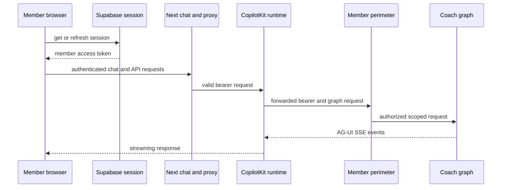

# Member frontend and CopilotKit transport

The member frontend is the browser-facing Next.js App Router application for coach conversations. It owns session-aware UI, member thread operations, chat projection, and presentation. It is **not** the authorization authority: browser checks and the proxy's bearer-format/thread probes improve the boundary, but the downstream member perimeter authorizes the Supabase identity and thread ownership. See [member perimeter](../agent/member-perimeter.md), [coach routing](../agent/coach-routing.md), and [operations runbook](../operations/runbook.md) for the server-side contract and operations.

## Entry and authentication boundary

`/chat` first obtains the Supabase session in the browser. A missing email or a session lookup failure redirects to `/login`; before rendering chat, it refreshes the cached Authorization header used by CopilotKit. It then mounts the CopilotKit v2 provider in multi-route mode (`useSingleEndpoint={false}`), selecting agent `coach` at the same-origin `/api/copilotkit` endpoint. Production dependencies are constructed only after this gate.

This is a client-side readiness and credential-propagation check, not server authorization. The client may send a current member bearer, but all direct member API calls and the proxy's downstream calls must be treated as untrusted requests by the server perimeter.



Caption: the browser obtains and refreshes a session, while the downstream perimeter remains the authority for identity and ownership.

## CopilotKit proxy and AG-UI transport

The catch-all API route delegates to a lazily built CopilotKit runtime containing a `LangGraphAgent` for graph `coach` and an `InMemoryAgentRunner`. Its every-route gate rejects missing or malformed `Authorization: Bearer <token>` before runtime dispatch. Default CopilotKit header forwarding carries that bearer to the LangGraph deployment; no platform key is introduced by this proxy. The runtime also fetches `GET /assistants/{assistant_id}/graph` before ordinary non-regenerate agent runs; the clean-room [agent server](../server/agent-server.md) serves this authorized topology from the configured raw graph, and the member perimeter admits the coach path.

The runtime's in-memory thread list is global rather than member-scoped. Accordingly, `GET /api/copilotkit/threads` returns an empty page while the sidebar uses the direct member thread API. For any URL-addressed thread, stop operation, or run/connect request that names a body `threadId`, the proxy first performs `GET /threads/{id}` upstream with the same bearer. An inaccessible or erased thread becomes a uniform 404 before the runtime can read, stop, connect, or recreate it. The proxy also preserves event streaming: it converts string SSE chunks to bytes without buffering for Node/undici compatibility.

Request logging is deliberately narrow—method, pathname, status, and an unverified JWT `sub` used only for correlation. It does not log request bodies, query values, or bearer tokens. The decoded `sub` is never an authorization decision.

## Chat state, projection, and recovery

`useCoachStream.ts` is the chat controller and accepts injected network, timing, polling, and ID seams so component tests can run the lifecycle without a real server. The headless `useAgent` adapter waits up to its readiness deadline before a run or resume, refreshes CopilotKit authorization immediately before those operations, and projects AG-UI `user`, `assistant`, and `tool` messages into the wire model. Reasoning, activity, developer, and system messages are not projected.

Only recognized top-level rendered nodes and specific top-level internal coach nodes may contribute messages. Unknown nodes and all subgraph messages are hidden and reported through telemetry. Switching threads clears the agent messages and state before the selected thread is reloaded, preventing the prior conversation from being displayed in the new one. Thread state reads are merged with stream messages by stable message identity, then split into HumanMessage-bounded turns for rendering.

A send creates a thread when necessary, echoes the human message, and starts a run. While a run is active the controller appends later sends to a FIFO queue and drains one at a time when idle. It supports non-cancelling detach/disconnect and subsequent rejoin; selection triggers one thread reconnection rather than repeatedly stacking connections. A missing active thread clears local messages, interrupts, staged upload state, and title, refreshes the thread list, and presents a recoverable friendly error. `stop` asks the stream to stop, while v2 transport cancellation is covered by the stop route.

### Version and feature gates

`NEXT_PUBLIC_HC_RAG_MEMBER_STREAM_PERIMETER` is a build-time public compatibility flag, not a secret. Its value must match the deployed perimeter protocol:

- Default/v1 uses updates only, non-resumable streams, and reject multitasking.
- `v2` uses updates plus messages, resumable streams, and `multitaskStrategy: "enqueue"`; it enables rejoin, checkpoint-based fork/edit/regenerate paths, and client queue compatibility.
- History, time-travel, and visible branching controls require the separate opt-in `NEXT_PUBLIC_COACH_HISTORY_BRANCH_UI=1`; the underlying controller operations remain callable when the UI gate is off.

Regeneration is intentionally narrower than normal send: it may replay only the latest HumanMessage-bounded completed assistant turn, using that turn's own question. It is disabled when that turn has tool activity, an erase marker, a pending interrupt, or a completed staged attachment.

## Rendering, interrupts, and data references

`CoachToolRenderers` is mounted within the provider and registers the supported tool, interrupt, medical, envelope, clipboard, and fallback renderers. Rendering is fail-closed:

- `compose_ui` parameters must pass the composed-node schema. Its tree renders only after a correlated successful `ToolMessage`; a correlated error suppresses the tree in favor of the textual result.
- The catalog hydrates `__ref` fact props only from a DATA envelope belonging to the same turn scope and resolves RFC 6901 pointers inside envelope `data`. A matching block from another turn is explicitly `cross_turn`; absent or invalid data is unresolved. Values-channel extraction ignores unknown shapes, deduplicates real envelopes, and can synthesize narrowly defined envelopes for `todos`, `citations`, and `metrics`.
- Catalog actions are a closed dispatch map. Unknown IDs and known-but-unregistered handlers are telemetry no-ops, never arbitrary browser actions.
- Only schema-recognized calendar-change and memory-extraction interrupts display approval cards. Their responses are validated as `{accept, fields?}` before resolve; malformed or unknown payloads render no member action and emit telemetry.

The browser can offer a small local `copy_to_clipboard` headless tool, but unknown client tool input is rejected. These client render and schema checks contain malformed model/transport output; they do not replace the server's tool and resume validation.

## Uploads, erasure, and direct member API

The direct `coachApi` surface is limited to member thread CRUD, state/history, upload/status, feedback, and run-related endpoints. `createCoachFetch()` and the LangGraph SDK request hook retrieve the Supabase token per request; `supabaseAccessToken()` refreshes a session with under one minute remaining. This avoids relying on the page's initial cached token for direct calls.

Attachments use the fixed document-review sentinel and server-reported stages (`uploading`, `scanning`, `extracting`, `done`); polling advances only from returned status. Erasure phase 2 begins after the server-side marker flow: the client waits for terminality, fully snapshots paginated owned threads in ascending ID order, deletes non-marker threads first, then deletes the marker-bearing current thread last. A delete failure fail-stops and preserves remaining IDs (including the marker thread) for retry.

## Environment and operation

Run the application with Bun:

```sh
bun --cwd frontend run dev
bun --cwd frontend run build
bun --cwd frontend run test
bun --cwd frontend run playwright
```

Browser configuration reads only `NEXT_PUBLIC_*` values: Supabase URL, Supabase anonymous key, public LangGraph URL, and explicit UI/protocol gates. `NEXT_PUBLIC_SUPABASE_ANON_KEY` is an intended public client identifier, not a secret. **Never place secrets, service-role credentials, LangSmith keys, deployment tokens, or other privileged values in `NEXT_PUBLIC_*` variables**—Next embeds them in the browser bundle. The server-only proxy obtains its deployment target from `LANGGRAPH_DEPLOYMENT_URL` (with the public URL accepted as a deployment alias); absent configuration fails when the proxy is first used rather than at build time.

For integration changes, run the configured Playwright suite. Its global setup starts an offline scripted gateway, real `langgraph dev`, and production `next start` on allocated ports; it intentionally runs one worker because fixture state and the single ephemeral stack are order-dependent.

## Focused verification

- Route tests cover the all-method bearer gate, forwarded bearer and SSE handling, runtime-list suppression, thread-probe 404 behavior, and log canaries proving token/body omission.
- Chat tests cover protocol exactness, forbidden modes, node filtering, queue ordering, rejoin, time travel/branching gates, rendering, interrupts, values hydration, attachment stages, erasure, and regeneration eligibility.
- Hermetic transport E2E verifies two-member isolation, erased-thread unreachability, a Next restart reconnecting with `/connect`, v2 cancellation, and concurrent isolated streams. Tool-call E2E verifies registered cards and final answers appear without raw tool-call wrappers.
