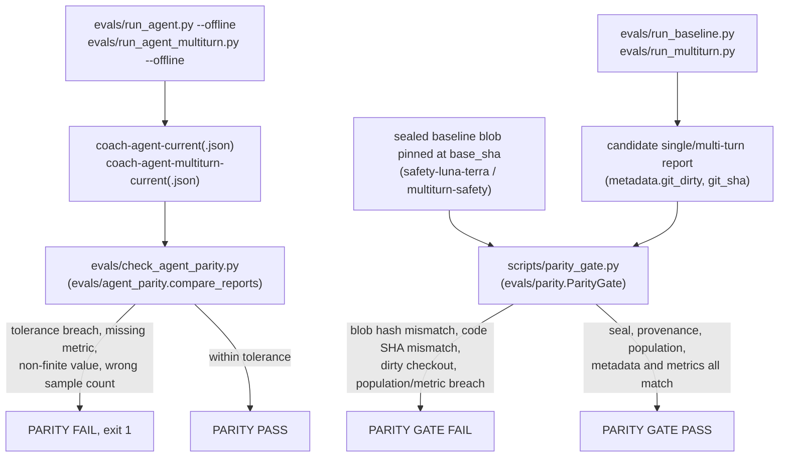

# Evaluation governance and integrity checks

Evaluation numbers are only meaningful as a comparison, and a comparison is only valid if both runs measured the same thing under the same conditions. This page owns the mechanisms that establish that equivalence and reject a claim when it does not hold: git-cleanliness seals, provenance manifests, and the two parity gates. The evaluation workflows themselves — the golden/multi-turn suites, the retrieval-arm gate, and the routing gates — are documented in [tracing and evaluations](evaluations.md), [retrieval arms](../retrieval/arms-and-reranking.md), and [routing evaluations](routing-evals.md); this page is their shared comparability contract.

## What makes two runs comparable

A candidate run is comparable to a baseline only if the dataset revision, evaluator/prompt/judge code, model and reasoning-effort settings, thresholds, concurrency/repetitions, and pricing table are identical. `evals/parity.py`'s `Metadata` equality check enforces this at the report level: `concurrency`, `disabled_stages`, `llm_model`, `validator_model`, `judge_model`, `reasoning_effort`, `pricing_as_of`, `chunk_file_hashes`, `judge_usage.reasoning_effort`, and (for multi-turn) `sim_user_model` must match exactly between baseline and candidate, or the comparison is rejected outright (`repo://evals/parity.py#L163-L181`).

Equal configuration is necessary but not sufficient — the two runs must also have scored the same population. `ParityGate._population` requires equal row counts, an equal example-ID multiset, equal split and category distributions, and equal `n_examples`/`n_conversations`; multi-turn additionally requires equal row-kind distribution, equal `n_turns_expected` per example, and that every `scripted` candidate row actually exposed as many turns as expected (`repo://evals/parity.py#L183-L199`). A candidate that answered a different set of questions, dropped a category, or truncated a scripted conversation cannot be compared even if its metrics look better.

The retrieval-arm gate (`evals/pageindex_gate.py`) applies the same principle by construction rather than by after-the-fact check: it re-runs the reference and the candidate arm together, in the same session, with identical flags, and never diffs a candidate against a historical committed report — retrieval, safety, decomposition, generation, and validation are held identical so any measured delta is attributable to the one thing that changed. The routing gates apply an equivalent rule across arms in one gate invocation via provenance binding (below).

## Seal: the git-cleanliness gate

`evals/seal_clean.py` decides whether a checkout is clean enough for its resulting report to be trusted as reproducible. `check_clean()` runs `git status --porcelain` and `is_clean_status()` accepts only an allowlisted set of untracked artifacts: paths under `evals/results/` with a `.json`, `.md`, or `.log` suffix, and paths rooted at `.omo`, `.claude`, `dist`, `__pycache__`, or `.pytest_cache`. Any tracked modification, any untracked `.py` file, and any untracked executable file are rejected regardless of path — a generated report cannot smuggle in a code change (`repo://evals/seal_clean.py#L11-L50`).

`evals/run_baseline.py` and `evals/run_multiturn.py` call `check_clean()` to compute the `git_dirty` field written into every report's metadata; a `GitStatusError` (git itself failing) is treated as dirty rather than silently passing (`repo://evals/run_baseline.py#L80-L84`). Both parity gates described below hard-require `git_dirty == False` on the candidate report before trusting any of its metrics — a dirty candidate is rejected before its numbers are even examined. `tests/test_seal_clean.py` and `tests/test_eval_seal.py` cover exempt-path classification, untracked-executable rejection, and the explicit `GitStatusError` on git failure.

## Two parity gates, two different guarantees

The repository has two independent parity mechanisms that are easy to conflate because both compare a "current" report against a "baseline" report and both fail loudly on drift. They protect different surfaces.

*The coach-agent offline gate (top) and the code-sealed pipeline gate (bottom) are separate tools with separate baselines and separate tolerance rules.*

### Coach-agent offline parity (`agent_parity.py` / `check_agent_parity.py`)

`evals/check_agent_parity.py` compares the offline coach-agent reports (`coach-agent-current.json` against `coach-agent-current-baseline.json`, and the multi-turn equivalents) using `evals/agent_parity.compare_reports`. Each metric value is either a single finite number or exactly three judge-repetition samples reduced to their median; a wrong sample count or a non-finite value raises `MetricShapeError` and fails the run (`repo://evals/agent_parity.py#L44-L64`). Default single-turn comparison checks `chunk_recall` (±0.02) and the judge metrics `correctness`/`groundedness` (±0.05) as higher-is-better; the multi-turn invocation instead requires `safe_redirect` and `behavior_match` (`SAFETY_HIGHER`) with zero tolerance for regression, plus a zero-tolerance ceiling on `forbidden_content`, `numeric_advice_leak`, `safety_drift`, `pii_persistence`, and `boundary_violations` (`SAFETY_LOWER`) whenever either report carries them (`repo://evals/agent_parity.py#L31-L109`, `repo://evals/check_agent_parity.py#L54-L68`). A metric missing from either report is a hard failure, never a skipped check. This gate is run through `make eval-agent` / `make eval-agent-multiturn` and guards the [coach agent](../agent/coach.md) the same way the pipeline gate guards the RAG path.

### Code-sealed pipeline parity (`parity.py` / `scripts/parity_gate.py`)

`scripts/parity_gate.py` runs `evals.parity.ParityGate` over explicit single- and multi-turn baseline/candidate report pairs. Before comparing any metric it pins the baseline reports and the evaluation source files that produced them to a specific commit: `_pin()` compares the git blob hash recorded at `base_sha` for `evals/results/safety-luna-terra-*.json`, `evals/results/multiturn-safety-*.json`, `evals/golden_dataset.json`, `evals/multiturn_dataset.json`, `evals/evaluators.py`, `evals/multiturn_evaluators.py`, and `evals/pricing.py` against what is actually on disk (`repo://evals/parity.py#L16-L24`, `#L155-L162`, `#L293-L301`). If a baseline report or the dataset/evaluator code behind it has been edited since `base_sha` without updating the pin, the gate fails before any metric is even read — this is what stops someone from quietly editing a committed baseline (or the code that produced it) and then calling an unrelated change "no regression."

The gate then requires the candidate's `metadata.git_sha` to resolve to the current code SHA, `metadata.git_dirty` to be `False`, and a fixed set of pipeline settings (`engine=graph`, `safety=True`, `max_subqueries=3`, `decompose_only_complex=True`, `structured_strict=False`) to hold on both the single- and multi-turn candidate (`repo://evals/parity.py#L302-L313`). Only after seal, code identity, and configuration all check out does it run the metadata/population/metric comparisons described above. Two accepted amendments are encoded directly as named tolerances rather than left as ad hoc slack: `hallucinated` is compared only over examples both engines actually answered, reporting newly-answered examples as an informational note instead of shifting the denominator (Amendment A1, `repo://evals/parity.py#L252-L291`); and `safety_drift` gets a wider +0.15 ceiling and `latency_p50_s` a ×1.35 ceiling, both documented in-line as accepted judge-phrasing sensitivity and the accepted conditional-pipeline redesign rather than silent threshold inflation (Amendment A2, `repo://evals/parity.py#L222-L249`). A breach prints every failing metric/label and exits nonzero; passing notes (such as the newly-answered count) print alongside a pass and never cause failure on their own (`repo://scripts/parity_gate.py#L22-L44`).

`evals/parity_drills.py` builds a real temporary git repository with a committed baseline and a matching sealed candidate (`sealed_reports` fixture) so `tests/test_parity_gate.py` can run the actual gate binary against both a clean positive control and targeted negative drills: a metric breach, a missing metric, a duplicate example ID, a candidate `git_sha` that does not resolve to the recorded code SHA, a shortened scripted multi-turn conversation, and a non-finite metric value each must fail with the expected reason string (`repo://tests/test_parity_gate.py#L56-L100`).

## Routing lane provenance binding

The routing gates (see [routing evaluations](routing-evals.md)) use a parallel but distinct binding mechanism: `evals/routing_provenance.RoutingProvenance` records the git SHA, cleanliness, arm environment, local/remote row-ID populations, per-artifact SHA-256 hashes (code, dataset, multiturn, prototypes, thresholds, evaluators, prompts, `uv.lock`), experiment identity, semantic-router/encoder/judge versions, repetitions, and concurrency for one arm run. `ExperimentRows` rejects a manifest whose local row-ID set does not exactly match its LangSmith row-ID set, and canonicalizes both to a sorted tuple so ordering cannot hide a mismatch (`repo://evals/routing_provenance.py#L41-L65`).

`compare_manifests()` is the cross-arm check run before any staged decision: it requires every manifest in a gate run to share the reference manifest's git SHA, artifact hashes, row-ID population, repetitions, concurrency, judge model, encoder model, and semantic-router version, and raises a typed `ProvenanceError` naming exactly which field diverged (`git_sha`, `hashes`, row binding, or measurement settings) otherwise (`repo://evals/routing_provenance.py#L114-L142`). It separately rejects a lane-contaminated arm environment — a query-lane manifest whose safety classifier is not `llm`, or a safety-lane manifest whose query arm is not `current` — via `_check_lane`, so a manifest built for one lane cannot be fed into the other lane's decision (`repo://evals/routing_provenance.py#L103-L112`). `tests/test_eval_seal.py` exercises SHA, hash, row-population, row-order, missing-URL, and mixed-lane rejection paths against synthetic manifests.

## What integrity checks reject, summarized

| Check | Rejects |
|---|---|
| `Metadata` equality (`parity.py`) | Different model, judge, reasoning effort, concurrency, pricing table, or chunk hashes between baseline and candidate |
| Population equality (`parity.py`) | Different row count, example-ID set, split/category mix, or (multi-turn) a scripted conversation that dropped turns |
| `_pin` blob check (`parity.py`) | A baseline report or its dataset/evaluator source edited since the pinned commit |
| Code-SHA / dirty check (`parity.py`, `seal_clean.py`) | A candidate whose `git_sha` doesn't resolve to the current commit, or whose checkout has uncommitted/untracked non-artifact changes |
| Metric tolerance (`parity.py`, `agent_parity.py`) | A regression beyond the documented per-metric tolerance, including amendment-adjusted ones (A1 hallucinated denominator, A2 safety-drift/latency) |
| Shape check (`agent_parity.py`) | A metric that is missing, non-finite, or carries a judge-sample tuple of the wrong length |
| `compare_manifests` (`routing_provenance.py`) | Arms in one routing-gate run with different git SHA, artifact hash, row-ID population, repetitions, concurrency, or a lane-contaminated arm environment |

## Change checklist

1. Add a regression as a dataset row/conversation (see [tracing and evaluations](evaluations.md)) rather than special-casing it in gate code.
2. Keep dataset revision, evaluator/prompt/model code, thresholds, repetitions, concurrency, and (for routing) arm manifests identical between the runs being compared; changing any of them invalidates a direct comparison until both sides are re-run under the new configuration.
3. Run from a clean checkout (`git status --porcelain` empty apart from allowlisted generated artifacts) so `metadata.git_dirty` is `False` and the report can seal.
4. Re-measure both sides together for a paired decision (retrieval-arm and routing gates); never diff a new candidate against an old, un-refreshed historical report.
5. Run the relevant parity gate before claiming "no regression": `evals/check_agent_parity.py` for the coach agent, `scripts/parity_gate.py` for the sealed single-/multi-turn pipeline reports. Treat a nonzero exit as a rejected comparison, not a warning to override.
6. Record any accepted tolerance widening in the gate itself with a named rationale (as amendments A1/A2 do), not as a silent threshold edit — per the reporting-discipline standard in [engineering decisions and scope](../decisions/submission-scope.md).
