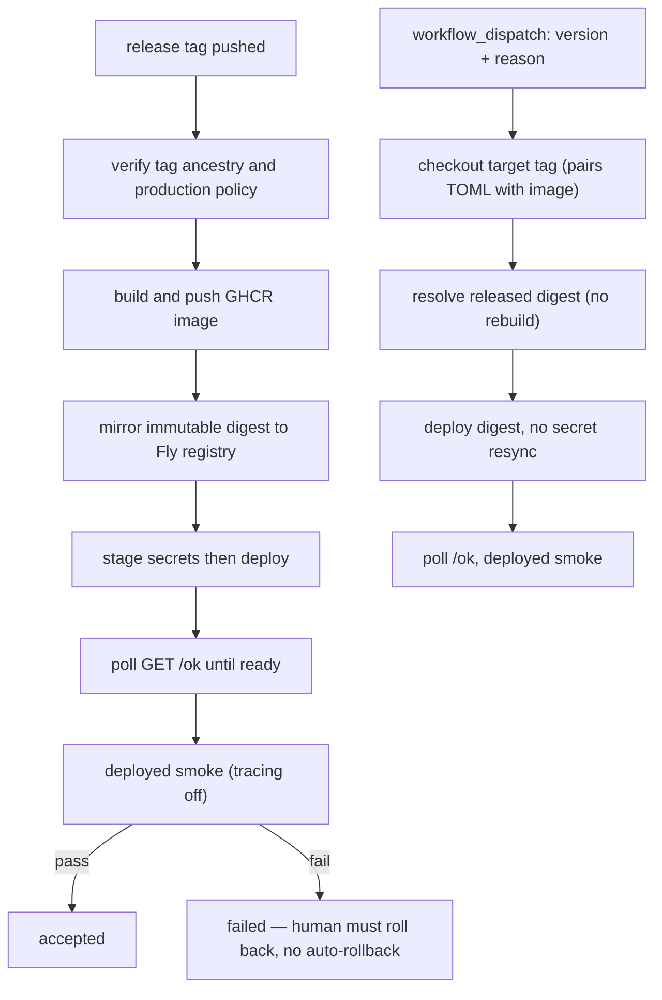

# Deployment topology and release acceptance

The base runtime, clean-room [agent server](../server/agent-server.md), and member frontend have distinct configuration owners. `pyproject.toml` and `uv.lock` own Python dependencies; do not restore the removed root `requirements.txt` (decision `docs/decisions/dependabot-requirements-txt.md`). `langgraph.json` owns graph/auth/custom-app selection; graph settings own model/pipeline knobs; compose/Fly files own topology-specific environment overrides. Read [models and runtime](../configuration/models-and-runtime.md) before changing an environment variable.

## Topology and persistence

Local base RAG compose runs Weaviate on 8080/50051 with persistent `weaviate_data`, anonymous access, and `restart: on-failure:0`. The app profile waits for health and forces tracing off. The server compose stack (`docker-compose.server.yml`) builds the server image from `server/Dockerfile` (not the root `Dockerfile`, which builds the base RAG app), waits for Weaviate, exposes server port 8000, and uses a read-only filesystem with tmpfs for the smoke container; it also includes a `pgvector/pgvector:pg16` Postgres service so the Postgres-backed storage path can be exercised locally, alongside Weaviate.

Fly deploys the server as an **immutable image digest** on internal port `8000` and a private-DNS Weaviate app in `iad`. `LANGGRAPH_API_URL=http://127.0.0.1:8000` is a loopback callback used by reminder/cron tool calls back into the server itself, not a public endpoint. The `[http_service]` forces HTTPS, maintains one minimum running machine with auto-stop disabled, and health-checks `GET /ok`. `/ok` is dependency-free and fast by design: it returns `200` only once `server/app.py`'s `ReadinessState.is_ready()` is true (every registered lifespan check — graph load, cron scheduler start, storage init — has flipped), and it is Fly's actual health-check target, so a stuck readiness check keeps the machine perpetually failing checks rather than serving half-initialized traffic.

Weaviate mounts the system's only persistent volume; production has run `SERVER_STORAGE=postgres` since v1.0.7 (flip executed 2026-08-24), so threads, store items, and cron registrations survive deploys/restarts, while in-flight runs, the pending-run queue, and open SSE streams remain process-local. `SERVER_STORAGE=memory` (in-process, wiped on restart) remains the local/dev default, and production must not enable `SERVER_LOCAL_DEV` (the Dockerfile sets `SERVER_LOCAL_DEV=0` by default). The two backends are not just a durability toggle: `server/config.py` requires `DATABASE_URI`/`DATABASE_URL` whenever `SERVER_STORAGE=postgres` (Fly's `postgres attach` sets it automatically — never by hand), and the two backends have different privacy behavior for run records — Postgres redacts raw run `input`/`command` to `[redacted]` at rest, while the in-memory backend echoes them — so code must not assume either guaranteed wipe-on-restart or guaranteed survival of raw input. `WEAVIATE_HOST` is the private Fly hostname. See the [clean-room agent server](../server/agent-server.md)'s dual-backend storage section for the code-level contract both backends must satisfy.

Production also runs the [member stream perimeter](../agent/member-perimeter.md) at `HC_RAG_MEMBER_STREAM_PERIMETER=v2` (flipped 2026-08-25); the frontend build's `NEXT_PUBLIC_HC_RAG_MEMBER_STREAM_PERIMETER` must be built at the matching version in the same release window, or member chat requests are denied, because it is baked at `next build` time rather than runtime-switchable.

## Tag release path

`.github/workflows/deploy.yml` is tag-triggered (`v*.*.*`). It verifies the tag exists on origin, that HEAD matches the tag commit, and that the tag commit is reachable from `origin/main`; verifies GitHub Environment `production` protection (deployment tag policy) and fails closed if the check is inconclusive; builds and pushes the image to GHCR; mirrors the GHCR digest into the Fly registry as an immutable image; stages required secrets to Fly before deploying; polls `GET /ok` until ready; and runs a deployed smoke test with tracing off. Smoke failure fails the deployment and there is no automatic rollback. `make release TAG=vX.Y.Z` only validates and prints tag commands; it does not push, and neither does `make rollback TAG=vX.Y.Z REASON='why'` or `make release-digest TAG=vX.Y.Z` — all three are hermetic local previews (validate/print, or resolve a digest) that never dispatch a workflow or mutate anything remotely.

## Release identity, version bumps, and rollback

`docs/decisions/release-tags-and-rollback.md` records the taxonomy a release depends on: the git tag is the immutable release identity, the immutable `{{version}}` GHCR image tag is the ledger mapping a tag to a digest, and only a validated `sha256:...` digest is ever deployed — never `latest` or a rolling tag. A release is the triple `(git tag, image digest, that tag's deploy/fly.prod.toml)`; rolling back re-deploys the whole triple so an old image never runs against a newer storage configuration. Both the forward deploy and rollback paths validate that a build digest is a well-formed `sha256:<64 hex>` value before use; the GHCR metadata action disables the `latest` tag (`latest=false`) and the rolling `{{major}}.{{minor}}` tag exists only for human registry browsing, never for a deploy or resolve step.

- `.github/workflows/release.yml` (dispatch-only, inputs `bump` and `dry_run`) cuts a tag; it never runs on a merge, since that would queue a production deploy request for every merge against this repo's human-gated posture. It refuses to run from any ref other than `refs/heads/main`, checks out `main` with full history/tags, refuses to re-point an already-existing tag (tags are immutable), and requires `pyproject.toml`'s version to already equal the computed tag before it will create the tag. `scripts/next_version.py` derives the bump from Conventional Commit subjects since the last release tag (`feat!`/`BREAKING CHANGE:` → major, `feat` → minor, else patch; a `0.x` breaking change bumps minor, not major, to avoid accidentally declaring API stability) and is shared by CI and `make next-version --explain` so the local preview matches what CI will pick; it also seeds the first release from `pyproject.toml`'s existing version rather than inventing `0.1.0`. `make release-prep BUMP=auto|patch|minor|major` writes that bump into `pyproject.toml`/`uv.lock` and re-locks so a human reviews it as an ordinary PR before the tag exists.
- Before tagging, `release.yml` requires the target commit to be green: it fetches the commit's check runs and workflow runs via the GitHub API and asserts the "Offline test suite" check (the one required check that runs on every push to `main`) succeeded, via `scripts/release_green_check.py`; a red or still-pending commit cannot be released. The tag itself is pushed using a `RELEASE_TAG_TOKEN` PAT, not `GITHUB_TOKEN` — refs pushed with `GITHUB_TOKEN` raise no workflow-triggering events, so a tag created with it would sit inert and never reach `deploy.yml`; the job refuses to tag rather than create that silently-dead tag. A successful run pushes an annotated tag whose message is the generated release notes and publishes a corresponding GitHub release.
- The actual rollback is a `workflow_dispatch` on `deploy.yml` requiring a `version` and a mandatory `reason` (the record of why production changed), plus an optional break-glass `image_digest` override; it is gated by the same `production` GitHub Environment and the same `deploy-production` concurrency group as a tag-triggered deploy, so a rollback and a forward deploy serialize instead of racing. The rollback job never rebuilds an image: it checks out the target release tag (pairing that tag's `deploy/fly.prod.toml` with its image), re-verifies tag existence/ancestry, resolves the released `{{version}}` GHCR tag to a digest (or accepts the break-glass digest override), and deploys that digest with `flyctl` using `--config deploy/fly.prod.toml` checked out at the target tag — checking out the target tag is what prevents deploying an old image against a newer TOML. The rollback path deliberately does not re-sync secrets, because a rollback must be able to recover from a bad secret sync rather than re-applying it; and rollback is never automatic — a red deployed smoke on either the forward or rollback path leaves the previously-live version running in production for a human to decide the next action.

Caption: image identity and smoke acceptance are deployment gates, not optional post-deploy diagnostics; rollback shares the same gates minus the build and secret-sync steps.

## What CI verifies vs. what is described but unverified

CI-verified, by direct assertion against the workflow source in test files:

- `tests/test_release_pipeline.py` asserts the release/rollback contract against both workflow files directly: digest-only deploys, no rebuild on rollback, production-environment and concurrency gating on both `deploy-prod` and `rollback` jobs, no secret resync on rollback, tag-ancestry checks on both push and dispatch paths, and redacted-log-only smoke artifacts (raw smoke logs never uploaded); it also asserts `release.yml`'s dispatch-only trigger, main-only + full-history checkout, immutable-tag refusal, pyproject/tag version agreement, the green-commit gate, and the `RELEASE_TAG_TOKEN` requirement.
- `tests/test_deploy_workflow.py` verifies `deploy.yml`'s production-environment protection audit script (fails closed on an inconclusive GitHub API response, requires `actions:read` permission), that the manual dispatch trigger can never become a second forward-deploy path (no build-push-action or docker build usage in the rollback job, and its inputs are restricted to version/reason/image_digest), that the Fly deploy mirrors the private GHCR image into the Fly registry, and that runtime secret sync imports all values in a single Fly update via `flyctl secrets import` rather than `flyctl secrets set`.
- `tests/test_next_version.py` exercises `scripts/next_version.py`'s version ordering (a final release outranks its own prereleases, versions order numerically not lexically, non-release tags are ignored), Conventional Commit classification, and end-to-end behavior against real temporary git repositories rather than mocked git output, because the parsing logic is what tends to break.

Described but not CI-verified — these depend on live infrastructure state that hermetic tests cannot observe, so treat `docs/deploy.md` and the Fly TOML comments as the record of *intent and history*, not a guarantee that current production state matches: the actual Postgres provisioning (cluster name, pgvector image, isolation, the 2026-08-24 sign-off), whether GitHub Environment `production`'s protection rules are configured exactly as the workflow expects at runtime (the workflow re-checks this every run and fails closed, but nothing hermetic pins the environment's live configuration), whether all required Fly/GitHub secrets are actually seeded, and whether the member stream perimeter v2 flip's frontend build actually matches the server's flipped value in any given deployed instant.

## Configuration and recovery rules

`OPENAI_API_KEY` is required for the base RAG/Weaviate vectorizer. LangSmith, Supabase, internal tokens, and feedback configuration have topology-specific owners; never copy values into docs. The custom coach app can fail startup on malformed feedback-project configuration. The server's storage-index initialization may explicitly fall back to lexical search for recognized index/dependency/auth failures; it does not create durable server storage.

If Weaviate exits cleanly or fails, run `make weaviate` again; restart policy does not retry it. Re-ingestion deletes all collections when using `make ingest`; follow [retrieval ingestion](../retrieval/weaviate-and-ingestion.md). Use `make server-image`, `make container-server-smoke`, `make server-test`, and `make parity` for server changes. Use `make deployed-smoke` only with a real deployment and required configured synthetic accounts/tokens.

Treat historical deployment docs as supporting material when they disagree with current workflow source; source and tests are authoritative.
