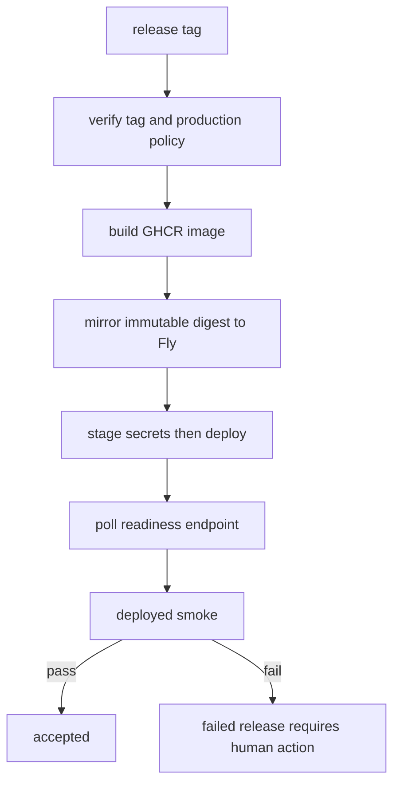

# Deployment topology and release acceptance

The base runtime, clean-room [agent server](../server/agent-server.md), and member frontend have distinct configuration owners. `pyproject.toml` and `uv.lock` own Python dependencies; do not restore the removed root `requirements.txt` (decision `docs/decisions/dependabot-requirements-txt.md`). `langgraph.json` owns graph/auth/custom-app selection; graph settings own model/pipeline knobs; compose/Fly files own topology-specific environment overrides. Read [models and runtime](../configuration/models-and-runtime.md) before changing an environment variable.

## Topology and persistence

Local base RAG compose runs Weaviate on 8080/50051 with persistent `weaviate_data`, anonymous access, and `restart: on-failure:0`. The app profile waits for health and forces tracing off. The server compose stack similarly waits for Weaviate, exposes server port 8000, uses read-only filesystem/tmpfs, and remains in-memory.

Fly deploys the server as an **immutable image digest** on internal port `8000` and a private-DNS Weaviate app in `iad`. `LANGGRAPH_API_URL=http://127.0.0.1:8000` is a loopback callback used by reminder/cron behavior, not a public endpoint. The HTTP service forces HTTPS, maintains one minimum running machine with auto-stop disabled, and health-checks `GET /ok`. Weaviate alone mounts a persistent volume; server `SERVER_STORAGE=memory`, threads/runs/store/crons/checkpoints disappear on deploy/restart. `WEAVIATE_HOST` is the private Fly hostname. Production must not enable `SERVER_LOCAL_DEV`.

## Tag release path

`.github/workflows/deploy.yml` is tag-triggered (`v*.*.*`). It verifies tag ancestry/HEAD, requires production policy checks, builds GHCR, mirrors and deploys an immutable Fly Registry digest, stages required secrets before deployment, polls `/ok`, then executes deployed smoke with tracing off. Smoke failure fails the deployment; there is no automatic rollback. `make release TAG=vX.Y.Z` only validates and prints tag commands; it does not push.

Caption: image identity and smoke acceptance are deployment gates, not optional post-deploy diagnostics.

## Configuration and recovery rules

`OPENAI_API_KEY` is required for the base RAG/Weaviate vectorizer. LangSmith, Supabase, internal tokens, and feedback configuration have topology-specific owners; never copy values into docs. The custom coach app can fail startup on malformed feedback-project configuration. The server's storage-index initialization may explicitly fall back to lexical search for recognized index/dependency/auth failures; it does not create durable server storage.

If Weaviate exits cleanly or fails, run `make weaviate` again; restart policy does not retry it. Re-ingestion deletes all collections when using `make ingest`; follow [retrieval ingestion](../retrieval/weaviate-and-ingestion.md). Use `make server-image`, `make container-server-smoke`, `make server-test`, and `make parity` for server changes. Use `make deployed-smoke` only with a real deployment and required configured synthetic accounts/tokens.

`tests/test_deploy_workflow.py` verifies tag/policy checks, immutable image flow, secret staging, and smoke enforcement. Treat historical deployment docs as supporting material when they disagree with current workflow source; source and tests are authoritative.
