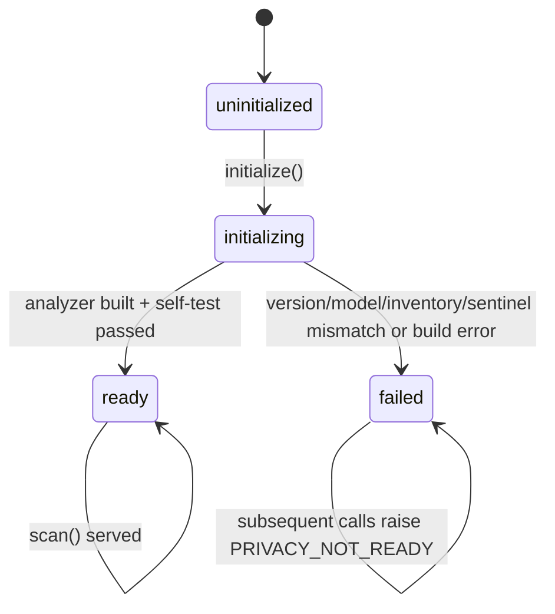

# Presidio privacy sanitizer

`PrivacySanitizer` (`healthcare_rag/processors/privacy.py`) is the single
process-wide recognizer of personal identifiers. It replaced the older regex-only
PHI list: `scrub_phi` in `healthcare_rag/processors/safety.py#L58-L76` now simply
delegates to `get().privacy.scan(text)`, so the [safety gate](../safety/gate.md),
history scrubbing, and the CLI monitor all redact through the same analyzer.
The `Resources` singleton owns one instance (`graph/resources.py#Resources.privacy`),
injectable for tests.

## What it recognizes

Each `scan(text)` call unions three candidate sources, then merges overlapping
spans (`union_spans`; overlapping *different* kinds collapse to one
`[REDACTED_IDENTIFIER]`):

1. **Presidio analyzer** — `AnalyzerEngine` over spaCy `en_core_web_sm` NER
   (PERSON only, with most non-person spaCy labels ignored) plus a fixed
   recognizer set: CA SIN, credit card, crypto, IBAN, IP, MAC, medical license,
   CA/US phone, URL, US bank/ITIN/driver license/MBI/NPI/passport/SSN
   (`ENTITY_TYPES`, `DEFAULT_SCORE_THRESHOLD = 0.40`, lemma context enhancer).
   Single-token PERSON hits are accepted only next to clinical cues
   ("name is", "patient", "dr."…); multi-token PERSON names always pass.
2. **Deterministic patterns** (`privacy_patterns.py`) — cued health-card, MRN,
   DOB/event dates, email, and cued-name regexes, kept as a floor the model
   cannot miss.
3. **Preserve carve-out** — `clinical_code_intervals(text)` protects clinical
   codes (e.g. ICD-style values) from Presidio redaction so dosing/code answers
   survive.

Returns `PrivacyScan(clean_text, kinds)`; each redaction leaves a
`[REDACTED_<KIND>]` token. Inputs larger than 16 KiB raise
`PrivacyScanError("PRIVACY_INPUT_TOO_LARGE")` — there is no bypass.

## Lifecycle and failure posture

- `GraphEngine._initialize` calls `privacy.initialize()` before compiling the
  graph (`graph/engine.py#L128-L142`), and every `scan` lazily initializes too.
- Initialization is guarded by a condition variable (concurrent initializers
  wait), and `_validate` pins exact versions: `presidio-analyzer==2.2.364`,
  `spacy==3.8.15`, `en_core-web-sm==3.8.0`, full entity inventory, plus a
  sentinel scan that must find PERSON and IP_ADDRESS. Any mismatch or exception
  moves the singleton to `FAILED` permanently — **fail-closed by design**.
- A `PrivacyScanError` during a turn makes `GraphEngine._run` mark
  `privacy_failed`, emit only the error code (e.g. `PRIVACY_NOT_READY`), and
  return empty state — the user gets no answer rather than an unscrubbed one
  (`graph/engine.py#L198-L214`).
- `monitor.QueryMonitor.set_raw_answer`/`set_final_answer`/`set_follow_up_questions`
  also run `scrub_phi` before displaying anything (`healthcare_rag/monitor.py`).

The [coach agent](../agent/coach.md) reuses the same sanitizer before persisting
member data: memory facts, reminder titles, metric units, and injection log
fields are scanned and refused with fixed strings on `PrivacyScanError`
(`agent/memory.py`, `agent/reminders.py`, `agent/tools/log_metric.py`,
`agent/tools/log_injection.py`, `agent/store_data.py`).

## Deployment note

The analyzer needs the pinned spaCy model; the Docker image bakes it in via
`langgraph.json` `dockerfile_lines` (`PRESIDIO_DEVICE=cpu`, pinned
presidio/spacy/`en_core_web_sm` wheels plus an import self-check). Build with
`make container-build`. When bumping any pinned version, update
`ANALYZER_VERSION` / `MODEL_VERSION` / the spacy check in `_validate` and the
matching wheels together, or the sanitizer will refuse to start.

## Change guidance and tests

Changing recognizers, thresholds, entity types, or preserve-rules shifts what
counts as `contains_phi` everywhere at once — the safety gate notices, eval
PHI categories, and coach tool refusals. Update `tests/test_privacy_sanitizer.py`
expectations and re-run `tests/test_safety_gate.py`; then measure with a
filtered eval (`pii_or_phi` category) via [evaluations](../observability/evaluations.md).
