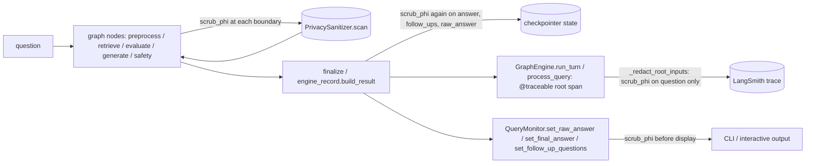
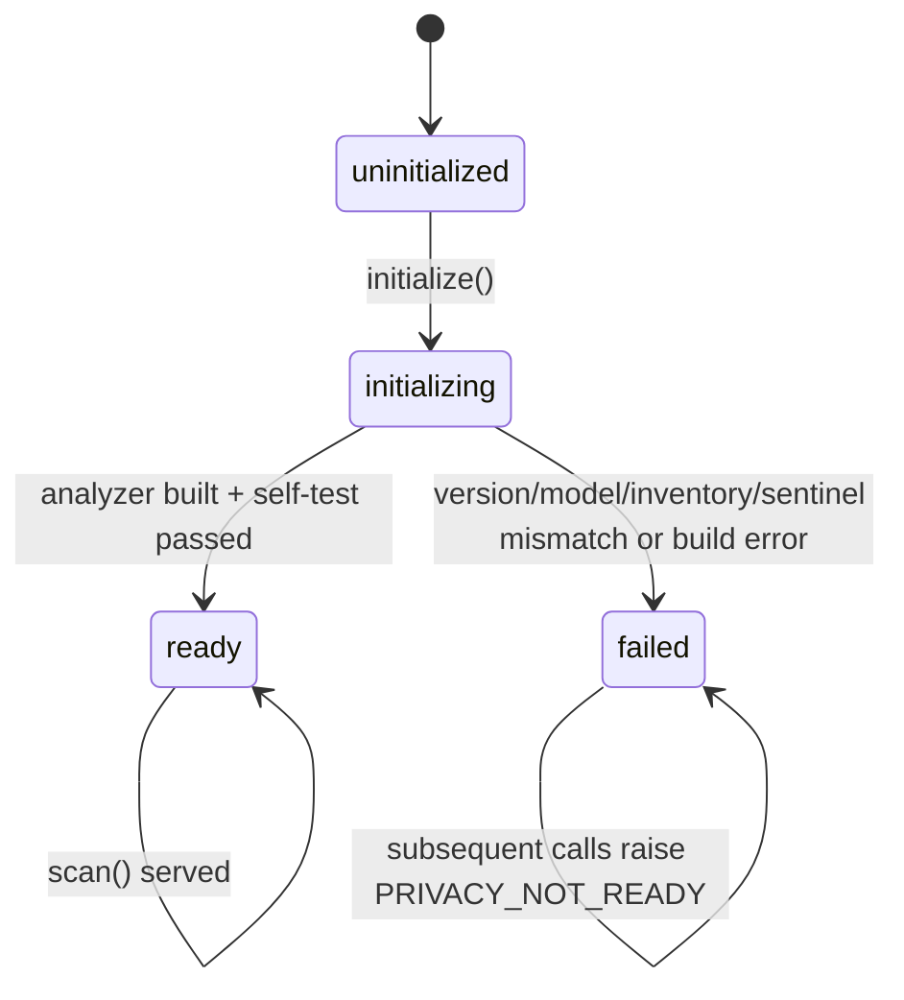

# Privacy sanitizer and PHI/PII scrubbing

`PrivacySanitizer` (`healthcare_rag/processors/privacy.py`) is the single
process-wide recognizer of personal identifiers. `scrub_phi` in
`healthcare_rag/processors/safety_signals.py` delegates to
`get().privacy.scan(text)`, so the [safety gate](../safety/gate.md), graph
nodes, history scrubbing, the CLI monitor, and the coach agent's persistence
writes all redact through the same analyzer. The `Resources` singleton owns
one instance (`graph/resources.py#Resources.privacy`), injectable for tests.

## What data classes are scrubbed

Each `scan(text)` call unions three candidate sources, then merges overlapping
spans (`union_spans`; overlapping *different* kinds collapse to one
`[REDACTED_IDENTIFIER]`):

1. **Presidio analyzer** — `AnalyzerEngine` over spaCy `en_core_web_sm` NER
   (PERSON only; most non-person spaCy labels are ignored) plus a fixed
   recognizer set covering generic identifiers and financial/network data: CA
   SIN, credit card, crypto, IBAN, IP, MAC, medical license, CA/US phone, URL,
   US bank/ITIN/driver license/MBI/NPI/passport/SSN (`ENTITY_TYPES`,
   `DEFAULT_SCORE_THRESHOLD = 0.40`, lemma context enhancer). Single-token
   PERSON hits are accepted only next to clinical cues ("name is", "patient",
   "dr."…); multi-token PERSON names always pass
   (`privacy.py#_presidio_result_allowed`).
2. **Deterministic patterns** (`privacy_patterns.py`) — a floor the model
   cannot miss, independent of NER confidence: email, phone, postal code,
   street address; biographic fields (cued full names, DOB, admission/
   discharge/appointment/visit/encounter "event" dates); and cued
   healthcare/administrative record identifiers — health card, MRN, patient
   account, claim, prior authorization, prescription, referral,
   accession/specimen/lab-order, encounter, device serial, and vehicle/plate
   identifiers. Each of these fires only next to its labelling cue word
   (e.g. "MRN", "claim number", "prior auth") so free-standing numbers are
   left alone.
3. **Preserve carve-out** — `clinical_code_intervals(text)` protects clinical
   codes (RxCUI, NDC, DIN, ATC, LOINC, SNOMED, ICD(-10), CPT, CCI, HCPCS,
   device model) from redaction so dosing/code answers survive scrubbing
   intact even when they sit next to an identifier match.

In short, the following must never reach a model provider, a log, a trace, or
persisted graph/checkpoint state in unredacted form: personal names (cued
single tokens or free multi-token names), contact details (email, phone,
postal code, street address), government/financial identifiers (SIN, SSN,
ITIN, credit card, bank number, driver license, passport, MBI, NPI, medical
license), network identifiers (IP, MAC, crypto address, URL), biographic
dates (DOB, admission/discharge/appointment/visit/encounter dates), and
healthcare/administrative record numbers (health card, MRN, patient account,
claim, prior authorization, prescription, referral, accession/specimen/lab
order, encounter, device serial, vehicle/plate identifiers). Clinical codes
and dosing information themselves are deliberately exempt from this list —
they are the content the system exists to answer with.

Returns `PrivacyScan(clean_text, kinds)`; each redaction leaves a
`[REDACTED_<KIND>]` token (or `[REDACTED_IDENTIFIER]` when different kinds of
span overlap). Inputs larger than 16 KiB raise
`PrivacyScanError("PRIVACY_INPUT_TOO_LARGE")` — there is no bypass.

## Where scrubbing runs relative to graph nodes, logging, and tracing

Scrubbing is applied repeatedly at each boundary rather than once centrally:

- **Inside the graph.** Every node that touches untrusted text —
  `preprocess`, `retrieve`, `evaluate`, `generate`, `safety`,
  `safety_finalize`, `history` — calls `scrub_phi` on its own inputs/outputs
  before they are written into graph state (`graph/nodes/*.py`,
  `graph/history.py`). `engine_record.build_result` re-scrubs the final
  `answer`, `raw_answer`, `follow_ups`, and router telemetry (dropping
  sensitive-keyed telemetry fields entirely via `ROUTER_SENSITIVE_KEYS`)
  before the turn's result dict — the thing that becomes checkpointed state —
  is assembled (`graph/engine_record.py`). `tests/graph/test_graph_privacy_persistence.py`
  and `tests/graph/test_validation_privacy.py` assert PHI/identifier canaries
  are absent from both the returned result and the LangGraph checkpoint, not
  merely from the final answer text.
- **Before logs.** `tests/graph/test_graph_privacy.py` asserts a canary never
  appears in `caplog` output. The CLI's `QueryMonitor.set_raw_answer`/
  `set_final_answer`/`set_follow_up_questions` scrub before storing anything
  the interactive client will print (`healthcare_rag/monitor.py`,
  `healthcare_rag/cli/interactive.py`).
- **Before tracing.** Tracing is opt-in and gated: `enforce_input_hiding()`
  forces `LANGSMITH_TRACING`/`LANGCHAIN_TRACING_V2` back to `false` unless
  `LANGSMITH_HIDE_INPUTS` is the exact string `"true"`, checked once in
  `GraphEngine.__init__` before any graph is built. On top of that blanket
  hide, the root `@traceable` span (`healthcare_rag.process_query`) uses
  `process_inputs=_redact_root_inputs`, which independently re-scrubs the
  traced question with `scrub_phi` and fails closed to `{}` on any scrubbing
  error, so LangSmith never records the raw prompt even if input-hiding
  configuration drifts (`graph/engine.py#_redact_root_inputs`,
  `#GraphEngine.__init__`). `tests/test_tracing_privacy.py` locks this
  gating behavior. **Outputs are not scrubbed by this mechanism** — the root
  run's returned `contexts` (retrieved chunk text) and `safety_outcome`/
  `usage` telemetry are copied verbatim into the trace; see
  [tracing and evaluations](../observability/evaluations.md) for the full
  exposure picture.
- **Before persistent storage.** The [coach agent](../agent/coach.md) reuses
  the same sanitizer before persisting member data: memory facts, reminder
  titles, metric units, and injection-log fields are scanned and refused with
  fixed strings on `PrivacyScanError` (`agent/memory.py`,
  `agent/reminders.py`, `agent/tools/log_metric.py`,
  `agent/tools/log_injection.py`, `agent/store_data.py`). See
  [member data lifecycle](../agent/member-data-lifecycle.md) for how these
  refusals surface to the user.

## Lifecycle and failure posture

- `GraphEngine._initialize` calls `privacy.initialize()` before compiling the
  graph (`graph/engine.py#L100-L101`), and every `scan` lazily initializes too.
- Initialization is guarded by a condition variable (concurrent initializers
  wait), and `_validate` pins exact versions: `presidio-analyzer==2.2.364`,
  `spacy==3.8.15`, `en_core_web_sm==3.8.0`, full entity inventory, plus a
  sentinel scan that must find PERSON and IP_ADDRESS. Any mismatch or exception
  moves the singleton to `FAILED` permanently — **fail-closed by design**.
- A `PrivacyScanError` during a turn makes `GraphEngine._run` mark
  `privacy_failed`, emit only the error code (e.g. `PRIVACY_NOT_READY`), and
  return empty state — the user gets no answer rather than an unscrubbed one
  (`graph/engine.py#L177-L193`).

## Direct-output policy (`processors/direct_output_policy.py`)

The `tool` query-response arm (see [architecture](../architecture/overview.md))
can let the model answer without retrieval; before any such text is shown,
`evaluate_generated_output` gates it. NFKC-normalized, casefolded text is
denied with reason:

* `privacy_error` — over `MAX_INPUT_BYTES` or any scrub hit (`privacy.scan(text).kinds` non-empty);
* `unsafe_direct_content` — `injection_flags` matches;
* `clinical_direct_content` — a `NUMERIC_DOSE` number-with-unit match, a
  `_CLINICAL_UNITS` token, the `_CLINICAL_ACTIONS ∩ _CLINICAL_TARGETS`
  instruction pattern (advise/take/double… × atorvastatin/metformin/dose/
  doctor…), or output that fails the social-only-content check
  (`_is_social_output`) once privacy and clinical checks pass.

Only a clean pass returns `(scrubbed_content, None)`; denials return empty
content plus the reason, which the gateway maps to a `fallback_reason`
(`QueryOrRespondDecision`, `graph/query_response.py`). History entering the
tool router is also projected through `project_history` (human/ai string
content only, each message scrubbed and size-checked via
`scrub_router_text`) before `trim_messages` truncates it, and the current
query is scrubbed the same way before being bound as the trailing
`HumanMessage` (`graph/llm.py#LangChainLLMGateway.aquery_or_respond`).
`tests/graph/test_direct_output_policy.py` locks the denial matrix
(action/target instruction transformations, unit/dose leaks, allowed
social/capability phrasing); `tests/graph/test_query_or_respond_privacy.py`
asserts the router's bound prompt and history never contain PHI canaries.

## Deployment note

The analyzer needs the pinned spaCy model; the Docker image bakes it in via
`langgraph.json` `dockerfile_lines` (`PRESIDIO_DEVICE=cpu`, pinned
presidio/spacy/`en_core_web_sm` wheels plus an import self-check). Build with
`make container-build`. When bumping any pinned version, update
`ANALYZER_VERSION` / `MODEL_VERSION` / the spacy check in `_validate` and the
matching wheels together, or the sanitizer will refuse to start.

## Related, separate mechanism: deploy smoke-log redaction

`scripts/redact_smoke_log.py` is a distinct, regex-only redaction layer that
protects a different sink: CI-published deploy smoke-test logs, not
model/log/trace/state boundaries inside the RAG or coach runtimes. It masks
credential shapes (bearer/API-key headers, `lsv2_`/`sbp_` keys, JWTs, named
env-var tokens) and truncates over-long lines to `status + length` before a
smoke-test artifact is uploaded, since those runs hit production with real
bearer tokens (`.github/workflows/deploy.yml` invokes it for both tag deploys
and rollbacks). `tests/test_redact_smoke_log.py` asserts secrets never survive
redaction, header names are preserved for readability, long bodies are
truncated with a `[TRUNCATED len=…]` marker, and a missing source log is
handled without failing the step. It shares the PrivacySanitizer's
no-bypass philosophy but is independent code with no PHI/PII entity
recognition — it only recognizes credential-shaped strings.
