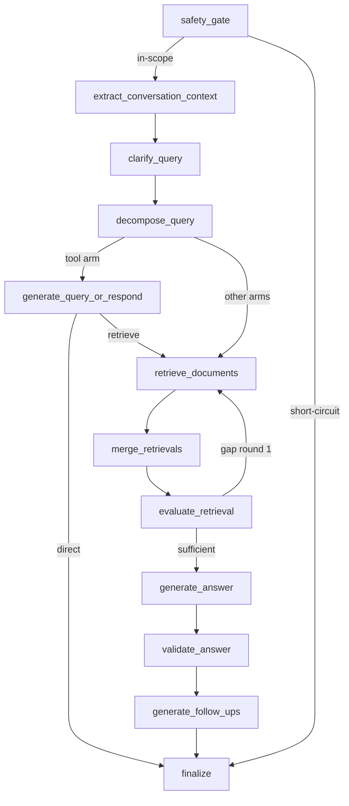

# Graph stages, prompts, and models

`PromptRegistry` (`healthcare_rag/graph/prompts.py`) renders `healthcare_rag/prompts/<file>.yaml.j2` through Jinja, YAML-loads the messages, and converts them to LangChain `SystemMessage`/`HumanMessage`. `STAGE_FILES` maps stage names to template stems and `RESPONSE_MODELS` pins each structured stage's Pydantic model. `LangChainLLMGateway` (`graph/llm.py`) executes stages: `astructured` (`with_structured_output`, `method="json_schema"`, strict when `HC_RAG_STRUCTURED_STRICT`), `acomplete` (plain text), `aroute_tools` (tool-calling retrieval routing), and `aquery_or_respond` (bound `retrieve_monographs` tool call for the tool-arm direct/retrieve decision). All are fail-soft — any exception is caught and the caller's default is returned. `sampling_params` (`services/model_sampling.py`) keeps calls model-family compatible (reasoning models take `reasoning_effort` instead of/alongside `temperature`); see [model configuration](../configuration/models-and-runtime.md).

## Stage flow

| Stage (gateway name) | Owning node | Template | Output model | Tier / temperature |
|---|---|---|---|---|
| `safety_gate` | `safety_gate` (`nodes/safety.py`, LLM call via `nodes/safety_classifier.py::LangChainSafetyGate`) | `safety_gate.yaml.j2` | `SafetyAssessment` | default, 0.0; wrapped by `processors/safety.py::SafetyGate.evaluate` → `SafetyDecision`. See [safety gate](../safety/gate.md) |
| `clarify_query` | `clarify_query` (`nodes/preprocess.py`) | `clarify_query.yaml.j2` | `ClarifiedQuery` | default, unset; skipped without history context or when `clarify` is disabled |
| `decompose_query` | `decompose_query` (`nodes/preprocess.py`) | `decompose_query.yaml.j2` | `DecomposedQuery` | default, unset; complexity-gated (`HC_RAG_DECOMPOSE_ONLY_COMPLEX`) and capped (`HC_RAG_MAX_SUBQUERIES`) |
| `extract_conversation_context` | `extract_conversation_context` (`nodes/preprocess.py`) | `context_extraction.yaml.j2` | `RelevantHistoryContext` | default, 0.1; no history returns `required_context=False`, empty snippets, no LLM call |
| retrieval routing | `retrieve_documents` (`nodes/retrieve.py`) | no template | LangChain `ToolCall[]` via `aroute_tools` + `processors/retrieval.py::build_routing_tools` | default; a routing failure is caught and treated as zero tool calls, then the selected arm's search plus optional rerank runs. See [retrieval](../retrieval/weaviate-and-ingestion.md) and [arms and reranking](../retrieval/arms-and-reranking.md) |
| `query_or_respond` | `generate_query_or_respond` (`nodes/query_or_respond.py`) | `query_or_respond.yaml.j2` | tool call via `aquery_or_respond` → `QueryOrRespondDecision` (no `RESPONSE_MODELS` entry — the decision is parsed from a bound `retrieve_monographs` tool call, not structured output) | default; only runs when `HC_RAG_QUERY_RESPONSE_ARM=tool`; direct content must pass the [direct-output policy](../privacy/sanitizer.md); a privacy scan failure or model exception yields a safe `"retrieve"` fallback decision |
| `evaluate_retrieval` | `evaluate_retrieval` (`nodes/evaluate.py`) | `retrieval_evaluation.yaml.j2` | `RetrievalEvaluation` | default, 0.1; drives at most one gap-fill round (`gap_round`) |
| `generate_answer` | `generate_answer` (`nodes/generate.py`) | `answer_generation.yaml.j2` | plain string (`acomplete`) | default, 0.1; consumes `formatted_docs`/`prompt_id_map` from `processors/generation.py::format_documents_for_prompt`; falls back to a fixed "I'm sorry, I don't know" string when merged retrieval has no docs |
| `validate_answer` | `validate_answer` (`nodes/generate.py`) | `answer_structuring.yaml.j2` | `CitedAnswerResult` (via `AnswerValidator`) | **validator**, 0.0; quote-match threshold 85. See [validation](validation.md) |
| `generate_follow_ups` | `generate_follow_ups` (`nodes/generate.py`) | `follow_up_questions.yaml.j2` | `FollowUpQuestions` | default, 0.3; runs only with a validated answer and a `user_id`; a gateway exception is caught locally and falls back to an empty list |
| `pageindex_select` | `retrieve_documents` (pageindex arm; `select_nodes` in `processors/pageindex_retrieval.py`) | `pageindex_select.yaml.j2` | `PageIndexSelection` | default, unset; only when `HC_RAG_RETRIEVER=pageindex`; fail-soft to an empty selection, capped at `HC_RAG_PAGEINDEX_MAX_NODES` |

`tests/graph/test_route_tools.py` pins two gateway mechanics beyond fidelity: `aroute_tools` binds one tool per name in `GraphSettings.collection_names` (via `build_routing_tools`) rather than a fixed tool list, and `chat_model`'s per-`(tier, model, temperature, reasoning_effort)` caching lets two concurrent `astructured` calls against the same stage/temperature run in parallel instead of serializing on a shared client.

The `safety_gate` LLM call is one layer of a two-layer decision: `processors/safety.py::SafetyGate.assess` OR-s the LLM's `SafetyAssessment.category` with deterministic regex pre-checks (`red_flag_terms`, `injection_flags`, `identifier_recall_requested`) that can only escalate the outcome (emergency > injection > identifier-recall), never relax it; if the LLM call fails, the deterministic layer alone decides. `SafetyGate.evaluate` then picks a `SafetyDecision` (short-circuit template, or `kind="none"` to run the normal pipeline); a detected prompt-injection attempt gets one recursive re-evaluation pass over the residual text after stripping the injected instruction, so a single turn can cost up to two LLM calls. The node wiring is split across `nodes/safety.py` (the `safety_gate` `Command`-returning node, deterministic pre-checks, refusal-boundary short-circuit), `nodes/safety_classifier.py` (`LangChainSafetyGate`, the concrete `_llm_assess` implementation binding the gateway), and `nodes/safety_finalize.py` (`finalize`, the terminal node that assembles the visible answer from `safety_response`/`direct_response`/`validated`+`follow_ups` and scrubs PHI one last time).

`healthcare_rag/processors/` holds the reusable logic the nodes call: `safety.py` + `safety_patterns.py` (`injection_flags`, `strip_injection`) + `safety_signals.py` (`scrub_phi`, `contains_phi`, `identifier_recall_requested`, `red_flag_terms`) together are "the safety gate" ([safety gate](../safety/gate.md)); `safety_responses.py` (plain-string refusal templates only, no LLM call); `social_responses.py` (benign-social direct text for the `query_or_respond` direct path); `privacy.py` + `privacy_patterns.py` (the [PrivacySanitizer](../privacy/sanitizer.md)); `direct_output_policy.py` (tool-arm direct-answer gating, `evaluate_generated_output`); `refusal_boundary.py` + `refusal_topics.py` (the persisted per-thread refusal replay state machine); `validation.py` + `validation_citations.py` + `validation_source.py` + `validation_rendering.py` ([answer validation](validation.md)); `retrieval.py` (the default Weaviate arm plus `build_routing_tools`/`union_results`); `generation.py` (`format_documents_for_prompt`); `pdf_chunker.py` (ingestion only); and the alternative retrieval arms `pageindex_retrieval.py`/`pinecone_retrieval.py` plus `rerank.py` ([retrieval arms and reranking](../retrieval/arms-and-reranking.md)). `base.py` only provides the `log_timing` decorator. The old `PromptManager`/`LLMParserService`/processor-class layer is gone. Full per-file map: `healthcare_rag/processors/AGENTS.md`.

## Contracts and change rules

* `ClarifiedQuery` forces `clarified_query` back to the original when `ambiguity_level == "clear and specific"`; `DecomposedQuery` normalizes `decomposed_query` to `[original_query]` when `query_complexity == "simple"` (`models/queries.py`). The graph keys clarification on the normalized `clarified` value being different from the working query and decomposition on there being 2+ normalized sub-queries — preserve these invariants.
* `RelevantHistoryContext` forcibly clears `relevant_snippets` when `required_context=False` (`models/answers.py`); its `relevant_snippets` feed the generation prompt as `conversation_context`.
* Generation maps real Weaviate UUIDs to sequential `doc_N` for the prompt (`format_documents_for_prompt`); `formatted_docs` and `prompt_id_map` must reach validation together with the answer — validation returns `(None, None)` if either is missing.
* The answer prompt instructs cite-every-claim and say-when-unknown; runtime refusal policy lives in the [safety gate](../safety/gate.md), upstream of generation.
* `aquery_or_respond` scrubs and token-trims conversation history (`trim_messages`, `history_max_tokens`) before it reaches the model, and a `PrivacyScanError` or model exception both map to a safe `"retrieve"`-biased `QueryOrRespondDecision` rather than raising.

## Adding or changing a stage

To add a stage: write the template, add the stage to `STAGE_FILES` and (if structured) `RESPONSE_MODELS`, add the node in `graph/nodes/`, wire it in `graph/build.py` with a `NODE_*` constant, extend `RAGState` (and `safety_gate`'s per-turn reset), and respect `HC_RAG_DISABLE_STAGES` if the stage should be ablatable (valid stages: `safety`, `clarify`, `decompose`, `evaluate`, `validate`, `followups` — `services/models.py::VALID_STAGES`). Disabled stages return pass-through values and make no LLM call: `validate` returns the raw generated answer, `followups` returns `[]`. `tests/graph/test_prompt_fidelity.py` pins stage→prompt wiring (frozen-fixture regression tests plus cwd-independence and unknown-stage/role error checks) and `tests/graph/test_route_tools.py` the routing tools.

**Focused validation:** `make test` for wiring; then `make eval-smoke`, and a filtered/full eval for prompt or model changes (`make eval-nojudge PREFIX=stage-change`, judges for answer/safety behavior).
