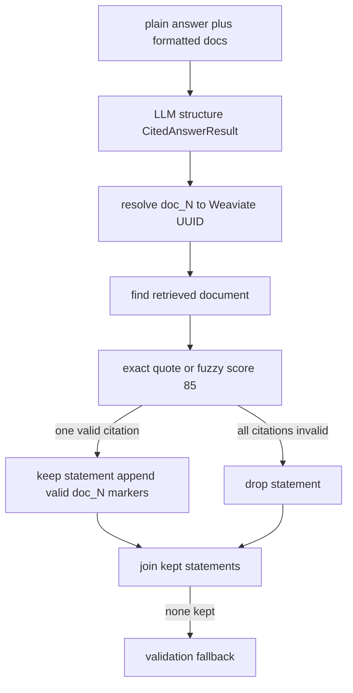

# Answer structuring and citation verification

`AnswerValidator.structure_and_validate_async` takes the generated plain answer plus its exact retrieval bundle and temporary prompt-ID map (`healthcare_rag/processors/validation.py#L266-L333`). It is a stronger model tier than generation; its structured output is `CitedAnswerResult(statements=[StatementWithCitations])`, where each citation has `doc_id`, `source_name`, and `quote` (`healthcare_rag/models/answers.py#L5-L31`). The structuring prompt asks for verbatim answer segments and citations based on `[doc_N]` markers (`prompts/answer_structuring.yaml.j2#L1-L34`).

This is the implemented transformation; it does not assess medical truth beyond quote-to-retrieved-document support.

## Exact rules

1. Missing `plain_answer`, retrieval results, formatted docs, or ID map returns `(None, None)` before any LLM call.
2. The structuring LLM may fail/parse to `None`; that also returns `(None, None)`.
3. `_resolve_citation_ids` replaces each temporary `doc_N` with its original document UUID using `prompt_id_map`. An unknown ID remains unresolvable and later fails document lookup.
4. For each citation, validator finds the UUID among **the retrieved documents only**. A quote passes if it is an exact substring or `fuzzywuzzy.process.extractOne` meets the threshold (default `85`) against that document's entire content (`healthcare_rag/processors/validation.py#L19-L61`, `#L171-L211`).
5. A statement with citations survives if **at least one** citation passes; failed citations are removed. A statement with **no citations is considered valid and is kept**. A statement with citations where all fail is dropped (`healthcare_rag/processors/validation.py#L103-L135`).
6. Kept text has existing `[doc_N]` markers removed, then sorted/deduplicated valid markers are appended. Only `\\n`, `\\n\\n`, and `\\n\\n\\n` linebreak values are converted; unexpected values become no break (`#L213-L264`).

If no statements survive—or there were no structured statements—the returned text is exactly: `I'm sorry, I couldn't validate the information to answer your question.` (`#L70-L101`). That string is truthy, so a normal turn completes with it. Missing inputs or structuring failure yield no text; the graph node `validate_answer` wraps the call so any exception also yields `(None, None)` (validation must never fail open), and every kept statement/citation field is additionally run through `scrub_phi` before it lands in state (graph/nodes/generate.py; see [privacy sanitizer](../safety/privacy-sanitizer.md)). `fold_branches` marks the selected branch FAILED when `validated` is `None` (`graph/engine_record.py`). With `HC_RAG_DISABLE_STAGES=validate` the node passes the **unvalidated** (scrubbed) plain answer through instead — that is ablation machinery, not a production setting.

## Safe changes

Changing prompt marker format requires changing `format_documents_for_prompt`, `prompt_id_map`, resolution, and marker cleaning/sorting together. Changing threshold changes acceptance sensitivity but does not make uncited statements fail. A stricter product-safety policy requires an explicit code change to the no-citation path, not merely template language. This distinction is central to [safety posture](../safety/posture.md).

**Focused validation:** use a golden answer case plus `make eval-nojudge PREFIX=validation-change`; then run judge evaluation because groundedness measures claims against retrieved context. For direct behavior, exercise invalid UUID, quote below threshold, mixed valid/invalid citations, uncited statement, and no surviving statement through `structure_and_validate_async`.
