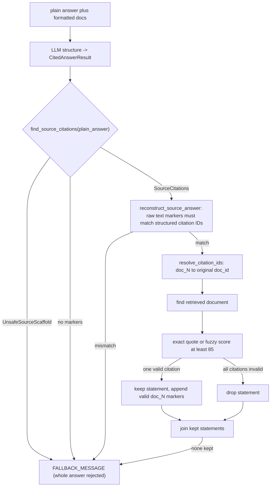

# Answer structuring and citation verification

`AnswerValidator.structure_and_validate_async` (`healthcare_rag/processors/validation.py`) takes the generated plain answer plus its exact retrieval bundle and temporary prompt-ID map. It is a stronger model tier than generation; its structured output is `CitedAnswerResult(statements=[StatementWithCitations])`, where each citation has `doc_id`, `source_name`, and `quote` (`healthcare_rag/models/answers.py`). The structuring prompt asks for verbatim answer segments and citations based on `[doc_N]` markers (`healthcare_rag/prompts/answer_structuring.yaml.j2`).

`validation.py` is a thin orchestrator over three collaborator modules:

- **`validation_source.py`** — `find_source_citations` scans the **raw plain answer text** (not the LLM's structured output) for `[doc_N]` citation groups and classifies it as `SourceCitations` (markers found), `None` (no markers), or `UnsafeSourceScaffold` when the answer text itself starts with leaked prompt/system scaffolding (`"Documents for citation context:"`, `"Document ID:"`, or a `"SYSTEM"` line). `reconstruct_source_answer` rebuilds statements by slicing the plain answer around each citation group and attaching the matching structured citations — it only succeeds if the structured answer's citation IDs exactly match the IDs found in the raw text, which detects prompt/response tampering between generation and structuring.
- **`validation_citations.py`** — `resolve_citation_ids` replaces each temporary `doc_N` with its original document ID using `prompt_id_map`; `validate_citations_and_build_answer` runs per-statement fuzzy/exact quote verification (`_FuzzyProcess` wraps `fuzzywuzzy.process.extractOne`) and renders the final answer string.
- **`validation_rendering.py`** — pure text helpers: `format_statement` (strip old `[doc_N]` markers, append sorted/deduplicated valid ones), `convert_linebreaks`, `join_statements`, and the `FALLBACK_MESSAGE` constant shared by every failure path.



Fuzzy citation verification: statements survive only when at least one citation quote is confirmed against the retrieved documents; every failure path converges on `FALLBACK_MESSAGE`.

This is the implemented transformation; it does not assess medical truth beyond quote-to-retrieved-document support.

## `doc_N` prompt IDs vs. real document IDs

Citations never carry real document identifiers through the prompt. `format_documents_for_prompt` (`healthcare_rag/processors/generation.py`) assigns each retrieved `QueryDocument` a throwaway prompt ID `doc_1`, `doc_2`, … in retrieval order and returns `prompt_id_to_original_id_map` (`{"doc_1": "<real id>", ...}`) alongside the formatted document block; that map is threaded through `generation` state as `prompt_id_map` and handed to `AnswerValidator.structure_and_validate_async`. For documents that came from the primary Weaviate-backed retrieval path (`healthcare_rag/processors/retrieval.py::to_query_documents`), that real ID is the string form of the Weaviate object's UUID (`doc_id=str(obj.uuid)`) — so `resolve_citation_ids` (`validation_citations.py`) is exactly the step that turns a prompt-scoped `doc_N` back into the actual Weaviate row identity before the citation is checked against retrieved content. (Alternate retrieval backends produce composite string IDs instead, e.g. `pageindex:{collection}:{chunk_id}` or `pinecone:{collection}:{chunk_id}`; `_find_document_by_id` matches whatever `doc_id` format the active retriever produced, so the mapping is retrieval-backend-agnostic.) An unresolved prompt ID (missing from `prompt_id_map`) is left as the literal `doc_N` string by `resolve_citation_ids`, which then fails document lookup in `_find_document_by_id` and causes that citation to be dropped.

## Exact citation matching rule and threshold

For each citation, `_validate_citation` (`validation_citations.py`) looks up its resolved `doc_id` among **the retrieved documents only** (`_find_document_by_id`, a linear scan over `retrieval_results.results[*].docs`) — a citation can never validate against a document that was not actually retrieved for this turn, even if that document exists elsewhere in the corpus. Once the document is found, `_verify_quote(quote, document_content, threshold)` accepts the citation if either:

1. `quote in document_content` — an exact substring match, or
2. `fuzzywuzzy.process.extractOne(quote, [document_content], score_cutoff=threshold)` returns a non-`None` match — a fuzzy ratio against the *entire* document content, not a sentence- or span-level match.

The threshold is a caller-supplied parameter (`AnswerValidator.structure_and_validate_async(..., quote_match_threshold: int = 85)`), and the graph node `validate_answer` (`graph/nodes/generate.py`) always calls it with `quote_match_threshold=85`. A citation with an empty quote or an empty document content always fails (`_verify_quote` short-circuits to `False`).

### Limitations of fuzzy verification

- It scores the quote against the **whole document's content string**, not against a specific sentence or line — a quote can score above threshold by loosely resembling the aggregate content even if no single passage actually supports it.
- It is a similarity check, not an entailment or factuality check: a fabricated but textually similar quote (e.g. same words reordered, or a negated claim with matching vocabulary) can pass at score 85 while asserting the opposite of the source.
- It only defends citation-to-source-text grounding. It does not verify that the statement text logically follows from the quote, and it does not check medical correctness — see "This is the implemented transformation; it does not assess medical truth beyond quote-to-retrieved-document support" above and [safety posture](../safety/posture.md).
- It cannot detect a citation pointing at the *wrong but still-retrieved* document if that document happens to contain similar-looking text.
- The uncited-statement path (`_process_statement` treats zero citations as automatically valid) is entirely outside fuzzy verification's reach — see "Safe changes" below.

This behavior is protected by `tests/test_answer_validation.py` (valid/invalid quote thresholds, mixed valid/invalid citations, uncited statements, duplicate/misordered citation canonicalization, unknown/malformed citation IDs) and `tests/test_validation_scaffold_prefix.py` (scaffold-prefix fail-closed and benign-prose false-positive avoidance), plus judge-based groundedness evaluation described in [evaluations](../observability/evaluations.md), which measures whether kept statements are actually supported by retrieved context — a check fuzzy quote matching alone cannot provide.

## Exact rules

1. Missing `plain_answer`, retrieval results, formatted docs, or ID map returns `(None, None)` before any LLM call.
2. The structuring LLM may fail/parse to `None`; that also returns `(None, None)`.
3. **Scaffold defense (fail closed):** if the raw plain answer text begins with `"Documents for citation context:"`, `"Document ID:"`, or a `SYSTEM` line — i.e. the model echoed leaked prompt/system scaffolding instead of a real answer — the whole answer is replaced with `FALLBACK_MESSAGE`, regardless of what the structuring LLM returned. Covered by `tests/test_validation_scaffold_prefix.py::test_generated_scaffold_prefix_fails_closed`.
4. If the raw answer has no `[doc_N]` markers at all, or the structured citation IDs do not exactly match the markers found in the raw text (`reconstruct_source_answer` returns `None`), the answer also falls back to `FALLBACK_MESSAGE` — this guards against the structuring step silently inventing or dropping citations relative to what was actually generated.
5. `resolve_citation_ids` replaces each temporary `doc_N` with its original document ID (the Weaviate UUID, or backend-specific composite ID) using `prompt_id_map`. An unknown ID remains unresolvable (left as the literal `doc_N` string) and later fails document lookup.
6. For each citation, the validator finds the ID among **the retrieved documents only**. A quote passes if it is an exact substring or `fuzzywuzzy.process.extractOne` meets the threshold (default `85`) against that document's entire content.
7. A statement with citations survives if **at least one** citation passes; failed citations are removed. A statement with **no citations is considered valid and is kept**. A statement with citations where all fail is dropped.
8. Kept text has existing `[doc_N]` markers removed, then sorted/deduplicated valid markers are appended. Only `\n`, `\n\n`, and `\n\n\n` linebreak values are converted; unexpected values become no break (`validation_rendering.convert_linebreaks`).

## Fallback strings and no-citation-survives behavior

`FALLBACK_MESSAGE` (`healthcare_rag/processors/validation_rendering.py`) is the single, exact string used on every validation failure path:

```
I'm sorry, I couldn't validate the information to answer your question.
```

It is returned verbatim by `join_statements` when the list of surviving statements is empty, by `validate_citations_and_build_answer` when the structured answer had no statements at all, and directly by `structure_and_validate_async` on the scaffold-defense and marker-mismatch paths. If no statements survive citation validation — or there were no structured statements, or the scaffold/marker-mismatch defenses fired — the returned `validated` text is exactly this fallback string. That string is truthy, so a normal turn still completes and renders it as the answer; it is not treated as an error by the graph.

This is distinct from the separate no-results message produced earlier in `generate_answer` when nothing was retrieved at all (`graph/nodes/generate.py`):

```
I'm sorry, I don't know the answer to that question.
```

That string bypasses structuring/validation entirely (it is returned before `format_documents_for_prompt` or any LLM call), because there is no retrieval bundle to validate against.

Missing inputs or structuring failure yield no text (`(None, None)`) rather than the fallback string — the graph node `validate_answer` wraps the call so any exception also yields `(None, None)` (validation must never fail open), and every kept statement/citation field is additionally run through `scrub_phi` before it lands in state (`graph/nodes/generate.py`; see [privacy sanitizer](../privacy/sanitizer.md)). `fold_branches` marks the selected branch FAILED when `validated` is `None` (`graph/engine_record.py`). With `HC_RAG_DISABLE_STAGES=validate` the node passes the **unvalidated** (scrubbed) plain answer through instead — that is ablation machinery, not a production setting.

## Safe changes

Changing prompt marker format requires changing `format_documents_for_prompt`, `prompt_id_map`, resolution in `validation_citations.py`, and marker cleaning/sorting in `validation_rendering.py` together. Changing the scaffold-prefix pattern in `validation_source.py` changes what counts as leaked prompt text — keep it conservative enough not to reject legitimate answers that happen to mention "system" or "document" (see `test_source_reconstruction_keeps_benign_system_and_document_prose`). Changing the fuzzy threshold changes acceptance sensitivity but does not make uncited statements fail. A stricter product-safety policy requires an explicit code change to the no-citation path, not merely template language. This distinction is central to [safety posture](../safety/posture.md).

**Focused validation:** `tests/test_answer_validation.py` and `tests/test_validation_scaffold_prefix.py` exercise `structure_and_validate_async` directly (invalid UUID, quote below threshold, mixed valid/invalid citations, uncited statement, no surviving statement, and the three scaffold-prefix variants) without any live LLM call. Use a golden answer case plus `make eval-nojudge PREFIX=validation-change`; then run judge evaluation because groundedness measures claims against retrieved context.
