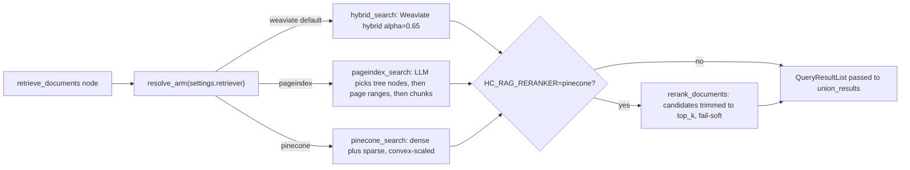

# Retrieval arms and reranking

The default retrieval is Weaviate hybrid search ([Weaviate retrieval and corpus
ingestion](weaviate-and-ingestion.md)). Two A/B alternatives swap only the
per-collection search callable: the `retrieve_documents` node resolves the arm
from `GraphSettings.retriever` via `_ARMS`/`resolve_arm`
(`healthcare_rag/graph/nodes/retrieve.py#L38-L57`), so routing, merge,
gap-fill, citations, and every downstream stage are unchanged. An explicitly
injected `Resources.hybrid_search` (tests, fixtures) always wins over the knob.
Each arm also declares the SDK error class worth retrying — Weaviate and
PageIndex arms retry `WeaviateBaseError` (PageIndex keeps this purely for
byte-identical retry behaviour, since it opens no client), and the Pinecone
arm retries `PineconeException`; `retrieve_documents` retries up to three
attempts with 1 s/2 s backoff. `HC_RAG_RETRIEVER` selects the arm (`weaviate`
default, `pageindex`, `pinecone`; an unknown name raises `ValueError` from
`resolve_arm`), documented in `healthcare_rag/services/models.py`.

Caption: `retrieve_documents` resolves one of three search callables from `HC_RAG_RETRIEVER`, then optionally reranks before results reach `union_results`.

When reranking is on, the search call is given `limit=rerank_candidates` (only
if the callable accepts a `limit` kwarg, `accepts_limit`) and
`rerank_documents` trims each result back to `rerank_top_k` inside the traced
retriever run, so generation still sees the same amount of context
(`graph/nodes/retrieve.py#L100-L138`).

## Shared-contract invariant

Every retrieval arm — `hybrid_search`, `pageindex_search`, `pinecone_search`
— mirrors `hybrid_search`'s signature and returns the same `QueryResultList`
shape (`QueryDocument`s carrying `page_numbers` and chunk `id_` metadata) over
the *same* contextualized chunks each collection ingests. Because the shape is
identical across arms, routing, merge/union, gap-fill, citation rendering, and
the `chunk_recall`/`page_recall` evaluators are entirely arm-independent: none
of them need to know which backend produced a result.

## Arm selection

PageIndex keeps the Weaviate error class purely for byte-identical retry behaviour — it opens no client. Only the Weaviate/Pinecone arms open a client (`resources.weaviate()` / `resources.pinecone()`); PageIndex reads cached JSON.

| Arm | Search callable | Source | Candidates per collection/query |
|---|---|---|---:|
| `weaviate` | `hybrid_search` | `processors/retrieval.py` | 4 (see [Weaviate retrieval](weaviate-and-ingestion.md)) |
| `pageindex` | `pageindex_search` | `processors/pageindex_retrieval.py` | up to `pageindex_max_chunks` (default 8) |
| `pinecone` | `pinecone_search` | `processors/pinecone_retrieval.py` | 4, or `rerank_candidates` when reranking |

## PageIndex arm (`HC_RAG_RETRIEVER=pageindex`)

`healthcare_rag/processors/pageindex_retrieval.py` is a tree-search adapter:

- One structured LLM call (`pageindex_select` prompt → `PageIndexSelection`)
  reads a compact outline of a monograph's section tree and picks up to
  `HC_RAG_PAGEINDEX_MAX_NODES` (default 4) nodes (`select_nodes`,
  `render_outline`; prompt/model registered in `graph/prompts.py`
  `STAGE_FILES`/`RESPONSE_MODELS`).
- Selected nodes' 1-based inclusive page ranges expand back onto the *same*
  contextualised chunks Weaviate uses (`data/chunks_<collection>.json`), capped
  at `HC_RAG_PAGEINDEX_MAX_CHUNKS` (default 8) in node order then chunk-id
  order, deduplicated (`select_chunks`).
- `to_query_documents` mirrors the Weaviate result shape with synthetic ids
  `pageindex:<collection>:<chunk id>` and rank-based scores, so `chunk_recall` /
  `page_recall` / citations keep working.
- Trees come from `make index-pageindex` (writes `data/pageindex_tree_*.json`)
  via the offline indexer `healthcare_rag/storage/pageindex_index.py`, which
  runs in an ephemeral uv env because `pageindex` needs `openai>=2` and the app
  pins `openai<2`. Missing tree/chunk files raise `FileNotFoundError` with the
  fix in the message. Trees and chunks are memoised (`clear_cache()` for tests
  or re-index). `HC_RAG_PAGEINDEX_DIR` relocates the data directory.
- Cost/quality gating experiments live in `evals/pageindex_gate.py` (offline
  harness exercised by `tests/test_pageindex_gate.py`).

## Pinecone arm (`HC_RAG_RETRIEVER=pinecone`)

`healthcare_rag/processors/pinecone_retrieval.py` searches a serverless
Pinecone index (built by `make ingest-pinecone` → `storage/pinecone_store.py`)
over the same chunks — one namespace per collection, lower-cased
(`namespace_for`). Per query, `embed_query` fetches dense OpenAI
`text-embedding-3-small` vectors and Pinecone sparse vectors concurrently in
worker threads. There is no server-side `alpha`, so `convex_scale` implements
Weaviate's semantics on a dot-product index: `dense *= alpha`,
`sparse *= 1 - alpha` (`HC_RAG_PINECONE_ALPHA`, default `0.65` matching the
Weaviate arm; `alpha` outside 0..1 raises). Index name, sparse model, and
embedding model are `HC_RAG_PINECONE_INDEX` / `HC_RAG_PINECONE_SPARSE_MODEL` /
`HC_RAG_EMBEDDING_MODEL`; `PINECONE_API_KEY` is required (secret, `.env`).
Pinecone metadata can only store strings/numbers/booleans/string-lists, so
`page_numbers` are stored as string lists on ingest and converted back to ints
on read by `page_numbers_from_metadata`.

The Pinecone SDK is synchronous; every call (embeddings, query, and — for the
reranker below — the inference call) crosses `anyio.to_thread` because the
process-wide `Resources` singleton outlives the event loop that would own an
aiohttp session. The sync OpenAI embedding client is cached process-wide for
the same reason (`embedding_client`/`reset_embedding_client`).

## Reranker (`HC_RAG_RERANKER=pinecone`)

`healthcare_rag/processors/rerank.py` is part of the *retrieval* stage, not a
new pipeline stage: when on, each collection search fetches
`HC_RAG_RERANK_CANDIDATES` (default 12) documents and `rerank_documents` keeps
`HC_RAG_RERANK_TOP_K` (default 4 — the un-reranked limit, so the context size
into generation is constant) via Pinecone Inference
(`HC_RAG_RERANK_MODEL`, default `bge-reranker-v2-m3`; needs `PINECONE_API_KEY`,
works on the Weaviate arm too via `Resources.pinecone_client`). It is
deliberately **fail-soft**: any exception during the Pinecone Inference call
is caught, logged as `RERANK_FAILED`, and the function returns the search's
own ordering truncated to `top_k` — an outage degrades quality, never
availability. `reorder` skips out-of-range and duplicate indices so a
malformed response yields a shorter list, never a corrupt one. Timing surfaces
as a nested `rerank_documents` LangSmith child run and a
`RERANK_APPLIED ... ms=` log line.

## A/B gating

`evals/pageindex_gate.py` is the two-stage go/no-go gate over arm strings of
the form `<retriever>[+rerank]` (`weaviate`, `pinecone`, `pageindex`,
optionally `+rerank` meaning `HC_RAG_RERANKER=pinecone`): stage 1 is a
deterministic, judge-free comparison of mean `page_recall` on eligible golden
questions (candidate retrieval only, no generation); a stage-1 loss is
terminal (exit code 2, REJECT) so no judge budget is spent on an arm that
retrieves worse pages. Stage 2 runs `evals.run_baseline` as a paired
subprocess for the reference arm and the single best passing stage-1
candidate, in the same session with identical flags, and requires
Δcorrectness ≥ +0.03, groundedness ≥ reference, holdout correctness ≥
reference, cost ≤ 1.25× reference, and p50 latency ≤ 1.25× reference to pass.
Exit codes: 0 pass, 2 stage-1 reject, 3 stage-2 fail, 1 error; `--json --smoke`
runs a cheap 3-question plumbing check. `evals/pageindex_gate.py` (retrieval
arms) is a distinct evaluator from `evals/routing_gate.py` and its supporting
modules, which gate query/safety decision-routing arms rather than retrieval
search arms. Design notes and results: `docs/retrieval-experiments.md`.

## Results: all three alternative arms lost to Weaviate

Per the decision records `docs/decisions/pageindex-vs-weaviate.md` and
`docs/decisions/pinecone-rerank.md`, and the consolidated evidence report
`docs/retrieval-experiments.md`, every alternative retrieval arm was measured
against a fresh Weaviate reference in the same session under the frozen
two-stage gate, and every one lost:

- **PageIndex** — stage 1 only (a stage-1 loss is terminal). Trailed Weaviate
  on `page_recall` (0.609 vs 0.681 overall; holdout 0.581 vs 0.676) and
  `chunk_recall` (0.601 vs 0.618), at roughly double the retrieval latency
  (3.10 s vs 1.66 s) and context size (8.2 vs 4.4 chunks/question), with total
  misses on three golden items where the node selector picked sections
  lacking the expected pages.
- **Pinecone hybrid** — rejected at stage 1: `page_recall` 0.463 vs a 0.648
  Weaviate reference (Δ −0.185). A labelled diagnostic (not used for arm
  selection) found that roughly 0.13 of that loss came from an unnormalized
  convex combination of raw dot-product and raw sparse scores, with the
  remainder attributable to the dense-only index trailing a lexical+dense
  hybrid on the holdout split.
- **Weaviate + reranker** — passed stage 1 (0.698 `page_recall`, +0.050) and
  reached the paired judged stage 2 (n = 172/arm), but was rejected there:
  correctness fell to 0.799 vs 0.850 (Δ −0.051) and holdout correctness to
  0.737 vs 0.828 (Δ −0.091), both outside their thresholds, even though cost
  and p50 latency passed. The reranker returned chunks from the right pages
  but less complete content (`chunk_recall` and `must_mention_recall` both
  fell), so answers lost required facts.
- **Pinecone + reranker** — also rejected at stage 1 (0.504 `page_recall`).

Because all three alternatives lost, Weaviate hybrid search stays as the
retrieval stage unchanged, and the arms plus the gate are inert at runtime
under default settings (`HC_RAG_RETRIEVER=weaviate`, `HC_RAG_RERANKER=none`);
they are retained so any future retrieval proposal can be judged the same way.

**Judge-noise caveat.** Stage-1 `page_recall` is deterministic (no LLM judge),
but the routing LLM that feeds it is not: the same unchanged Weaviate
reference scored 0.681 / 0.648 / 0.664 `page_recall` across three same-day
stage-1 runs (≈ ±0.02 nondeterminism), which is why the gate always pairs
against a fresh reference run in the same session rather than a historical
number, and treats stage-1 deltas below ≈0.03 as noise. Stage-2 correctness is
LLM-judged; `docs/baseline-report.md` treats single-run differences ≤ 0.05 as
noise at n ≈ 44, and the reranker decision record additionally cites a
sharper ±0.07 judge-noise band (measured at the same n) to argue that the
observed −0.051/−0.091 correctness deltas are outside noise even after
allowing for judge variance — none of these caveats reverse a verdict.

## Change guidance

- Adding an arm: mirror `hybrid_search`'s signature, return `QueryResultList`
  of `QueryDocument`s with `page_numbers` and chunk `id_` metadata, register it
  in `_ARMS` with its retry error class in `graph/nodes/retrieve.py`, add the
  settings getter and docstring entry in `services/models.py`, and snapshot it
  in `GraphSettings` (`graph/settings.py`).
- Tuning an arm or the reranker: validate offline with the focused tests
  above, then compare equal-config eval experiments
  (`make eval-nojudge PREFIX=<arm>`) watching `chunk_recall`, `page_recall`,
  latency, and cost; see [evaluations](../observability/evaluations.md).
- Environment knobs are summarized in [models and runtime](../configuration/models-and-runtime.md).
