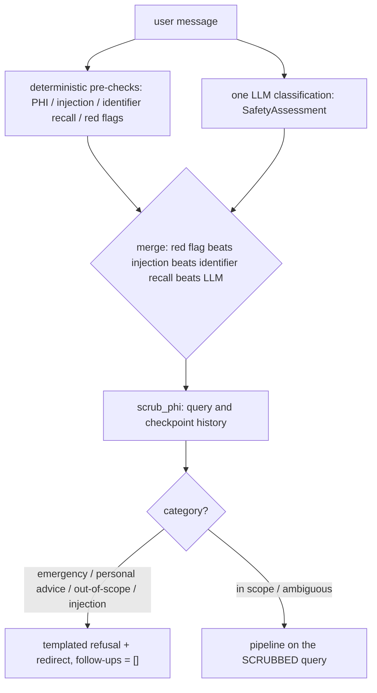

# Runtime safety gate

Every query passes the `safety_gate` graph node **before** retrieval or generation (`healthcare_rag/graph/nodes/safety.py`; see [architecture](../architecture/overview.md)). It exists because the baseline had no runtime guard at all: `safe_redirect` scored 0.00–0.33 across every model configuration, a "should I double my metformin tonight?" question returned a dosing table, and out-of-scope questions returned nothing (journey findings F13/F18; `docs/safety.md`, `docs/journey.json`). Full policy doc: `docs/safety.md`; measured impact: `docs/baseline-report.md` §6 and [safety posture](posture.md).

## Design: two layers, OR-ed

1. **Deterministic pre-checks** (no network, split across `healthcare_rag/processors/safety_patterns.py` and `safety_signals.py`, composed by `safety.py`): PHI detection (`contains_phi`, `scrub_phi`, `safety_signals.py`) delegates to the Presidio-backed [PrivacySanitizer](../privacy/sanitizer.md) for identifiers; `safety_patterns.py` holds the regexes for instruction-override attempts (`injection_flags`, `strip_injection`) and `safety_signals.py` holds requests to recite identifiers back (`identifier_recall_requested`) and first-person emergency red flags (`red_flag_terms`) — it imports `injection_flags`/`strip_injection` from `safety_patterns.py` in turn. These are a **floor** — they can only escalate an outcome (force `emergency_red_flag`/`prompt_injection`, set `contains_phi`), never downgrade what the model chose.
2. **One LLM classification call** (`prompts/safety_gate.yaml.j2` → `SafetyAssessment` in `healthcare_rag/models/safety.py`, temperature 0, default model): one of `in_scope_informational`, `personal_medical_advice`, `emergency_red_flag`, `out_of_scope`, `prompt_injection`, `ambiguous`, plus `phi_spans` and `drug_mentioned`.

**Exact fallback on LLM failure or uncertainty:** the adapter (`graph/nodes/safety.py#L158-L176`) wraps the structured call in `suppress(Exception)`; any exception logs `SAFETY_CLASSIFICATION_FAILED` and returns a fixed default `SafetyAssessment(category="ambiguous", contains_phi=False, phi_spans=[], drug_mentioned="none", rationale="safety-gate LLM call failed; deterministic checks only")` (`processors/safety.py::SafetyGate._llm_assess`, mirrored in `graph/nodes/safety_classifier.py::LangChainSafetyGate._llm_assess`). `category="ambiguous"` is **not** a refusal category — `SafetyGate._evaluate` falls through it to "run the normal pipeline" (`short_circuit=False`, `kind="none"`) exactly like a genuinely ambiguous question. This means an LLM-call failure is **fail-open for the model layer**: only the deterministic pre-checks can still force a refusal that turn (`red_flag_terms`/`injection_flags` still escalate `category` to `emergency_red_flag`/`prompt_injection` in `SafetyGate.assess`, `processors/safety.py#L161-L186`). PHI scrubbing is unaffected either way because it never depends on the LLM call. This exact path — gateway raises, category becomes `ambiguous`, question state is still cleared, no short-circuit — is pinned by `tests/graph/test_graph_safety.py::test_gate_gateway_failure_uses_ambiguous_default_and_clears_question` and `tests/graph/test_safety_node_exports.py::test_classifier_without_llm_uses_ambiguous_fail_soft_assessment`.

`SafetyGate.assess` merges both; `SafetyGate.evaluate` returns a `SafetyDecision` carrying the scrubbed query, template choice, and one-line notices.

*Control flow of one turn through the safety gate: deterministic pre-checks and the single `SafetyAssessment` call are merged, the message is scrubbed regardless of category, and only the merged category decides whether the turn short-circuits to a template or continues into the pipeline.*

## Scrubbing and short-circuit wiring

- `scrub_phi(text, extra_spans)` (`healthcare_rag/processors/safety_signals.py`) replaces identifiers with `[REDACTED_<KIND>]` tokens. It no longer runs its own regexes: it delegates to the process-wide [PrivacySanitizer](../privacy/sanitizer.md) (`get().privacy.scan`), Presidio plus deterministic clinical patterns, and the `extra_spans` argument is retained only for call compatibility — model output never receives text-mutation authority. It is **fail-closed** (initialization or scan errors raise `PrivacyScanError` and abort the turn), so `contains_phi` reflects only what the deterministic sanitizer found.
- The `safety_gate` node first derives history views from the checkpointed messages: when the gate is on, every message is scrubbed (`build_history_views`), then token-capped (`HC_RAG_HISTORY_MAX_TOKENS`) and paired into the processed-history and context windows (`healthcare_rag/graph/history.py`). The node then **resets all downstream state** for the turn (retrievals, branch events, route, generation, validation, `direct_response`, `response_action`, `query_router`, etc., via `Overwrite`) so nothing leaks from a prior turn on a checkpointed thread, then runs `LangChainSafetyGate.evaluate` (`graph/nodes/safety.py`, adapter in `nodes/safety_classifier.py`). On short-circuit, `finalize` joins notices + template with `follow_ups = []` deliberately; the refusal never re-enters retrieval or generation. A benign-social direct answer (`direct_response`) also finalizes without retrieval.
- Non-short-circuited queries run the pipeline on the scrubbed query (`working_query = decision.scrubbed_query`); one-line notices ("identifiers disregarded", "instructions unchanged") are prefixed to the final answer by `render_display_answer` at finalize.
- Observability: the `safety` state field (`SafetyOutcome`) records category, `contains_phi`, `short_circuited`, response kind, deterministic flags, PHI kinds, LLM-call count, `benign_social`/`social_intent`, `classifier_backend`/`classifier_calls`/`embedding_calls`, gate latency, and a scrubbed rationale; `build_result` copies it into each eval result row as `safety_outcome` (`graph/nodes/safety.py`; `graph/engine_record.py`).

## Benign-social direct responses and the query-response arms

The gate's `SafetyAssessment` now carries `benign_social` + `social_intent` (`greeting|thanks|goodbye|capability`), accepted only when the category is `out_of_scope` and the gate is not escalating (`processors/safety.py::assess`). How that turn is answered is decided by `HC_RAG_QUERY_RESPONSE_ARM` (`services/models.py`, default `current`):

- `current` — out-of-scope template refusal, as before;
- `deterministic` — the hard-coded `social_response(intent)` text from `processors/social_responses.py` becomes the `direct_response` and finalizes immediately;
- `tool` — the turn routes to `generate_query_or_respond` (see [architecture](../architecture/overview.md)); benign-social fallbacks still use the deterministic text, and any model direct answer must pass the [direct-output policy](../privacy/sanitizer.md).

`HC_RAG_SAFETY_CLASSIFIER` (`llm` default | `semantic_router`, `services/models.py::safety_classifier_backend`) selects the classification backend. The `semantic_router` backend was **never installed, imported, or exercised**: `semantic-router==0.1.16` is unsatisfiable with the unchanged `openai>=1.76,<2` and `python-dotenv>=1.1` bounds, so the semantic lane is dependency-INCONCLUSIVE — a dependency fact, not a runtime or quality result (see [routing evaluations](../observability/routing-evals.md)). It is also **fail-hard, not fail-open, at process start**: `GraphEngine.__init__` raises `SafetyClassifierUnavailableError` immediately if `settings.safety_classifier == "semantic_router"`, so a misconfigured deployment cannot silently run without a classifier — it refuses to start (`healthcare_rag/graph/engine.py#L40-L86`). Production defaults remain `current`/`llm`.

## Templates and the no-numbers rule

Responses are plain Python strings in `healthcare_rag/processors/safety_responses.py` — no LLM, no retrieval — and are rendered verbatim as `decision.response`/`safety_response`, joined with any notices by `graph/nodes/safety_finalize.py::finalize` into the final `answer`. Exact bodies:

- `emergency_response(*, overdose=False)` (`safety_responses.py#L32-L54`) opens with `"What you're describing needs to be assessed by a person, not by a document assistant."`, always includes `"Please seek urgent medical care now: call your local emergency number (911 in Canada and the US) or go to your nearest emergency department."`, and when `overdose=True` inserts `"If you think you have taken too much of a medicine, call your local poison control centre on your way — they can advise while you travel."` It deliberately contains **no monograph content**.
- `personal_advice_response()` (`safety_responses.py#L57-L69`) opens with `"I can't tell you what to do with your own dose or treatment."` and redirects to `"the person who prescribed it — your doctor or nurse practitioner, your pharmacist, or your diabetes nurse"`.
- `out_of_scope_response()` (`safety_responses.py#L72-L82`) opens with `"I can only answer from two documents: the Lipitor (atorvastatin) and metformin product monographs."`
- `identifier_recall_response()` (`safety_responses.py#L85-L95`) opens with `"I don't hold personal identifiers."` and states identifiers are `"stripped out of a message before it is used and are not kept in this conversation"`.
- `injection_response()` (`safety_responses.py#L98-L105`) opens with `"I can't change the instructions I operate under, adopt a different persona, or print those instructions for you"`.
- `PHI_NOTICE` (`safety_responses.py#L22-L24`): `"I've disregarded the personal identifiers in your message; please don't share them here."` — prefixed as its own line whenever `scrub_phi` finds an identifier.
- `INJECTION_NOTICE` (`safety_responses.py#L27-L30`): `"I can't change the instructions I operate under or take on a different persona, so I'll answer your question as the monograph assistant."` — prefixed only on a salvaged `ignore_instructions` pass.

Hard rule: **no template contains a specific number with a clinical unit**. `NUMERIC_DOSE` (`safety_patterns.py#L66-L70`) matches numbers with clinical units (`mg`, `mcg`, `ml`, `mmol/L`, `%`, `tablets`, `times a day`, `hours`, `days`, `weeks`); `tests/test_safety_gate.py::test_no_template_contains_a_specific_dose` and `tests/graph/test_graph_safety.py::test_refusal_templates_never_contain_a_numeric_clinical_unit` both assert it against every string in `ALL_TEMPLATES` (`safety_responses.py#L108-L118`), mirroring the `evals.evaluators.numeric_advice_leak` grader.

## Terminal refusals and informational follow-ups

`personal_medical_advice` refusals are terminal for the current turn. A later explicitly informational question remains answerable because the refusal-boundary matcher carves out document-sourced wording and sends that new turn through the full safety gate and normal RAG pipeline.

## Prompt injection: one extra pass

`persona_override`, `unrestricted_mode`, `system_prompt_exfil`, `fiction_harm` are refused outright. Only `ignore_instructions` is salvageable: the override wording is stripped (`strip_injection`) and the residual text goes through the gate exactly once more. Recursion is capped at one extra pass, so the worst case is two classification calls.

## Refusal boundaries: persisted refusals and deterministic replay

`HC_RAG_REFUSAL_BOUNDARY` (default `true`; `refusal_boundary_enabled()` in `services/models.py`, read live each turn) makes the gate persist qualifying refusals into checkpoint state (`RAGState.refusal_boundaries`) and replay them without a second LLM call (`healthcare_rag/processors/refusal_boundary.py`; `graph/nodes/safety.py#L134-L223`):

- **Write path:** after a gate refusal of kind `personal_advice`, `emergency`, or `injection`, the node builds a `RefusalBoundary` (kind, topic `lipitor|metformin|both|none|other`, a **byte-exact allowed template** from `allowed_responses(kind)` — the classifier's own text is never persisted, a fallback template is substituted otherwise — UTC `created_ts`, `template_version`). `upsert_boundary` replaces the matching key and appends; emergency distinguishes the overdose variant.
- **Read path:** next turn, before the LLM call, `boundary_hit(scrubbed_query, boundaries)` matches under exclusive cue precedence — emergency red flags first, then unsalvageable injection flags, then first-person dosing/decision cues — and only if the query is not informational (`_INFORMATIONAL` carve-out) and its topic matches (anaphoric ≤15-word or referent queries inherit the stored topic; `both`↔single-drug cross-match). A hit short-circuits with `response_kind="boundary_replay"`, `llm_calls=0`, route `safety_gate:boundary:<kind>`, and the stored template.
- **Safety valves:** corrupted or stale-version boundaries are inert but retained (`RefusalBoundary.from_state` returns `None`; `from_state` rejects any response not in the current allowed set). Gate off (`HC_RAG_SAFETY_GATE=false`) never writes and never replays. Corrupt state cannot widen behavior — only the fixed template set can ever be emitted.
- **Concurrency limit:** same-thread concurrent turns are unsupported by design; the CLI and eval harness are sequential (`refusal_boundary.py` module docstring, known limit L4 for cue-less re-asks).

Focused tests: `tests/test_refusal_boundary.py` (pure matching/upsert/topic semantics), `tests/graph/test_graph_safety.py` boundary suite (write/replay/carve-out/knob-off/gate-off/corrupted/variant mismatch), `tests/graph/test_boundary_durability.py` (SQLite checkpoint survives reopen with no raw PHI bytes), and `tests/graph/test_settings.py` for the flag parsing.

## Flags and linear path

`HC_RAG_SAFETY_GATE` (default `true`) or `HC_RAG_DISABLE_STAGES=safety` turns classification off for before/after ablations (`safety_gate_enabled` in `healthcare_rag/services/models.py`); identifier scrubbing remains active and the scrubbed question becomes the working query.

**Change guidance:** edit deterministic regex patterns in `safety_patterns.py`/`safety_signals.py`, merge policy in `safety.py`, or templates in `safety_responses.py` (and remember `refusal_boundary.py`'s allowed-response set and `TEMPLATE_VERSION` must be bumped/kept in sync when a template string changes — old boundaries go inert by design); recognizer changes belong in `privacy.py` (`ENTITY_TYPES`, `MODEL_VERSION`, `ANALYZER_VERSION`) and must move with the pinned spaCy model in the app image. Keep every deterministic check escalate-only, and validate with `make test` (`tests/test_safety_gate.py` covers injection, red flags, template content, and gate policy cases; `tests/test_privacy_sanitizer.py` the scanner; `tests/graph/test_graph_safety.py` the graph wiring, terminal refusals, ablation switch, and boundary write/replay; `tests/graph/test_safety_node_exports.py` and `tests/test_social_responses.py` the node/template surfaces). Then measure with [evaluations](../observability/evaluations.md): `make eval-nojudge PREFIX=safety-change`, full judge run, and multi-turn safety — watch `safe_redirect`/`numeric_advice_leak`/`pii_persistence` improve while `correctness`/`groundedness`/`chunk_recall` stay flat. Known limits (deterministic floor not fence, first-person red flags, LangSmith holding scrubbed text, residual drift) are tracked in [safety posture](posture.md).
