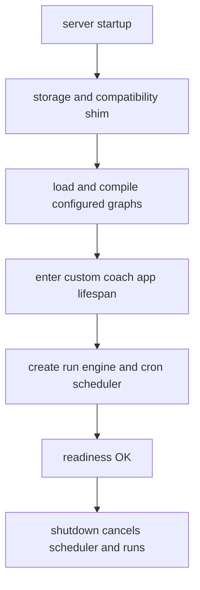

# Clean-room agent server

`server/` is a clean-room, in-memory implementation of the Agent Server surface. `langgraph.json` selects the RAG and coach graphs, the auth/custom HTTP modules, store embedding configuration, API version `0.12.6`, and disables MCP/A2A. It is not the base RAG `GraphEngine`; it hosts compiled graphs behind HTTP.

## Startup and readiness

`python -m server` loads configuration and starts Uvicorn. App lifespan creates storage, installs the local compatibility module, loads/recompiles graphs against shared saver/store, enters the custom app lifespan, creates the run engine, starts the cron scheduler, and marks readiness components. Shutdown clears scheduler readiness, cancels scheduler work/runs, and exits the custom lifespan. `/ok` returns 503 until every component is ready; `/info` exposes API version.

Caption: readiness is not reported before storage, graphs, custom app, and scheduler are established.

## HTTP surface and authorization

Auth applies before dispatch except public `/ok` and `/info`. Native resources are threads/state/copy, runs/wait/stream/join/cancel, crons, store items, and read-only assistants. Custom coach routes are inserted before native routes and add uploads/status, feedback, and internal version. The member-specific authorization and response projection are canonical in [member perimeter](../agent/member-perimeter.md).

The fallback returns 501 only for enumerated documented-but-unimplemented paths; MCP/A2A stay unmounted and return 404/405. Member graph routing/catalog behavior is [coach routing](../agent/coach-routing.md).

## Run/thread/cron semantics

Thread scope mismatches appear as 404. Run input contains exactly one of input or command; server-authenticated identity is injected and client-provided identity stripped. Per-thread conflicts reject, enqueue, or interrupt according to policy; queue overflow is 503 with `Retry-After`. Resume commands are replay-key idempotent. Cancellation rolls back pre-run state; graph exceptions record `error`; shutdown marks pending work interrupted.

Cron schedules validate cron/IANA zone, poll once per second, enqueue due work, and leave queue-conflicted records due for a later pass. Thread delete cascades best-effort run/cron/checkpoint cleanup.

## Boundaries and validation

Only `SERVER_STORAGE=memory` is supported. Threads, checkpoints, runs, store, crons, and replay data vanish on restart; only Weaviate persistence is external. Embedding-index startup may fall back to lexical store search on recognized dependency/auth failures. `SERVER_LOCAL_DEV` is dev-only and the image sets it off.

Use `make server-test`; use `make parity` for pinned-oracle compatibility; `make container-server-smoke` checks compose readiness. Tests under `tests/server/` pin SSE, rollback, cancellation, copy/delete cascade, cron, scoping, and license boundary. Operations/deployment topology is [deployment](../operations/deploy.md).
