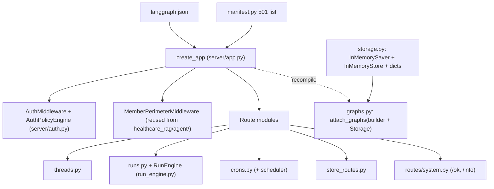

# OSS Agent Server

`server/` is a second server surface next to the CLI: a clean-room, in-memory
reimplementation of the LangGraph Agent Server HTTP API, served by plain
Starlette + uvicorn (`server/__main__.py`, `server/app.py:create_app`). It exists
so the repository can run and parity-test the deployed API shape
([coach agent](../agent/coach.md) included) without depending on the closed
`langgraph-api` package; `tests/server/test_license_boundary.py` pins that
boundary. Everything runs from `langgraph.json` — the same file the LangGraph
platform uses — parsed by `server/config.py:load_config` into a frozen
`ServerConfig` (`SERVER_STORAGE` must be `memory`, `SERVER_PORT`, `SERVER_LOCAL_DEV`
local-dev auth bypass).

## What it serves



- **Threads** (`server/threads.py`): thread CRUD/state backed by a plain dict plus
  the shared checkpointer.
- **Runs** (`server/runs.py`, `server/run_engine.py`): streaming run lifecycle.
  `RunRequest` is strict (`extra="forbid"`, exactly one of `input`/`command`, fixed
  stream modes) and `RunEngine` executes graph turns against the attached graphs.
- **Crons** (`server/crons.py`): reminder schedules plus an in-process scheduler
  (`start_scheduler`) — this is what wakes the coach's `reminder_delivery`.
- **Store** (`server/store_routes.py`) over `InMemoryStore`; the semantic index
  config comes from `langgraph.json` `store.index` and falls back to lexical-only
  search if embeddings are unavailable (`server/storage.py:create_storage`).
- **Graphs** (`server/graphs.py`): each entry in `config.graphs` is loaded from its
  import string, then `attach_graphs` recompiles the raw builder with the shared
  `InMemorySaver`/`InMemoryStore` — never uses a pre-compiled graph — so both the
  `healthcare_rag` and `coach` graphs serve from one storage seam.
- **Auth** (`server/auth.py`): `AuthMiddleware` + `AuthPolicyEngine` with resource ×
  action scopes (`runs`, `threads`, `crons`, `assistants`, `store`), `ScopeUser`
  principals, `/ok` and `/info` public. Topology (which principal reaches which
  route) is pinned in `tests/server/test_topology.py` and
  `tests/server/test_topology_upload.py`.
- **501 manifest** (`server/manifest.py`): documented-but-unimplemented endpoints
  (`/metrics`, `/store/…`, `/assistants`, `/runs/wait|stream`, `/webhooks`,
  `/listeners`) return 501; MCP/A2A are simply unmounted. Keep this list in sync
  when adding routes.

## Parity against the real platform

The repo dev venv resolves `langgraph-api==0.13.0` via `[tool.uv]
constraint-dependencies` and is explicitly **not** the characterization source.
The pinned oracle (`tests/server/oracle/README.md`) uses
`langgraph-cli[inmem]==0.4.31` + `langgraph-api==0.12.6` in an isolated
`tests/server/oracle/.venv` (`--no-config` to bypass the constraint), runs the
verbatim-copied `langgraph.json` from the repo root, and feeds
`tests/server/contract/`:

```bash
make server-test                       # unit suites (tests/server/, offline)
make parity                            # ORACLE=1 pytest tests/server/contract
make server-dev                        # SERVER_PORT=2024 SERVER_LOCAL_DEV=1 python -m server
make server-image                      # docker build -f server/Dockerfile -t hc-rag-server:dev
make container-server-smoke            # compose stack + /ok probe
```

## Change guidance

- Adding a route: add it to the route module, decide 501 vs implemented in
  `manifest.py`, and extend `tests/server/test_topology.py` (and the oracle
  contract if the real API has the endpoint).
- Changing run semantics: `RunRequest`/`RunEngine` invariants are pinned by
  `tests/server/test_runs.py`; contract drift is caught by `make parity` only
  when the pinned oracle venv exists.
- Local dev auth is a bypass (`SERVER_LOCAL_DEV=1`); never ship it — production
  runs the [Fly deploy](../operations/deploy.md) with platform auth.
