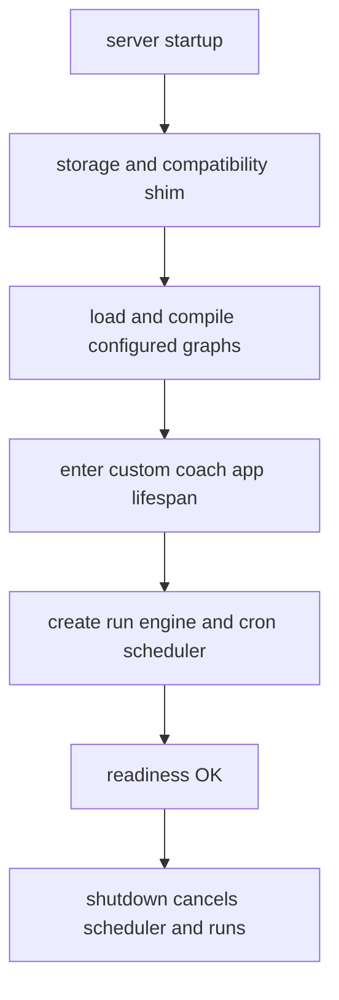

# Clean-room agent server

`server/` is a clean-room implementation of the Agent Server surface, with a dual-backend storage seam (`memory` or `postgres` — see below). `langgraph.json` selects the RAG and coach graphs, the auth/custom HTTP modules, store embedding configuration, API version `0.12.6`, and disables MCP/A2A. It is not the base RAG `GraphEngine`; it hosts compiled graphs behind HTTP.

## Startup and readiness

`python -m server` loads configuration and starts Uvicorn. App lifespan creates storage, installs the local compatibility module, loads/recompiles graphs against shared saver/store, enters the custom app lifespan, creates the run engine, starts the cron scheduler, and marks readiness components. Shutdown clears scheduler readiness, cancels scheduler work/runs, and exits the custom lifespan. `/ok` returns 503 until every component is ready; `/info` exposes API version.

Caption: readiness is not reported before storage, graphs, custom app, and scheduler are established.

## HTTP surface and authorization

Auth applies before dispatch except public `/ok` and `/info`. Native resources are threads/state/copy, runs/wait/stream/join/cancel, crons, store items, and read-only assistants. Custom coach routes are inserted before native routes and add uploads/status, feedback, and internal version. The member-specific authorization and response projection are canonical in [member perimeter](../agent/member-perimeter.md).

The read-only assistant surface includes `POST /assistants/search`, `GET /assistants/{assistant_id}`, and `GET /assistants/{assistant_id}/graph` (`server/assistants.py`). The graph endpoint applies the same `assistants:read` policy as the assistant record, resolves the configured raw graph, calls `aget_graph(xray=...)`, and removes internal node `data.id` values from its JSON response. This is a consumer-facing dependency of the [member frontend](../frontend/member-frontend.md): the CopilotKit/AG-UI LangGraph client asks for graph topology before ordinary non-regenerate agent runs. Do not replace the endpoint with an unchecked static graph or weaken the policy; a member must not use graph visualization to discover an unauthorized configured graph. `tests/agent/test_perimeter_copilotkit.py::test_copilotkit_captured_upstream_routes_are_admitted` pins perimeter admission of `/assistants/coach/graph`; `tests/server/test_assistants_store.py` covers the server endpoint's topology, missing-assistant, xray, and policy cases. Run `uv run pytest -q tests/agent/test_perimeter_copilotkit.py tests/server/test_assistants_store.py` when changing this contract.

The fallback returns 501 only for enumerated documented-but-unimplemented paths; MCP/A2A stay unmounted and return 404/405. Member graph routing/catalog behavior is [coach routing](../agent/coach-routing.md).

## Run/thread/cron semantics

Thread scope mismatches appear as 404. Run input contains exactly one of input or command; server-authenticated identity is injected and client-provided identity stripped. Per-thread conflicts reject, enqueue, or interrupt according to policy; queue overflow is 503 with `Retry-After`. Resume commands are replay-key idempotent. Cancellation rolls back pre-run state; graph exceptions record `error`; shutdown marks pending work interrupted.

Cron schedules validate cron/IANA zone, poll once per second, enqueue due work, and leave queue-conflicted records due for a later pass. Thread delete cascades best-effort run/cron/checkpoint cleanup.

## Storage: dual-backend, Postgres live in production

`SERVER_STORAGE` selects between two backends in `server/storage.py:create_storage()`: `memory` (default; `InMemorySaver`/`InMemoryStore` plus in-process dict registries — nothing survives a restart except Weaviate's own volume) and `postgres` (`AsyncPostgresSaver`/`AsyncPostgresStore` over a pooled `psycopg` connection, plus durable `hc_threads`/`hc_runs`/`hc_crons` tables created with advisory-locked DDL in `server/registries.py`). `server/config.py` requires `DATABASE_URI` (or the Fly-provided `DATABASE_URL` alias) whenever `SERVER_STORAGE=postgres` and rejects any other value.

Production (`deploy/fly.prod.toml`) runs `SERVER_STORAGE=postgres` — the flip shipped in v1.0.7 (2026-08-24) against a dedicated Fly Postgres cluster with the `vector` extension; see [deployment](../operations/deploy.md) and `docs/deploy.md` §§8–9. Threads, store items, and cron registrations now survive deploys/restarts/OOMs; in-flight runs, the pending-run queue, and open SSE streams remain process-local and are still lost on a deploy (`docs/deploy.md` §8). Postgres mode also redacts run `input`/`command` payloads to `[redacted]` at rest (`PERSISTED_PAYLOAD_REDACTION` in `run_engine.py`), while memory mode echoes them raw in process memory — code must not assume either behavior universally. Local/dev defaults to `memory`; embedding-index startup may fall back to lexical store search on recognized dependency/auth failures. `SERVER_LOCAL_DEV` is dev-only and the image sets it off.

Focused tests: `make server-test-pg` starts a disposable compose Postgres and runs `tests/server/test_registries.py`, `test_threads_postgres.py`, `test_runs_durable.py`, `test_crons_postgres.py`, and `test_storage_postgres.py` against it (plus `scripts/pg_lane_concurrent.py` for the advisory-lock race), tearing the container/volume down afterward. `tests/server/test_postgres_durability_gaps.py` (restart durability, store-API equivalence, erasure, orphan cascade, migration idempotency) is gated the same way behind a `POSTGRES_TEST_DSN` env var — via its `postgres_url` fixture — and skips cleanly when unset, but is not in the `make server-test-pg` file list, so run it explicitly with `POSTGRES_TEST_DSN=... uv run pytest tests/server/test_postgres_durability_gaps.py` when touching durability behavior. The memory path is covered by the rest of `tests/server/` under plain `make server-test`.

## ThreadStream protocol (member perimeter v2)

`server/protocol_stream.py` + `server/protocol_events.py` implement the v2-native ThreadStream transport for the member stream protocol: `POST /threads/{id}/stream/events` (SSE, validated `channels`/`namespaces`/`depth`/`since`) and `POST /threads/{id}/commands` (per-method validation of `run.start`, `input.respond`, and read-only `state.get`/`state.listCheckpoints`/`state.fork`; `update`/`goto`/`metadata` and unknown methods fail closed with 400). These routes are admitted only when [`HC_RAG_MEMBER_STREAM_PERIMETER=v2`](../agent/member-perimeter.md) — v1 rejects both outright. The current browser transport is CopilotKit/AG-UI, documented in the [member frontend](../frontend/member-frontend.md), rather than `@langchain/react` `useStream`. Implementation reuses the run engine, checkpoint saver, and queue; production parity is pinned by `tests/server/test_protocol_stream.py`, and the hermetic Playwright suite exercises the full protocol (chat, history/time-travel, recovery) against real `langgraph-api` behavior behind the perimeter.

## Boundaries and validation

Use `make server-test`; use `make parity` for pinned-oracle compatibility; `make container-server-smoke` checks compose readiness. Tests under `tests/server/` pin SSE, rollback, cancellation, copy/delete cascade, cron, scoping, and license boundary. Operations/deployment topology is [deployment](../operations/deploy.md).
